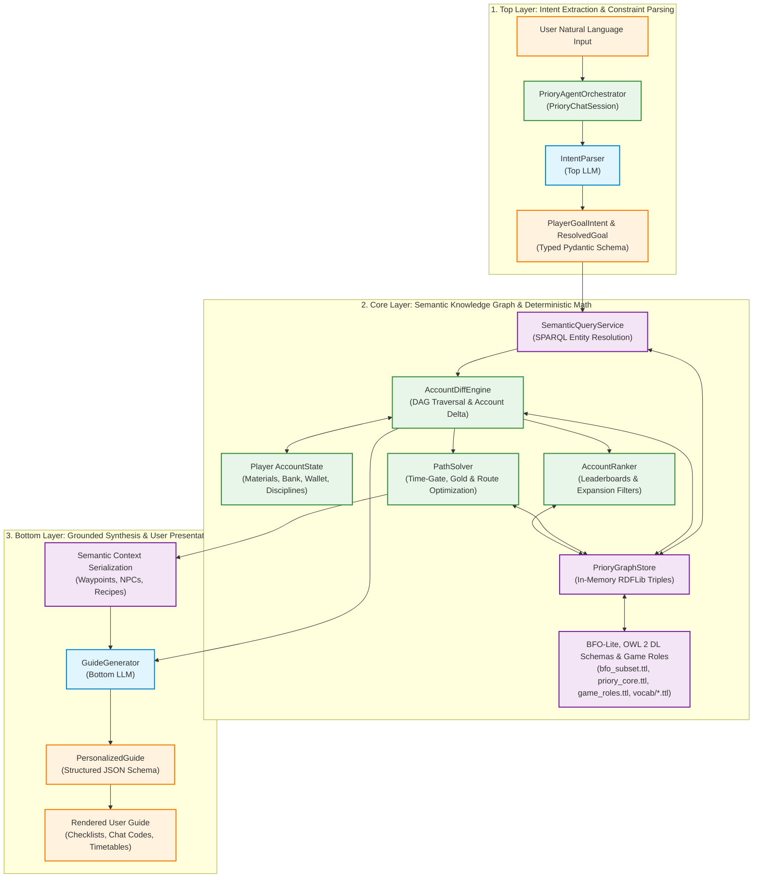
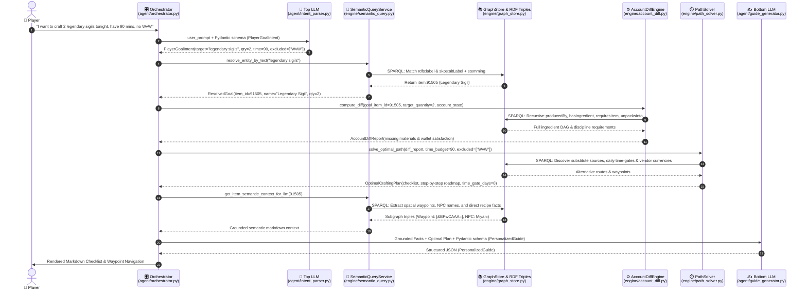

# Project Priory (GW2 Semantic Layer & Neuro-Symbolic Engine)

> **Project Priory** is a **Neuro-Symbolic Domain Semantic Layer and Knowledge Graph Engine** for *Guild Wars 2*.
>
> * **[`gw2-priory-def`](https://github.com/cdcc-jpg/gw2-priory-def)**: The **Domain Ontology & Schema Layer (OWL 2 DL TBox + SHACL)**, defining formal entity classes, dependency relations, and structural integrity rules.
> * **[`gw2-priory-ref`](https://github.com/cdcc-jpg/gw2-priory-ref)**: The **Controlled Vocabulary & Reference Taxonomy Layer (SKOS)**, managing standardized concept schemes, hierarchies, and multilingual synonyms.
> * **The Engine**: A **Deterministic Graph Solver & Neuro-Symbolic Agent Pipeline**, using SPARQL and graph traversal to ground LLM reasoning in verified semantic facts.

By combining formal Semantic Web standards (**OWL 2 DL**, **SKOS**, **SHACL**, **SPARQL**) with live player account data (**GW2 REST API**) and deep game domain knowledge (**GW2 Semantic MediaWiki**), Priory powers a **neuro-symbolic sandwich architecture** that allows players to receive mathematically verified, highly personalized in-game itineraries and progression guidance.

---

## 📚 Complete Technical Documentation Suite

For exhaustive technical breakdowns, data dictionaries, and sequence traces, see the [`docs/`](./docs/) directory:

* [🏛️ **System Architecture Overview**](./docs/architecture_overview.md) — The Neuro-Symbolic Sandwich, component topology, and execution model.
* [📊 **Pipeline & Semantic Touchpoints Reference**](./docs/neuro_symbolic_architecture_and_pipeline.md) — Detailed sequence interactions, data transformation state machines, and granular component matrix.
* [🔍 **The Three Semantic Layers Deep Dive**](./docs/semantic_layers_deep_dive.md) — Exhaustive analysis of `ref` (SKOS), `def` (OWL/SHACL/ABox), and the Triple Store graph engine with comprehensive Mermaid diagrams.
* [⚡ **End-to-End Data Flow & Reasoning Trace**](./docs/data_flow_and_reasoning.md) — Step-by-step trace of a live query with concrete JSON payloads and sequence diagrams.
* [📖 **Ontology & Vocabulary Reference Guide**](./docs/ontology_and_vocab_reference.md) — Formal catalog of all OWL Classes, Properties, SKOS Concept Schemes, and SHACL Shapes.

---

## 🏛️ Core Architecture & Pipeline Flow

The system coordinates Large Language Models and deterministic Semantic Web components via a **Neuro-Symbolic Sandwich**:



### End-to-End Sequence & Touchpoint Trace



---

## 🧩 Semantic Web Modeling Strategy

| Component | Standard | Purpose in Project Priory |
| :--- | :--- | :--- |
| **Upper Ontology (BFO-Lite)** | **ISO/IEC 21838-2 (BFO 2020) + IAO** | Foundational upper-level ontology (`bfo_subset.ttl`) aligning entities, independent/specifically dependent continuants, realizable roles, dispositions, and information content artifacts. |
| **TBox (Domain Ontology Schema)** | **OWL 2 DL** | Defines formal domain classes (`Item`, `LedgerToken`, `AccountWalletScalar`, `ContainerizedToken`, `ManifestedArtifact`, `Recipe`), object properties (`playsRole`, `producesItem`), datatype constraints (`isContainerized`, `apiWalletId`), and substrate disjointness axioms. |
| **Controlled Vocabularies & Game Roles** | **SKOS + OWL 2 DL Punning** | Standardized concept schemes (`role:GameRoleScheme`, `currency:CurrencyScheme`, `weapon:WeaponTypeScheme`, etc.) modeling realizable game roles (`CurrencyExchange`, `CraftingIngredient`, `SalvageTarget`, `MarketCommodity`, `Precursor`, `EquippedGear`) with punning support. |
| **ABox (Instance Knowledge Graph)** | **RDF / OWL Individuals** | Specific game items, recipes, vendor exchanges, currencies, and ephemeral hydrated character triples. |
| **Integrity & Substrate Constraints** | **W3C SHACL** | Enforces closed-world structural validation shapes (`role_shape.ttl`, `priory_shacl.ttl`, `character_shape.ttl`) guaranteeing storage substrate invariants, role disjointness (`JunkSell` vs `EquippedGear`), and recipe cardinalities. |
| **Dynamic Delta & Opportunity Cost Solver** | **SPARQL 1.1 + Python Math** | Substrate-agnostic purchasing power aggregation across wallet and containerized slots, zero domain semantics graph querying, and cross-role opportunity cost optimization (`SELL_ON_TP`, `SALVAGE`, `SPEND_AS_CURRENCY`). |
| **Arbitrage & Ergonomics Engine** | **Trading Post API + Graph Solver** | Solves multi-way acquisition matrix (`solve_buy_vs_craft_vs_vault`) adhering to Wallace's verified 15% TP tax model, Wizard's Vault Starter Kit precursor valuation (1,200 AA), Mystic Clover EV (3.2 MC + 3.2 Ecto), T6 fine material promotion spreads, and multi-alt discipline routing avoiding 50 silver reactivation fees. |

---

## 🚀 Quick Start: Running the Interactive Copilot

### 1. Prerequisites & Environment
Ensure Python 3.10+ is installed. Clone both repositories:
```bash
git clone https://github.com/cdcc-jpg/gw2-priory-def.git
git clone https://github.com/cdcc-jpg/gw2-priory-ref.git
```

Set up your `.env` file (see `.env.example`):
```bash
GW2_API_KEY="YOUR-ARENANET-API-KEY"
GEMINI_API_KEY="YOUR-GOOGLE-GEMINI-KEY"
```

### 2. Run the Live Interactive CLI
```bash
# Interactive multi-turn conversation mode:
python3 priory_cli.py

# Or one-shot query:
python3 priory_cli.py "I want to craft 2 legendary sigils tonight. I have 90 mins."
```

### 3. Run the Lightweight Web GUI (Developer Explorer)
> [!NOTE]
> **Architectural Decision:** This lightweight Flask interface (`web/app.py`, `run_web.py`) serves as a temporary developer GUI and conversational playground for the neuro-symbolic semantic layer before full integration into the main *gw2priory* frontend website.

```bash
python3 run_web.py
# Open your browser at http://127.0.0.1:5001
```

### 4. Run the Character Reasoning Benchmark & Demonstration
```bash
python3 scripts/demo_character_reasoning.py
```

### 5. Run the Automated Test Suite (150+ tests)
```bash
python3 -m unittest discover tests
```

---

## 📂 Repository Structure

```
gw2-priory-def/
├── docs/                        # Complete technical documentation suite
│   ├── README.md                # Documentation Table of Contents
│   ├── architecture_overview.md # Neuro-Symbolic Sandwich & component topology
│   ├── neuro_symbolic_architecture_and_pipeline.md # Complete pipeline diagrams & matrix
│   ├── semantic_layers_deep_dive.md # Detailed ref, def & Triple Store deep dive
│   ├── data_flow_and_reasoning.md   # Step-by-step query lifecycle trace
│   └── ontology_and_vocab_reference.md # Complete data dictionary
├── ontology/                    # OWL 2 DL Schemas, SHACL Shapes & Instances
│   ├── bfo_subset.ttl           # ISO/IEC 21838-2 BFO 2020 & IAO upper alignment
│   ├── priory_core.ttl          # Core OWL 2 DL schema, substrates & token taxonomy
│   ├── character.ttl            # Character ontology, disciplines, bags & equipability
│   ├── priory_shacl.ttl         # SHACL validation shapes for 7 archetypes
│   ├── shapes/                  # Granular SHACL constraint shape definitions
│   │   ├── character_shape.ttl  # Character individual validation shapes
│   │   └── role_shape.ttl       # Storage substrates & game role disjointness shapes
│   ├── instances/               # Verified RDF item instance graphs (ABox)
│   └── vocab/                   # Controlled vocabularies & game roles
│       ├── game_roles.ttl       # Punned OWL 2 DL & SKOS Game Roles taxonomy
│       └── ...
├── engine/                      # Graph Store & Deterministic Reasoning
│   ├── graph_store.py           # In-memory Dataset & RDF graph store loader
│   ├── character_graph.py       # Ephemeral in-memory character named graph hydrator
│   ├── semantic_query.py        # SPARQL 1.1 query, equipability & MCP tool handlers
│   ├── account_diff.py          # Dynamic overlay, multi-character crafting & inventory delta math
│   ├── account_ranker.py        # Multi-criteria speed-biased legendary ranker
│   └── path_solver.py           # Multi-criteria optimization & character assignment scheduler
├── agent/                       # Neuro-Symbolic AI Agent Layer
│   ├── llm_client.py            # Plug-and-play LLM client (Gemini, Ollama, Mock)
│   ├── intent_parser.py         # Top LLM: Natural Language intent parsing
│   ├── guide_generator.py       # Bottom LLM: Grounded guide synthesis & waypoints
│   └── orchestrator.py          # Central Sandwich orchestrator & multi-turn session
├── ingestion/                   # Data Ingestion Bridges
│   ├── gw2_api.py               # Official ArenaNet REST API Client (v2)
│   └── smw_client.py            # Complete 7-archetype Semantic MediaWiki crawler
├── scripts/                     # Demonstrations & benchmarks
│   └── demo_character_reasoning.py # 6-case character reasoning & benchmark runner
├── web/                         # Lightweight Developer Web GUI (Flask)
│   ├── app.py                   # Flask server & REST API
│   ├── templates/index.html     # Semantic GUI template
│   └── static/                  # Vanilla CSS & JS controller
├── tests/                       # Automated Unit Test Suites (150+ tests)
│   ├── test_bfo_roles_and_substrates.py # BFO roles, substrates & opportunity costs
│   ├── test_character_ontology.py # SHACL validation, hydration SLA & MCP tests
│   └── ...
├── run_web.py                   # Web GUI runner script
├── priory_cli.py                # Interactive CLI runner
├── CHANGELOG.md                 # Project version changelog
└── README.md                    # Project overview
```
