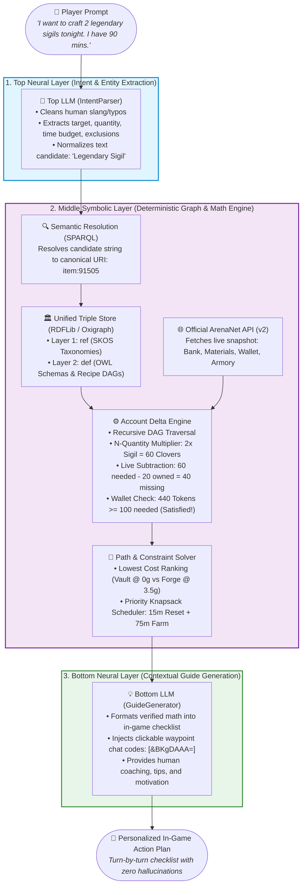
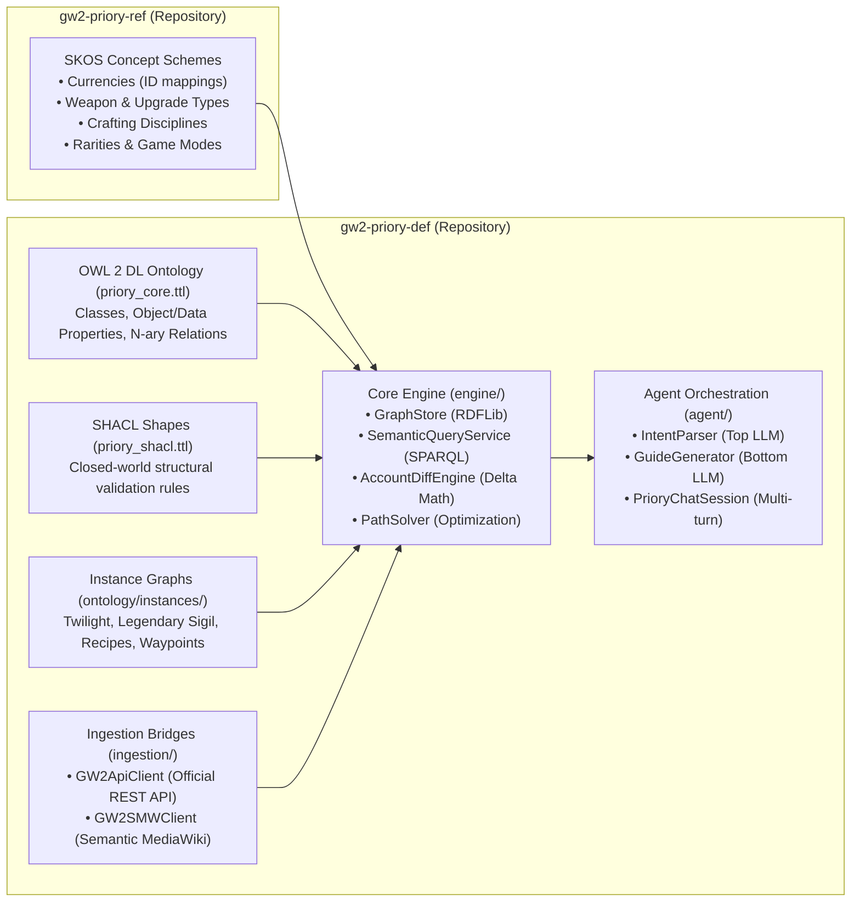

# System Architecture Overview

This document describes the high-level architecture of **Project Priory**, explaining how natural language understanding, deterministic knowledge graphs, live game API telemetry, and mathematical path optimization collaborate to guide players.

---

## 1. The Core Paradigm: The Neuro-Symbolic Sandwich

Traditional AI assistants hallucinate numbers, miscalculate recipes, and cannot inspect live game state. Procedural codebases (standard scripts) lack natural language flexibility and struggle with conversational reasoning.

Project Priory solves this using a **Neuro-Symbolic Sandwich**:

---

## 2. Why This Architecture Wins

| Aspect | Pure LLM (e.g. ChatGPT / Claude) | Standard Web Calculator (e.g. GW2Efficiency) | Project Priory (Neuro-Symbolic) |
| :--- | :--- | :--- | :--- |
| **Natural Language** | ✅ Fluid and conversational | ❌ None (rigid drop-down UI only) | ✅ **Fluid, multi-turn conversational chat** |
| **Recipe Accuracy** | ❌ Hallucinates fake recipes and quantities | ✅ 100% exact math | ✅ **100% exact math grounded in RDF graph** |
| **Live Account State** | ❌ Cannot check bank or armory | ✅ Reads live API | ✅ **Reads live API (materials, wallet, armory)** |
| **Personalized Routing** | ❌ Guesses arbitrary schedules | ❌ Fixed static tables (no time budgeting) | ✅ **Dynamic knapsack time-budget optimization** |
| **In-Game Navigation** | ❌ Frequently hallucinates wrong waypoints | ❌ Disconnected from current play session | ✅ **Verified in-game waypoint codes `[&...]`** |

---

## 3. High-Level Component Topology

---

## 4. Summary of Subsystems

1. **The Reference Repository (`gw2-priory-ref`):** Provides the authoritative, immutable controlled vocabularies and taxonomies across all Guild Wars 2 systems.
2. **The Definition Repository (`gw2-priory-def`):** Implements the formal OWL 2 DL domain schema, SHACL constraints, item dependency graphs, graph algorithms, and AI orchestrators.
3. **The Ingestion Pipeline:** Queries the official ArenaNet REST API and the Semantic MediaWiki API, converting game data into validated RDF triples.
4. **The Agent Orchestrator:** Implements multi-turn stateful sessions, taking player goals and returning hallucination-free, waypoint-navigated game plans.
