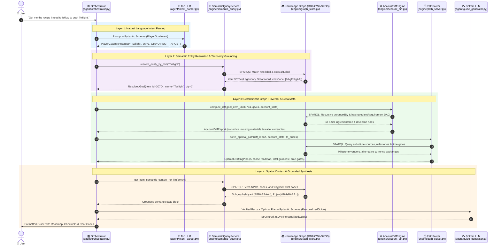
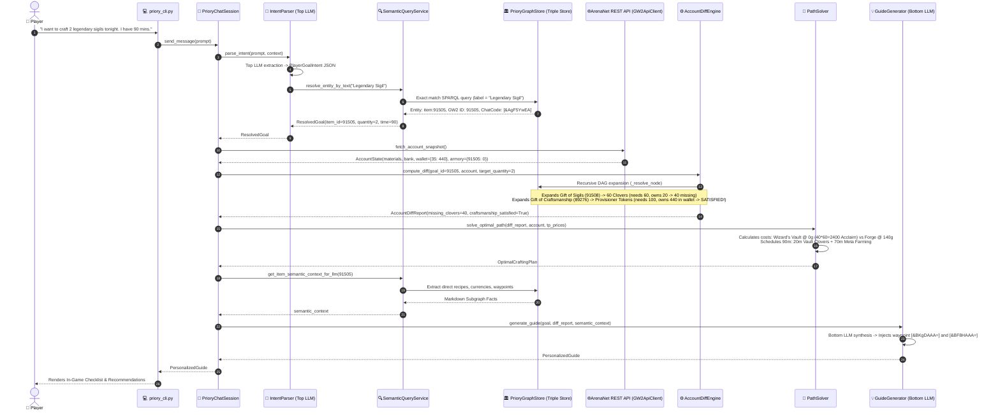

# End-to-End Data Flow & Reasoning Trace

This document details the exact lifecycle of player requests as they flow through every subsystem of Project Priory, providing concrete sequence diagrams, JSON payloads, mathematical state transitions, and spatial graph context.

---

## 1. End-to-End Information Flow Overview (Direct Recipe Query Trace)

### Scenario: *"Get me the recipe I need to follow to craft Twilight."*



#### Step-by-Step Flow Breakdown
1. **Top LLM Intent Parsing (`agent/intent_parser.py`):**
   * Parses the user prompt into typed `PlayerGoalIntent(target_entity="Twilight", target_quantity=1, goal_type=GoalType.DIRECT_TARGET)`.
2. **Semantic Entity Resolution (`engine/semantic_query.py`):**
   * Executes SPARQL over `PrioryGraphStore` matching `rdfs:label` and `skos:altLabel`.
   * Resolves text `"Twilight"` to canonical IRI `item:30704` (GW2 ID `30704`, Chat Code `[&AgErZgAA]`, `rarity:Legendary`, `weapon:Greatsword`).
3. **Deterministic Recipe DAG Traversal & Account Delta (`engine/account_diff.py`):**
   * Traverses `recipe:forge_twilight` recursively down to raw leaves (*Dusk*, *Gift of Fortune*, *Gift of Mastery*, *Gift of Twilight*).
   * Cross-references live `AccountState` (materials, bank, wallet, armory unlock status).
   * Computes exact missing materials, currency requirements (Spirit Shards, Karma), and discipline skill requirements (Weaponsmith 400, Armorsmith 400).
4. **Multi-Criteria Route Optimization & Milestones (`engine/path_solver.py`):**
   * Formulates the authentic **5-Phase Master Roadmap** (*Phase 1: Precursor Journey*, *Phase 2: Mystic Fortune/Tribute*, *Phase 3: Tyrian Mastery*, *Phase 4: Specific Weapon Gift*, *Phase 5: Final Mystic Forge Assembly*).
   * Calculates live Trading Post costs for tradeable missing components.
5. **Spatial Context Extraction (`engine/semantic_query.py`):**
   * Queries spatial milestone vendor individuals: **Miyani** (`[&BBAEAAA=]`), **Rojan the Penitent** (`[&BHsBAAA=]`), and **Grandmaster Hobbs** (`[&BBAEAAA=]`).
6. **Bottom LLM Grounded Synthesis (`agent/guide_generator.py`):**
   * Synthesizes the finalized, hallucination-free progression guide with formatted roadmap, copyable chat codes, and checklists.

---

## 2. Complex Multi-Constraint Sequence & Payload Trace

### Scenario: *"I want to craft 2 legendary sigils tonight. I have 90 mins."*



---

## 2. Step-by-Step Data Payload Transitions

### Step 1: Player Natural Language Prompt
```text
"I want to craft 2 legendary sigils tonight. I have 90 mins."
```

---

### Step 2: Top LLM Structured Intent Output
The Top LLM converts the natural text into a structured Pydantic object:
```json
{
  "goal_item_query": "Legendary Sigil",
  "target_quantity": 2,
  "time_budget_minutes": 90,
  "excluded_game_modes": [],
  "preferred_game_modes": [],
  "exhausted_sources": [],
  "liquid_gold_budget": null
}
```

---

### Step 3: Semantic Entity Resolution
`SemanticQueryService.resolve_entity_by_text` runs an exact label match query against the Knowledge Graph:
```sparql
SELECT DISTINCT ?item ?gw2Id ?label ?chatCode WHERE {
    ?item priory:gw2Id ?gw2Id ;
          rdfs:label ?label .
    OPTIONAL { ?item priory:chatCode ?chatCode }
    FILTER (lcase(str(?label)) = "legendary sigil")
}
```
**Matched Entity:**
* **URI:** `<https://priory.gw2/id/item/91505>`
* **GW2 ID:** `91505`
* **Label:** `"Legendary Sigil"`
* **Chat Code:** `"[&AgF5YwEA]"`

---

### Step 4: Live Account State (`AccountState`)
The `GW2ApiClient` fetches the player's live account snapshot from ArenaNet REST endpoints:
```json
{
  "materials": {
    "19675": 20,       // 20 Mystic Clovers owned
    "19721": 150       // 150 Globs of Ectoplasm owned
  },
  "bank": {},
  "inventory": {},
  "wallet": {
    "35": 440,         // 440 Provisioner Tokens owned!
    "68": 500          // 500 Astral Acclaim owned
  },
  "legendary_armory": {
    "91505": 0         // 0 Sigils in Armory (Goal: 2)
  },
  "disciplines": {
    "weaponsmith": 500
  }
}
```

---

### Step 5: Deterministic Delta Math (`AccountDiffEngine`)
The engine descends the recipe DAG recursively with multiplier $N = 2$:

$$\text{Mystic Clovers Required} = 30 \times 2 = 60\text{ Clovers}$$
$$\text{Missing Clovers} = \max(0, 60 - 20\text{ owned}) = \mathbf{40\text{ Clovers Missing}}$$

$$\text{Provisioner Tokens Required} = 50 \times 2 = 100\text{ Tokens}$$
$$\text{Owned in Wallet} = 440\text{ Tokens} \ge 100 \implies \mathbf{Gift\ of\ Craftsmanship\ is\ 100\%\ Satisfied!}$$

**Diff Report Summary:**
```json
{
  "goal_item_id": 91505,
  "goal_item_name": "Legendary Sigil",
  "target_quantity": 2,
  "is_fully_satisfied": false,
  "missing_materials": {
    "Mystic Clover": 40,
    "Pile of Lucent Crystal": 1500,
    "Symbol of Control": 150,
    "Symbol of Enhancement": 150,
    "Symbol of Pain": 150,
    "Vicious Claw": 200,
    "Powerful Blood": 200
  },
  "missing_disciplines": []
}
```

---

### Step 6: Multi-Criteria Path Solving (`PathSolver`)
The solver allocates the player's 90-minute time budget:
1. **Urgency 1 (Daily Reset Tasks):**
   * *Provisioner Barter Run:* **0 mins** (Omitted because 440 tokens already satisfy the requirement!).
   * *Wizard's Vault Clovers:* **20 mins** (Claim 40 clovers for 2,400 Astral Acclaim).
2. **Urgency 2 (Elastic Material Farming):**
   * $\text{Remaining Time} = 90 - 20 = \mathbf{70\text{ mins}}$ allocated to Silverwastes / Drizzlewood meta farming.

---

### Step 7: Final Synthesized Progression Guide
The Bottom LLM receives the verified numbers and spatial waypoints, producing the final clean response:

```text
──────────────────────────────────────────────────────────────────────────────
 🎯  OPTIMAL PROGRESSION GUIDE: 2x LEGENDARY SIGIL [&AgF5YwEA]
──────────────────────────────────────────────────────────────────────────────
📊 Overall Account Readiness: 45%

💡 STRATEGIC RECOMMENDATIONS:
   ✅ Provisioner Tokens Ready: Your account has enough Provisioner Tokens (440 owned vs 100 needed) to fulfill this requirement immediately!
   🎲 Mystic Clovers (40 needed): Use Astral Acclaim from the Wizard's Vault first (60 Acclaim each).

📋 ACTIONABLE SESSION PLAN (Tonight's 90 mins):
   [1] Complete Daily Wizard's Vault Tasks (~20 mins | OpenWorld)
       -> Complete daily objectives to claim Astral Acclaim and purchase remaining Mystic Clovers.
   [2] Gather Materials & Farm Meta Events (~70 mins | OpenWorld) [[&BF8HAAA=]]
       -> Teleport to Camp Resolve Waypoint [&BF8HAAA=] in Silverwastes to farm gold, Lodestones, and Lucent Motes.

📦 REMAINING DELTA TO CRAFT:
   • Mystic Clover: 40 needed
   • Pile of Lucent Crystal: 1500 needed
   • Symbol of Control: 150 needed
   • Symbol of Enhancement: 150 needed
   • Symbol of Pain: 150 needed
```
