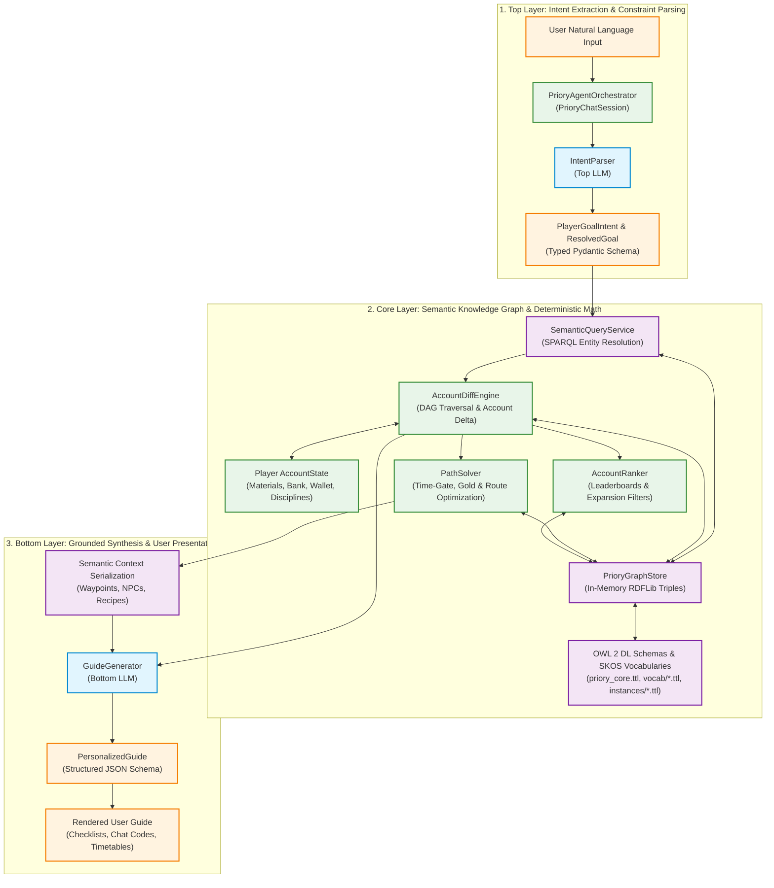
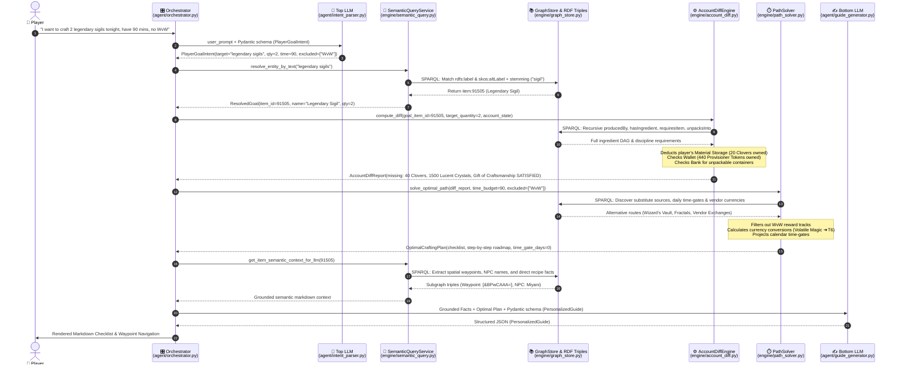
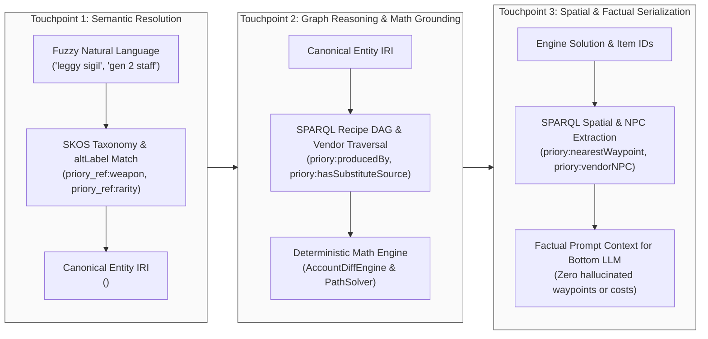

# Project Priory: Neuro-Symbolic Architecture & Pipeline Interaction Reference

This document provides a comprehensive technical breakdown and visual graphs illustrating the end-to-end data flow, component interactions, and the precise roles of the **Semantic Web Layer (OWL 2 DL, SKOS, RDFLib, SPARQL)** in Project Priory.

---

## 1. High-Level Architecture Overview

Project Priory executes a **Neuro-Symbolic Sandwich** pattern that combines the natural language strengths of Large Language Models with the strict determinism and verifiable truth of Semantic Web technologies and mathematical graph algorithms.

---

## 2. End-to-End Sequence & Interaction Flow

---

## 3. Data Transformation Pipeline

The data representation undergoes precise typed transformations across each boundary:

---

## 4. The Three Touchpoints of the Semantic Web Layer

---

## 5. Granular Component & Data Specification Matrix

| Stage | Class / Module | Input Data | 🔍 Semantic Web Operation | Output Data | Concrete Payload Example |
| :--- | :--- | :--- | :--- | :--- | :--- |
| **1. Input** | CLI / UI | Human text | *None (Raw input).* | `str` | `"I want to craft 2 legendary sigils tonight, have 90 mins, no WvW"` |
| **2. Intent Parse** | [`IntentParser`](../agent/intent_parser.py) `agent/intent_parser.py` | `user_prompt: str` | Top LLM compiles prompt into Pydantic schema [`PlayerGoalIntent`](../agent/intent_parser.py). | `PlayerGoalIntent` | `goal_type: SPECIFIC_ITEM` `target_item_name: "legendary sigils"` `target_quantity: 2` `time_budget_minutes: 90` `excluded_game_modes: ["WvW"]` |
| **3. Entity Resolution** | [`SemanticQueryService`](../engine/semantic_query.py) `engine/semantic_query.py` | `"legendary sigils"` | **⚡ SPARQL Query over SKOS Vocabularies:** • Regex query against `rdfs:label` and `skos:altLabel` • Subsumption check on `a priory:LegendarySigil` • Morphological stemming (`sigils` $\to$ `sigil`) | `ResolvedGoal` | `resolved_item_id: 91505` `resolved_item_name: "Legendary Sigil"` `chat_code: "[&AgH5WgEA]"` |
| **4. DAG Traversal** | [`AccountDiffEngine`](../engine/account_diff.py) `engine/account_diff.py` | `item_id: 91505` `multiplier: 2` | **⚡ Recursive SPARQL Tree Query:** `?item priory:producedBy ?recipe .` `?recipe priory:hasIngredient ?req .` `?req priory:requiresItem ?child ; priory:requiresQuantity ?qty .` | `ItemRequirementNode` DAG | • 60x Mystic Clover • 1500x Lucent Crystal • 150x Symbol of Control • 2x Gift of Craftsmanship |
| **5. Account Delta** | [`AccountDiffEngine`](../engine/account_diff.py) `engine/account_diff.py` | Tree DAG + Player [`AccountState`](../engine/account_diff.py) | **⚡ Ontology Container & Discipline Rules:** • Checks `?c priory:unpacksInto ?item` (Starter Kits in bank) • Checks `?recipe priory:requiresDiscipline ?d` against player levels | [`AccountDiffReport`](../engine/account_diff.py) | • Missing Clovers: `40` (60 needed - 20 owned) • Missing Lucent Crystals: `1500` • Gift of Craftsmanship: `SATISFIED` (Wallet has 440 Provisioner Tokens) |
| **6. Source Discovery** | [`SemanticQueryService`](../engine/semantic_query.py) `engine/semantic_query.py` | Missing IDs (`19675`, `89271`, etc.) | **⚡ SPARQL Polymorphic Source Query:** `?item priory:hasSubstituteSource ?path .` Discovers `priory:VendorExchange`, `priory:RewardTrack`, `priory:nearestWaypoint`, and `priory:hasTimeGate`. | `Dict[str, Any]` (Acquisition Paths) | • Wizard's Vault Astral Acclaim • Fractal Relic Vendor (`[&BEEFAAA=]`, 2/day limit) • WvW Reward Tracks |
| **7. Multi-Criteria Solving** | [`PathSolver`](../engine/path_solver.py) `engine/path_solver.py` | `diff_report`, `budget: 90m`, `excluded: ["WvW"]` | **⚡ Time-Gate & Currency Constraint Filtering:** • Filters out `priory:hasGameMode gamemode:WvW` • Queries `priory:requiresCurrency currency:VolatileMagic` for T6 conversion math • Computes calendar bottleneck dates from `priory:dailyCap` | [`OptimalCraftingPlan`](../engine/path_solver.py) | • Checklist: 3 tasks fitting 90-min budget • Estimated Completion: Today (0 time-gate days) • Recommended T6 currency conversions |
| **8. Grounding Context** | [`SemanticQueryService`](../engine/semantic_query.py) `engine/semantic_query.py` | `item_id: 91505` | **⚡ Graph Neighborhood Serialization:** Serializes connected RDF triples into verified Markdown bullet points. | `semantic_context: str` | Facts block passed to Bottom LLM: `### Semantic Entity: Legendary Sigil` `* Waypoints: [&BPwCAAA=]` `* Direct Recipes: Mystic Forge` |
| **9. Guide Synthesis** | [`GuideGenerator`](../agent/guide_generator.py) `agent/guide_generator.py` | Verified Plan + Grounded Context | Bottom LLM strictly formats verified math and waypoints into typed schema [`PersonalizedGuide`](../agent/guide_generator.py). | [`PersonalizedGuide`](../agent/guide_generator.py) | Structured JSON with checklist steps, exact time allocations, and strategic advice. |
| **10. UI Output** | [`PrioryChatSession`](../agent/orchestrator.py) `agent/orchestrator.py` | `guide: PersonalizedGuide` | *None (formatting and rendering).* | Formatted User Guide | Final user-facing markdown output with interactive task boxes and in-game chat codes. |

---

## 6. Architectural Guarantees

1. **Zero Domain Semantics in Python**:
   Per [`AGENTS.md`](../AGENTS.md), no entity labels, weapon taxonomies, currencies, or action verbs are hardcoded in Python. All vocabularies and hierarchy rules reside exclusively in `.ttl` files.

2. **Zero Mathematical Hallucination**:
   The LLM never computes material counts, gold subtractions, or recipe requirements. All arithmetic is calculated through deterministic DAG traversal in [`AccountDiffEngine`](../engine/account_diff.py).

3. **Zero Spatial Hallucination**:
   Waypoint chat links (e.g. `[&BPwCAAA=]`), zone names, and NPC identifiers are fetched directly from ontology instances, ensuring all navigation advice is verifiable in the live game.
