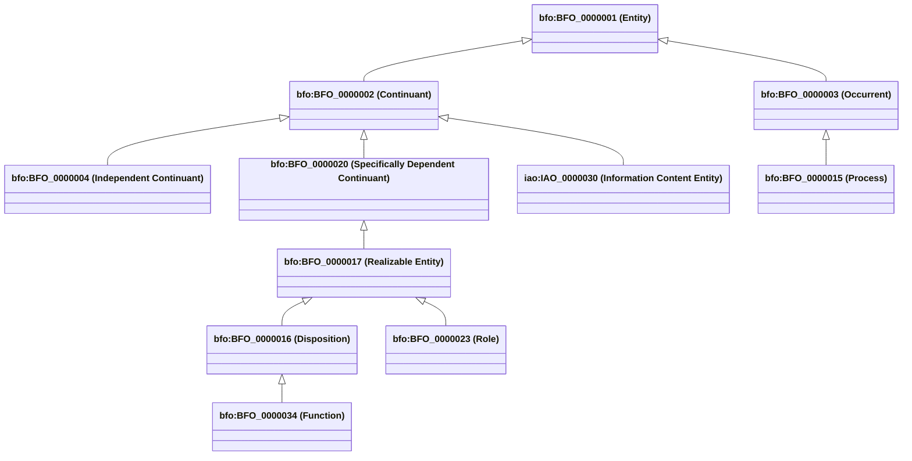
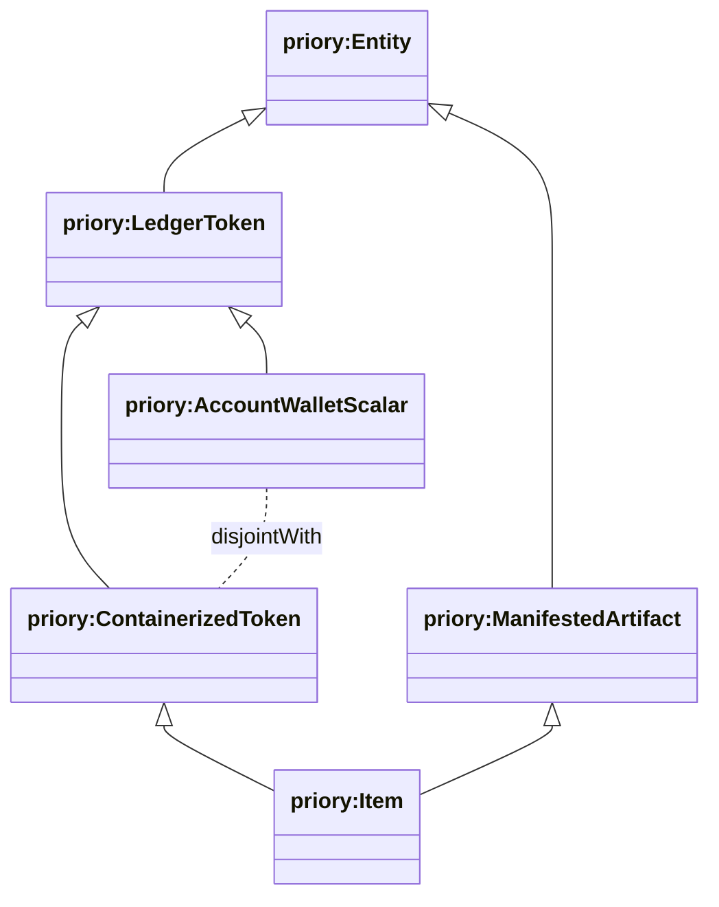
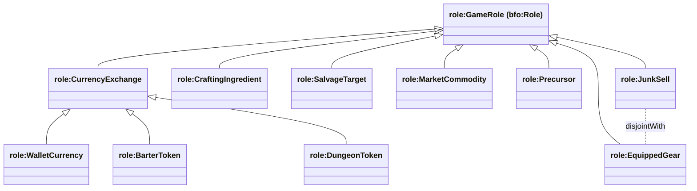

# Ontology & Controlled Vocabulary Reference Guide

This document serves as the formal data dictionary and quick-reference guide for all OWL classes, properties, SKOS concept schemes, and SHACL validation shapes in Project Priory.

---

## 1. Standard Namespace Prefixes

| Prefix | Full IRI URI | Description |
| :--- | :--- | :--- |
| `priory:` | `https://priory.gw2/def/` | Core OWL schema and ontology definitions |
| `priory-ref:`| `https://priory.gw2/ref/` | Base reference URI |
| `item:` | `https://priory.gw2/id/item/` | Game item individuals (keyed by GW2 API ID) |
| `recipe:` | `https://priory.gw2/id/recipe/` | Recipe transformation individuals |
| `currency:` | `https://priory.gw2/ref/currency/` | SKOS Currency & Token concepts |
| `discipline:`| `https://priory.gw2/ref/discipline/` | SKOS Crafting Discipline concepts |
| `weapon:` | `https://priory.gw2/ref/weapon/` | SKOS Weapon Type taxonomy |
| `armor:` | `https://priory.gw2/ref/armor/` | SKOS Armor Weight & Slot taxonomy |
| `slot:` | `https://priory.gw2/ref/slot/` | SKOS Equipment Slot concepts |
| `upgrade:` | `https://priory.gw2/ref/upgrade/` | SKOS Upgrade Component taxonomy (Sigils/Runes) |
| `rarity:` | `https://priory.gw2/ref/rarity/` | SKOS Item Rarity hierarchy |
| `gamemode:` | `https://priory.gw2/ref/gamemode/` | SKOS Game Mode concepts |
| `mount:` | `https://priory.gw2/ref/mount/` | SKOS Mount & Mobility taxonomy |
| `region:` | `https://priory.gw2/ref/region/` | SKOS Core Tyria Regions taxonomy |
| `zone:` | `https://priory.gw2/ref/zone/` | SKOS Exploration & Farming Zones |
| `bfo:` | `http://purl.obolibrary.org/obo/BFO_` | ISO/IEC 21838-2 Basic Formal Ontology 2020 |
| `iao:` | `http://purl.obolibrary.org/obo/IAO_` | Information Artifact Ontology (IAO) |
| `role:` | `https://priory.gw2/ref/role/` | SKOS Concept Scheme and Punned OWL 2 DL Game Roles |
| `skos:` | `http://www.w3.org/2004/02/skos/core#` | W3C Simple Knowledge Organization System |
| `sh:` | `http://www.w3.org/ns/shacl#` | W3C Shapes Constraint Language |

---

## 2. BFO-Lite Metaphysical Foundations (`ontology/bfo_subset.ttl`)

Project Priory aligns with the **Basic Formal Ontology 2020** (ISO/IEC 21838-2) and the **Information Artifact Ontology (IAO)** to provide rigorous metaphysical grounding for game entities, storage substrates, processes, and player progression states.

### BFO Core Relations

| Relation | Domain | Range | Description |
| :--- | :--- | :--- | :--- |
| `bfo:BFO_0000050` (`part of`) | `bfo:Entity` | `bfo:Entity` | Mereological relation between part and whole (transitive). |
| `bfo:BFO_0000051` (`has part`) | `bfo:Entity` | `bfo:Entity` | Inverse of `part of`. |
| `bfo:BFO_0000052` (`inheres in`) | `bfo:SpecificallyDependentContinuant` | `bfo:IndependentContinuant` | Relation between dependent quality/role and its bearer. |
| `bfo:BFO_0000053` (`bearer of`) | `bfo:IndependentContinuant` | `bfo:SpecificallyDependentContinuant` | Inverse of `inheres in`. |
| `bfo:BFO_0000054` (`realized in`) | `bfo:RealizableEntity` | `bfo:Process` | Relation linking a realizable role/disposition to executing process. |
| `bfo:BFO_0000055` (`realizes`) | `bfo:Process` | `bfo:RealizableEntity` | Inverse of `realized in`. |
| `iao:IAO_0000136` (`is about`) | `iao:IAO_0000030` | `bfo:Entity` | Links information content entity to its subject matter. |

---

## 3. Storage Substrates & Ledger Separation (`ontology/priory_core.ttl`)

Priory explicitly models the physical and systemic reality of storage substrates in *Guild Wars 2*, categorizing all tokens and items into mutually disjoint continuant classes:

### Substrate Comparison Matrix

| Property / Feature | `priory:AccountWalletScalar` | `priory:ContainerizedToken` |
| :--- | :--- | :--- |
| **Physical Reality** | Unlocated, non-containerized balance | Discrete item tokens occupying inventory/bank slots |
| **API Endpoint** | `/v2/account/wallet` | `/v2/account/materials`, `/v2/account/bank`, `/v2/characters[*]/inventory` |
| **Key Identifier** | `priory:apiWalletId` (`xsd:integer`) | `priory:gw2Id` (`xsd:integer`) |
| **Containerized Flag** | `priory:isContainerized false` | `priory:isContainerized true` |
| **Stack Size Limit** | Uncapped (up to API integer max) | Constrained by `priory:maxStackSize` (typically 250) |
| **Prohibited Roles** | Cannot play `role:SalvageTarget` or `role:MarketCommodity` | Can play all physical and commercial roles |
| **Disjointness Axiom** | `AccountWalletScalar owl:disjointWith ContainerizedToken` | Disjoint with `AccountWalletScalar` |

---

## 4. OWL 2 DL Class Hierarchy (`ontology/priory_core.ttl`)

---

## 5. Properties Reference

### Object Properties (Graph Relationships)

| Property | Domain | Range | Description |
| :--- | :--- | :--- | :--- |
| `priory:playsRole` | `priory:Entity` | `role:GameRole` | Grounding relation linking an item/token to a realizable game role. |
| `priory:producesItem` | `priory:Recipe` | `priory:Item` | The output item produced by a recipe. |
| `priory:producedBy` | `priory:Item` | `priory:Recipe` | Inverse of `producesItem`. |
| `priory:hasIngredientRequirement` | `priory:Recipe` | `priory:IngredientRequirement` | Reified N-ary relation specifying an ingredient and count. |
| `priory:requiresItem` | `priory:IngredientRequirement` | `priory:Item` | The specific item required. |
| `priory:requiresCurrency` | `priory:VendorExchangePath` | `skos:Concept` | The currency needed for a vendor purchase. |
| `priory:acquiredVia` | `priory:Item` | `priory:AcquisitionPath` | Acquisition pathway for an item. |
| `priory:hasSubstituteSource` | `priory:Item` | `priory:AcquisitionPath` | Alternative acquisition method. |
| `priory:unpacksInto` | `priory:ContainerItem` | `priory:Item` | Connects container/starter kit to items produced when opened. |
| `priory:unpacksFrom` | `priory:Item` | `priory:ContainerItem` | Inverse of `unpacksInto`. |
| `priory:requiresDiscipline` | `priory:DisciplineRecipe` | `skos:Concept` | The crafting discipline required (e.g. `discipline:Weaponsmith`). |
| `priory:hasRarity` | `priory:Item` | `skos:Concept` | SKOS rarity tier (e.g. `rarity:Legendary`). |
| `priory:hasWeaponType` | `priory:Weapon` | `skos:Concept` | SKOS weapon type (e.g. `weapon:Greatsword`). |
| `priory:hasUpgradeType` | `priory:UpgradeComponent`| `skos:Concept` | SKOS upgrade type (`upgrade:Sigil`, `upgrade:Rune`). |
| `priory:hasTimeGate` | `priory:AcquisitionPath` | `priory:TimeGate` | Cooldown or time constraint associated with path. |

### Datatype Properties (Literals & Coordinates)

| Property | Domain | Range | Description |
| :--- | :--- | :--- | :--- |
| `priory:apiWalletId` | `priory:AccountWalletScalar` | `xsd:integer` | ArenaNet API wallet currency integer ID. |
| `priory:isContainerized` | `priory:LedgerToken` | `xsd:boolean` | Whether token occupies discrete inventory/bank container slots. |
| `priory:isSalvageable` | `priory:Item` | `xsd:boolean` | Whether item can be broken down with salvage kits into materials. |
| `priory:isTradeable` | `priory:Item` | `xsd:boolean` | Whether item can be listed and bought on the Black Lion Trading Post. |
| `priory:isDestroyable` | `priory:Item` | `xsd:boolean` | Whether item can be deleted/dragged out of bags. |
| `priory:isMailable` | `priory:Item` | `xsd:boolean` | Whether item can be attached to player-to-player in-game mail. |
| `priory:maxStackSize` | `priory:ContainerizedToken` | `xsd:integer` | Maximum stack capacity in a single inventory container slot (typically 250). |
| `priory:gw2Id` | `priory:Item` | `xsd:integer` | Official ArenaNet API item/recipe integer ID. |
| `priory:chatCode` | `priory:Item` | `xsd:string` | In-game chat link code (e.g. `[&AgErZgAA]`). |
| `priory:requiredQuantity` | `priory:IngredientRequirement`| `xsd:integer` | Exact integer quantity required. |
| `priory:outputQuantity` | `priory:Recipe` | `xsd:integer` | Number of items produced per craft. |
| `priory:requiresRating` | `priory:DisciplineRecipe` | `xsd:integer` | Discipline skill level (0 to 500). |
| `priory:isAccountBound` | `priory:Item` | `xsd:boolean` | Whether item cannot be traded on the Trading Post. |
| `priory:vendorNPC` | `priory:AcquisitionPath` | `xsd:string` | Name of the vendor NPC (e.g. `"Faction Provisioner"`). |
| `priory:zoneName` | `priory:AcquisitionPath` | `xsd:string` | In-game Map/Zone name (e.g. `"Black Citadel"`). |
| `priory:waypointName` | `priory:AcquisitionPath` | `xsd:string` | Name of nearest waypoint (e.g. `"Junker's Waypoint"`). |
| `priory:nearestWaypoint` | `priory:AcquisitionPath` | `xsd:string` | In-game waypoint chat code (e.g. `[&BKgDAAA=]`). |

---

## 6. Punned Game Roles Taxonomy (`ontology/vocab/game_roles.ttl`)

In accordance with OWL 2 DL Punning, game roles are declared simultaneously as **Classes** (subclasses of `bfo:BFO_0000023`), **Named Individuals**, and **SKOS Concepts** within `role:GameRoleScheme`:

### Game Role Definitions & Affordances

| Role IRI | SKOS Scheme | Definition | Canonical Exemplars |
| :--- | :--- | :--- | :--- |
| `role:CurrencyExchange` | `role:GameRoleScheme` | Medium of exchange accepted by merchants or system vendors. | Astral Acclaim, Spirit Shards, Ectoplasm, Mystic Coins |
| `role:WalletCurrency` | `role:GameRoleScheme` | Unlocated, account-wide liquid currency tracked in `/v2/account/wallet`. | Gold, Karma, Astral Acclaim, Spirit Shards |
| `role:BarterToken` | `role:GameRoleScheme` | Containerized physical item traded directly to NPCs for goods. | Glob of Ectoplasm, Mystic Coin |
| `role:DungeonToken` | `role:GameRoleScheme` | Explorable dungeon reward tokens used for dungeon equipment. | Tales of Dungeon Delving (`currency:69`) |
| `role:CraftingIngredient` | `role:GameRoleScheme` | Component utilized in discipline crafting or Mystic Forge transformations. | Ectoplasm, Mystic Clovers, T6 Trophies, Ingot stacks |
| `role:SalvageTarget` | `role:GameRoleScheme` | Equipment or salvage items broken down by salvage kits. | Masterwork/Rare armor, Glob of Ectoplasm, Unidentified Gear |
| `role:MarketCommodity` | `role:GameRoleScheme` | Liquid tradeable commodity traded on Black Lion Trading Post. | Glob of Ectoplasm, Mystic Coins, T6 Blood |
| `role:Precursor` | `role:GameRoleScheme` | Base exotic/ascended weapon serving as mandatory forge foundation. | Dusk, Dawn, The Hunter, Dragon's Flight |
| `role:EquippedGear` | `role:GameRoleScheme` | Active combat equipment slotted into equipment templates. | Twilight, Dusk, Ascended Armor sets |
| `role:JunkSell` | `role:GameRoleScheme` | Zero combat/crafting utility items meant solely for "Sell Junk" vendor gold. | Vendor junk, broken claws, ruined hides |

---

## 7. SKOS Reference Vocabularies (`gw2-priory-ref/vocab/`)

| File | Concept Scheme | Top Concepts | Key Notations (API IDs) |
| :--- | :--- | :--- | :--- |
| `currencies.ttl` | `currency:CurrencyScheme` | Coin, Karma, SpiritShard, ProvisionerToken, AstralAcclaim, FractalRelic, MagnetiteShard, ImperialFavor, RiftEssences | `29` (Provisioners), `63`/`68` (Vault), `23` (Spirit Shards), `2` (Karma) |
| `weapon_types.ttl` | `weapon:WeaponTypeScheme` | TwoHandedWeapon, OneHandedWeapon, OffHandWeapon, AquaticWeapon | Hierarchical: Greatsword, Hammer, Staff, Sword, Dagger, Axe |
| `disciplines.ttl` | `discipline:DisciplineScheme` | Weaponsmith, Armorsmith, Leatherworker, Tailor, Jeweler, Artificer, Huntsman, Chef, Scribe | Max level `500` (Weapons/Armor/Artificer), `400` (Jeweler/Chef) |
| `upgrade_types.ttl` | `upgrade:UpgradeTypeScheme`| Sigil, Rune | Upgrades slotted into weapons & armor |
| `rarities.ttl` | `rarity:RarityScheme` | Legendary, Ascended, Exotic, Rare, Masterwork, Fine, Basic, Junk | Hierarchical subsumption |
| `game_modes.ttl` | `gamemode:GameModeScheme` | PvE, OpenWorld, Fractals, Raids, Strikes, WvW, PvP | Game mode classifications |

---

## 8. SHACL Validation Shapes (`ontology/priory_shacl.ttl` & `ontology/shapes/`)

| Shape Name | Target Class | Source File | Enforced Rules |
| :--- | :--- | :--- | :--- |
| `priory:AccountWalletScalarShape` | `priory:AccountWalletScalar` | `shapes/role_shape.ttl` | Exactly one integer `priory:apiWalletId`, `priory:isContainerized false`, forbidden from playing `role:SalvageTarget` or `role:MarketCommodity`. |
| `priory:ContainerizedTokenShape` | `priory:ContainerizedToken` | `shapes/role_shape.ttl` | Must have `priory:isContainerized true`. |
| `priory:RoleDisjointnessShape` | `priory:Entity` / subjects of `priory:playsRole` | `shapes/role_shape.ttl` | Closed-world exclusion: an entity cannot simultaneously play both `role:JunkSell` and `role:EquippedGear`. |
| `priory:ItemShape` | `priory:Item` | `priory_shacl.ttl` | Must have `rdfs:label`, `priory:gw2Id >= 1`, and `priory:hasRarity` pointing to a valid SKOS IRI. |
| `priory:RecipeShape` | `priory:Recipe` | `priory_shacl.ttl` | Must have exactly one `producesItem` IRI and `outputQuantity >= 1`. |
| `priory:IngredientRequirementShape` | `priory:IngredientRequirement` | `priory_shacl.ttl` | Must have `requiredQuantity >= 1` and `requiresItem` IRI. |
| `priory:DisciplineRecipeShape` | `priory:DisciplineRecipe` | `priory_shacl.ttl` | Must specify `requiresDiscipline` IRI and `requiresRating` integer between `0` and `500`. |
| `priory:VendorExchangePathShape` | `priory:VendorExchangePath` | `priory_shacl.ttl` | Must have `requiresCurrency` IRI and `requiredQuantity >= 1`. |
