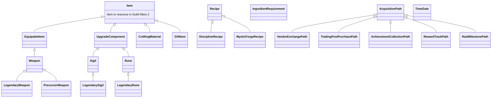

# Ontology & Controlled Vocabulary Reference Guide

This document serves as the formal data dictionary and quick-reference guide for all OWL classes, properties, SKOS concept schemes, and SHACL validation shapes in Project Priory.

---

## 1. Standard Namespace Prefixes

| Prefix | Full IRI URI | Description |
| :--- | :--- | :--- |
| `priory:` | `https://priory.gw2/def/` | Core OWL schema and ontology definitions |
| `priory-ref:`| `https://priory.gw2/ref/` | Base reference URI |
| `item:` | `https://priory.gw2/id/item/` | Game item individuals (keyed by GW2 API ID) |
| `recipe:` | `https://priory.gw2/id/recipe/` | Recipe transformation individuals |
| `currency:` | `https://priory.gw2/ref/currency/` | SKOS Currency & Token concepts |
| `discipline:`| `https://priory.gw2/ref/discipline/` | SKOS Crafting Discipline concepts |
| `weapon:` | `https://priory.gw2/ref/weapon/` | SKOS Weapon Type taxonomy |
| `upgrade:` | `https://priory.gw2/ref/upgrade/` | SKOS Upgrade Component taxonomy (Sigils/Runes) |
| `rarity:` | `https://priory.gw2/ref/rarity/` | SKOS Item Rarity hierarchy |
| `gamemode:` | `https://priory.gw2/ref/gamemode/` | SKOS Game Mode concepts |
| `skos:` | `http://www.w3.org/2004/02/skos/core#` | W3C Simple Knowledge Organization System |
| `sh:` | `http://www.w3.org/ns/shacl#` | W3C Shapes Constraint Language |

---

## 2. OWL 2 DL Class Hierarchy (`ontology/priory_core.ttl`)

---

## 3. Properties Reference

### Object Properties (Graph Relationships)

| Property | Domain | Range | Description |
| :--- | :--- | :--- | :--- |
| `priory:producesItem` | `priory:Recipe` | `priory:Item` | The output item produced by a recipe. |
| `priory:producedBy` | `priory:Item` | `priory:Recipe` | Inverse of `producesItem`. |
| `priory:hasIngredientRequirement` | `priory:Recipe` | `priory:IngredientRequirement` | Reified N-ary relation specifying an ingredient and count. |
| `priory:requiresItem` | `priory:IngredientRequirement` | `priory:Item` | The specific item required. |
| `priory:requiresCurrency` | `priory:VendorExchangePath` | `skos:Concept` | The currency needed for a vendor purchase. |
| `priory:acquiredVia` | `priory:Item` | `priory:AcquisitionPath` | Acquisition pathway for an item. |
| `priory:hasSubstituteSource` | `priory:Item` | `priory:AcquisitionPath` | Alternative acquisition method. |
| `priory:requiresDiscipline` | `priory:DisciplineRecipe` | `skos:Concept` | The crafting discipline required (e.g. `discipline:Weaponsmith`). |
| `priory:hasRarity` | `priory:Item` | `skos:Concept` | SKOS rarity tier (e.g. `rarity:Legendary`). |
| `priory:hasWeaponType` | `priory:Weapon` | `skos:Concept` | SKOS weapon type (e.g. `weapon:Greatsword`). |
| `priory:hasUpgradeType` | `priory:UpgradeComponent`| `skos:Concept` | SKOS upgrade type (`upgrade:Sigil`, `upgrade:Rune`). |
| `priory:hasTimeGate` | `priory:AcquisitionPath` | `priory:TimeGate` | Cooldown or time constraint associated with path. |

---

### Datatype Properties (Literals & Coordinates)

| Property | Domain | Range | Description |
| :--- | :--- | :--- | :--- |
| `priory:gw2Id` | `priory:Item` | `xsd:integer` | Official ArenaNet API item/recipe integer ID. |
| `priory:chatCode` | `priory:Item` | `xsd:string` | In-game chat link code (e.g. `[&AgErZgAA]`). |
| `priory:requiredQuantity` | `priory:IngredientRequirement`| `xsd:integer` | Exact integer quantity required. |
| `priory:outputQuantity` | `priory:Recipe` | `xsd:integer` | Number of items produced per craft. |
| `priory:requiresRating` | `priory:DisciplineRecipe` | `xsd:integer` | Discipline skill level (0 to 500). |
| `priory:isAccountBound` | `priory:Item` | `xsd:boolean` | Whether item cannot be traded on the Trading Post. |
| `priory:vendorNPC` | `priory:VendorExchangePath` | `xsd:string` | Name of the vendor NPC (e.g. `"Faction Provisioner"`). |
| `priory:zoneName` | `priory:VendorExchangePath` | `xsd:string` | In-game Map/Zone name (e.g. `"Black Citadel"`). |
| `priory:waypointName` | `priory:VendorExchangePath` | `xsd:string` | Name of nearest waypoint (e.g. `"Junker's Waypoint"`). |
| `priory:nearestWaypoint` | `priory:VendorExchangePath` | `xsd:string` | In-game waypoint chat code (e.g. `[&BKgDAAA=]`). |

---

## 4. SKOS Reference Vocabularies (`gw2-priory-ref/vocab/`)

| File | Concept Scheme | Top Concepts | Key Notations (API IDs) |
| :--- | :--- | :--- | :--- |
| `currencies.ttl` | `currency:CurrencyScheme` | Coin, Karma, SpiritShard, ProvisionerToken, AstralAcclaim, FractalRelic, MagnetiteShard, ImperialFavor, RiftEssences | `35` (Provisioners), `68` (Vault), `23` (Spirit Shards), `2` (Karma) |
| `weapon_types.ttl` | `weapon:WeaponTypeScheme` | TwoHandedWeapon, OneHandedWeapon, OffHandWeapon, AquaticWeapon | Hierarchical: Greatsword, Hammer, Staff, Sword, Dagger, Axe |
| `disciplines.ttl` | `discipline:DisciplineScheme` | Weaponsmith, Armorsmith, Leatherworker, Tailor, Jeweler, Artificer, Huntsman, Chef, Scribe | Max level `500` (Weapons/Armor/Artificer), `400` (Jeweler/Chef) |
| `upgrade_types.ttl` | `upgrade:UpgradeTypeScheme`| Sigil, Rune | Upgrades slotted into weapons & armor |
| `rarities.ttl` | `rarity:RarityScheme` | Legendary, Ascended, Exotic, Rare, Masterwork, Fine, Basic, Junk | Hierarchical subsumption |
| `game_modes.ttl` | `gamemode:GameModeScheme` | PvE, OpenWorld, Fractals, Raids, Strikes, WvW, PvP | Game mode classifications |

---

## 5. SHACL Validation Shapes (`ontology/priory_shacl.ttl`)

| Shape Name | Target Class | Enforced Rules |
| :--- | :--- | :--- |
| `priory:ItemShape` | `priory:Item` | Must have `rdfs:label`, `priory:gw2Id >= 1`, and `priory:hasRarity` pointing to a valid SKOS IRI. |
| `priory:RecipeShape` | `priory:Recipe` | Must have exactly one `producesItem` IRI and `outputQuantity >= 1`. |
| `priory:IngredientRequirementShape` | `priory:IngredientRequirement` | Must have `requiredQuantity >= 1` and `requiresItem` IRI. |
| `priory:DisciplineRecipeShape` | `priory:DisciplineRecipe` | Must specify `requiresDiscipline` IRI and `requiresRating` integer between `0` and `500`. |
| `priory:VendorExchangePathShape` | `priory:VendorExchangePath` | Must have `requiresCurrency` IRI and `requiredQuantity >= 1`. |
