# Comprehensive Domain Analysis & Master Specification: Twilight, Dusk, The Eternity Loop & Semantic Progression Graph Architecture

**Document Version:** 4.0.0 — Master Specification  
**Domain Focus:** Guild Wars 2 — Generation 1 Legendary Greatsword *Twilight* (Item ID: `30704`), Precursor *Dusk* (Item ID: `29185`), 4-Pillar Staging Protocol & Final Assembly Checklist, The Complete Eternity Loop & Mathematical Arbitrage Engine, Trading Post Fee Structure & Skin Retention Mechanics, Legendary Armory Binding Rules, Precursor Collections (Dusk I, II, III), Core Tyria 100% Map Completion Meta (2026), 2x Gift of Exploration Multi-Character Pipelines, VIP Lounge Landscape & Teleport Anchors, Complete Gem Store & In-Game Convenience Ecosystem, Daily Converter Exchange Networks (LEMC, Karmic Converter, Gleam of Sentience, Ascended Gobblers), Portal Tome Ergonomics, Salvage Yield Models, Booster Registry & Gobbler Animation Cancels, Formal OWL 2 DL Ontology Architecture (TBox OWL Classes vs. SKOS Concept Schemes vs. ABox NamedIndividuals), and Codified Neuro-Symbolic Solver Rules.  
**Target Audience:** Priory Neuro-Symbolic Solver Architects, Semantic Engineers, Knowledge Graph Designers, and High-Efficiency Players.

---

## 1. Executive Summary & Architecture Overview

The creation of the Generation 1 Legendary Greatsword **Twilight** represents the gold standard of multi-layered progression journeys in *Guild Wars 2*. The acquisition graph encompasses four primary pillars:
1. **Pillar 1: The Precursor (Dusk — Item ID: `29185`)** — Acquired via direct Trading Post purchase, Grandmaster Hobbs' 3-Tier Precursor Crafting Collections, the Wizard's Vault Legendary Weapon Starter Kit, or Mystic Forge RNG promotion.
2. **Pillar 2: Gift of Mastery (Item ID: `19674`)** — 100% Core Tyria World Completion (1x Gift of Exploration), World vs. World (Gift of Battle), 250 Obsidian Shards, and 200 Spirit Shards (Bloodstone Shard).
3. **Pillar 3: Gift of Fortune (Item ID: `19626`)** — 77 Mystic Clovers, 250 Globs of Ectoplasm, Gift of Might (1,000 T6 Fine Trophies), and Gift of Magic (1,000 T6 Fine Trophies).
4. **Pillar 4: Gift of Twilight (Item ID: `19648`)** — Gift of Metal (Disciplines: Weaponsmith/Armorsmith 400), Gift of Darkness (100 Onyx Lodestones, Gift of Ascalon / 500 Tales of Dungeon Delving, Sigil of Force), 100 Icy Runestones (100g flat vendor cost), and 1 Superior Sigil of Force.

Beyond Twilight itself, a single completed map exploration run awards **two** Gifts of Exploration, naturally feeding into the **Post-Twilight Eternity Loop** where Twilight and Sunrise are combined in the Mystic Forge to forge **Eternity** (Item ID: `30689`). Under modern game mechanics, this loop provides either:
* **The Commercial Unbound Arbitrage Path:** Yielding $\approx +1,500\text{g} \text{ to } +1,750\text{g}$ net liquid profit while permanently retaining both the Twilight and Sunrise weapon skins in the account Wardrobe.
* **The Legendary Armory Tri-Mastery Path:** Unlocking all three legendary Greatsword skins and granting up to three concurrent legendary Greatsword armory slots across all characters on the account.

```mermaid
graph TD
    subgraph TwilightNode ["Legendary Weapon: Twilight (ID: 30704)"]
        Dusk["Pillar 1: Precursor Dusk (ID: 29185)"]
        GMast["Pillar 2: Gift of Mastery (ID: 19674)"]
        GFort["Pillar 3: Gift of Fortune (ID: 19626)"]
        GTwi["Pillar 4: Gift of Twilight (ID: 19648)"]
    end

    subgraph Pillar1 ["Pillar 1: Precursor Vectors"]
        WV["Wizard's Vault Starter Kit (0g / 1,200 AA)"] --> Dusk
        TP["Trading Post Direct Buy (~320g - 380g)"] --> Dusk
        Hobbs["Grandmaster Hobbs Collections (I, II, III)"] --> Dusk
        MF["Mystic Forge Greatsword Promotion (~2% RNG)"] --> Dusk
    end

    subgraph Pillar2 ["Pillar 2: Gift of Mastery"]
        GExp["Gift of Exploration (ID: 19677) (100% Core Tyria)"] --> GMast
        GBat["Gift of Battle (ID: 19678) (WvW Reward Track)"] --> GMast
        Obs250["250x Obsidian Shards (Karma/SW/Magic/Converters)"] --> GMast
        BldS["Bloodstone Shard (ID: 20797) (200 Spirit Shards)"] --> GMast
    end

    subgraph Pillar3 ["Pillar 3: Gift of Fortune"]
        Clov["77x Mystic Clovers (ID: 19675) (Forge / Vault / Fractals)"] --> GFort
        Ect250["250x Globs of Ectoplasm (ID: 19721)"] --> GFort
        GMig["Gift of Might (ID: 19672) (250x Claws, Bones, Fangs, Scales)"] --> GFort
        GMag["Gift of Magic (ID: 19673) (250x Blood, Venom, Totems, Dust)"] --> GFort
    end

    subgraph Pillar4 ["Pillar 4: Gift of Twilight"]
        GMet["Gift of Metal (ID: 19621) (Mithril, Ori, Darksteel, Plat)"] --> GTwi
        GDark["Gift of Darkness (ID: 19631) (Ascalonian Delving + Onyx Lodes)"] --> GTwi
        Icy["100x Icy Runestones (ID: 19676) (100g Flat Vendor)"] --> GTwi
        Sig["Superior Sigil of Force (ID: 24615)"] --> GTwi
    end

    subgraph PostTwilight ["Post-Twilight Eternity Pipeline"]
        TwilightNode --> EternityForge["Mystic Forge: Twilight + Sunrise + Dust + Stones"]
        SunriseNode["Sunrise (Gift of Exploration #2)"] --> EternityForge
        EternityForge --> Eternity["Eternity (ID: 30689)"]
    end
```

---

## 2. Core Tyria Map Completion Optimization & 2026 Routing Meta

Core Tyria Map Completion awards **2x Gift of Exploration** (Item ID: `19677`) per character. Achieving 100% completion requires discovering all objectives across **31 zones** (6 Capital Cities + 25 Explorable Zones).

```
Total Core Tyria Objectives:
├── 303 Waypoints
├── 517 Points of Interest (POIs)
├── 266 Vistas
├── 175 Renown Hearts
└── 67 Hero Points (All 1-point challenges)
Total: ~1,328 map milestones
```

> [!NOTE]
> **Excluded Zones:** Southsun Cove, Dry Top, The Silverwastes, all Living World zones, Expansion zones (HoT, PoF, EoD, SotO, JW), WvW Borderlands/EBG, and Edge of the Mists do NOT count towards Core Tyria Map Completion.

### 2.1 The 31 Required Zones Breakdown

| Region | Count | Zones & Level Brackets | Total Hearts | Regional Traversal Profile |
|---|---|---|---|---|
| **Capital Cities** | 6 | Lion's Arch, Divinity's Reach, Black Citadel, Rata Sum, The Grove, Hoelbrak | **0** | Pure speedrun (100% swiftness/mounts), dense POI/Vista clusters. |
| **Ruins of Orr** | 3 | Straits of Devastation (70-75), Malchor's Leap (75-80), Cursed Shore (80) | **0** | **Zero Renown Hearts!** High elevation points allow continuous Griffon supersonic gliding. |
| **Maguuma Jungle** | 5 | Caledon Forest (1-15), Metrica Province (1-15), Brisban Wildlands (15-25), Sparkfly Fen (55-65), Mount Maelstrom (60-70) | 48 | Dense verticality, multilevel Asuran structures, swamp canopies. Skyscale wall launch dominant. |
| **Shiverpeaks** | 6 | Wayfarer Foothills (1-15), Snowden Drifts (15-25), Lornar's Pass (25-40), Dredgehaunt Cliffs (40-50), Timberline Falls (50-60), Frostgorge Sound (70-80) | 44 | Towering peaks and long valleys. Griffon dive-boost from peak-to-peak saves 70% transit time. |
| **Ascalon** | 6 | Plains of Ashford (1-15), Diessa Plateau (15-25), Fields of Ruin (30-40), Blazeridge Steppes (40-50), Iron Marches (50-60), Fireheart Rise (60-70) | 43 | Wide-open flat plains interrupted by Brand scars. Roller Beetle sprints + Skyscale cliff scaling. |
| **Kryta** | 5 | Queensdale (1-15), Kessex Hills (15-25), Gendarran Fields (25-35), Harathi Hinterlands (35-45), Bloodtide Coast (45-55) | 40 | Densely packed Renown Hearts with extensive event chaining opportunities. |

---

### 2.2 Optimal Zone Sequencing Strategy (The "Hub-to-Rim" Route)

```mermaid
flowchart LR
    Phase0["Phase 0: 6 Capital Cities<br/>(~25-35 mins | 0 Hearts)"] --> Phase1["Phase 1: Ruins of Orr<br/>(~35-45 mins | 0 Hearts)"]
    Phase1 --> Phase2["Phase 2: Maguuma Jungle<br/>(~2.0-2.5 hrs | 48 Hearts)"]
    Phase2 --> Phase3["Phase 3: Shiverpeaks<br/>(~2.2-2.8 hrs | 44 Hearts)"]
    Phase3 --> Phase4["Phase 4: Ascalon<br/>(~2.0-2.5 hrs | 43 Hearts)"]
    Phase4 --> Phase5["Phase 5: Kryta<br/>(~1.8-2.2 hrs | 40 Hearts)"]
    
    style Phase0 fill:#e1f5fe,stroke:#0288d1,stroke-width:2px
    style Phase1 fill:#e8f5e9,stroke:#388e3c,stroke-width:2px
    style Phase5 fill:#fff3e0,stroke:#f57c00,stroke-width:2px
```

1. **Phase 0: Capital City Sweep (6 Maps, ~25-35 min total)**
   * *Order:* Rata Sum $\rightarrow$ The Grove $\rightarrow$ Divinity's Reach $\rightarrow$ Lion's Arch $\rightarrow$ Hoelbrak $\rightarrow$ Black Citadel.
   * *Strategy:* Complete 100% of cities immediately. No combat, no hearts. Yields 6 Transmutation Charges + 6 chances at Black Lion Chest Keys, while unlocking central waypoints to all major regional biomes.
2. **Phase 1: Ruins of Orr Fast Sweep (3 Maps, ~35-45 min total)**
   * *Order:* Straits of Devastation $\rightarrow$ Malchor's Leap $\rightarrow$ Cursed Shore.
   * *Rationale:* Orr has **0 Renown Hearts**. Launching from the Cathedral of Zephyrs or the high cliffs of Drowned Empire allows supersonic Griffon dives to clear 15-20 POIs and Vistas per minute. Completing Orr early provides massive psychological momentum and early map chest rewards.
3. **Phase 2: Maguuma Jungle Canopy Run (5 Maps, ~2.0-2.5 hours)**
   * *Order:* Caledon Forest $\rightarrow$ Metrica Province $\rightarrow$ Brisban Wildlands $\rightarrow$ Mount Maelstrom $\rightarrow$ Sparkfly Fen.
   * *Strategy:* Use Skyscale Wall Launch + Ley-Line Gliding to ignore multi-level laboratory z-axis puzzles. Complete jumping puzzles via mount elevation rather than walking puzzle paths.
4. **Phase 3: Shiverpeaks Ridge Glide (6 Maps, ~2.2-2.8 hours)**
   * *Order:* Wayfarer Foothills $\rightarrow$ Snowden Drifts $\rightarrow$ Lornar's Pass $\rightarrow$ Dredgehaunt Cliffs $\rightarrow$ Timberline Falls $\rightarrow$ Frostgorge Sound.
   * *Strategy:* Exploit massive vertical elevation differential. Climb mountain ridges on Skyscale, launch into Griffon Supersonic Dive, and sweep entire valleys in single continuous glides.
5. **Phase 4: Ascalon Plains Run (6 Maps, ~2.0-2.5 hours)**
   * *Order:* Plains of Ashford $\rightarrow$ Diessa Plateau $\rightarrow$ Fields of Ruin $\rightarrow$ Blazeridge Steppes $\rightarrow$ Iron Marches $\rightarrow$ Fireheart Rise.
   * *Strategy:* Roller Beetle along linear roads and flat plains; swap to Skyscale for the Dragonbrand crystal cliffs and Separatist forts.
6. **Phase 5: Kryta Regional Wrap (5 Maps, ~1.8-2.2 hours)**
   * *Order:* Queensdale $\rightarrow$ Kessex Hills $\rightarrow$ Gendarran Fields $\rightarrow$ Harathi Hinterlands $\rightarrow$ Bloodtide Coast.
   * *Strategy:* Complete the densely clustered village hearts. Finish in Bloodtide Coast to collect the 100% Core Tyria world completion reward popup.

---

### 2.3 Mount Dynamics & Elevation Exploitation Meta (2026)

| Mount / Tool | Optimal Use Case | Elevation & Speed Mechanics | Pro-Tip / Acceleration Trick |
|---|---|---|---|
| **Skyscale** | Vertical climbs, cliff perches, aerial combat | *Wall Launch* converts vertical walls into flight stamina reset. Hovering allows interacting with vistas without taking fall damage. | **Fireball Barrage (SotO/JW):** Destroy ambient heart mobs (rabbits, grubs, spiders) from the air without dismounting! |
| **Griffon** | Lateral cross-map supersonic travel | *Dive Boost* achieves maximum flight speed tier (135% speed). | **Mid-Air Swap:** Climb vertically with Skyscale, execute *Bond of Vigor* or Jade Bot Glider Boost $\rightarrow$ dismount in mid-air $\rightarrow$ mount Griffon $\rightarrow$ dive into supersonic glide. |
| **Roller Beetle** | Flatland sprints (Ascalon/Kryta) | Accelerates to top speed via drift boosts along paved roads and open plains. | Use *Roll* over small water bodies to skip swimming slow-downs. |
| **Raptor / Jackal** | Precision horizontal gap leaps | Fast horizontal dash; Jackal sand portals bypass locked fortress gates. | Raptor Engage Skill (*Tail Spin*) pulls all surrounding heart mobs into a tight cluster for instant 1-shot burst. |

---

### 2.4 Renown Heart & Hero Point Acceleration Tricks

* **In-Game Content Guide Configuration:** Set the Options menu `Content Guide` dropdown to **"Hide Events and Story"**. The minimap compass will strictly point to the closest unexplored POI, Vista, Heart, or Hero Point.
* **Blish HUD / TacO Routing:** Install the **Blish HUD Pathing Module** with **Tekkit's Workshop Map Completion Pack** or **Teh's Trails**. These overlays provide continuous, mathematically optimized single-line Euler paths that eliminate backtracking.
* **Heart Event Multiplier (3x - 5x Speedup):** Participating in dynamic events occurring within a heart boundary fills the progress bar 3x to 5x faster than killing individual ambient mobs. Always prioritize active event objectives.
* **Pre-Purchased Inventory Item Turn-Ins:** Several hearts accept gatherable or merchant items (e.g. Ash Legion weapon parts, rabbit feed, bundles). Keep relevant consumables in shared inventory to instantly complete hearts upon arrival.
* **Stealth Channeling (Zero Combat):** On Thief (Shadow Refuge / stealth dodge) or Mesmer (Mass Invisibility / Veil), enter stealth before interacting with long-channel objectives (beacons, debris, cages, hero challenge communes). Channel uninterrupted while enemies stand idle.
* **Hero Point Burst Skips:** All 67 Core Tyria Hero Points award 1 point. Avoid prolonged fights by running high-burst Power builds (Power Herald, Power Reaper, Power Mechanist, Power Willbender) that eliminate Veteran challenge targets in < 4 seconds.

---

## 3. The 2x Gift of Exploration Reward Loop & Multi-Character Pipelines

### 3.1 Economics of the 2x Gift of Exploration Loop

Every 100% Core Map Completion generates **2x Gift of Exploration** (Item ID: `19677`). Each Generation 1 Legendary Weapon consumes exactly **1x Gift of Exploration**. Thus, 1 Map Completion run fuels the creation of **2 Generation 1 Legendaries**.

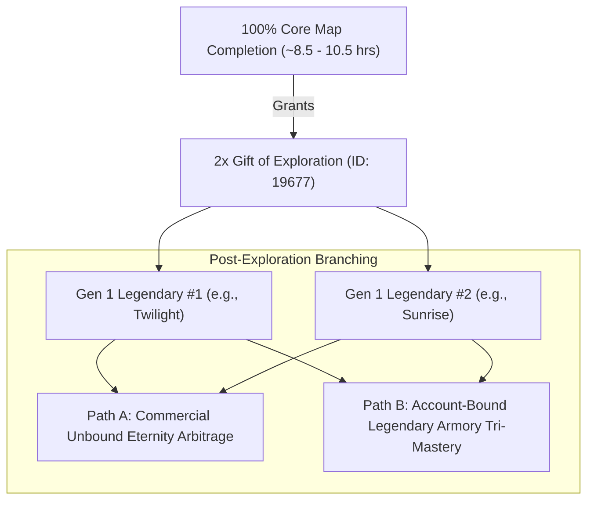

### 3.2 Veteran Multi-Character Crafting Pipeline Architecture

```
Pipeline Flow for Alt-Cycling Accounts:
[Level 80 Boost / 78x Tomes of Knowledge] 
    └── Equip Celestial/Power Exotic Gear + Mounts
        └── Run 8.5-Hour Optimized Map Completion Route
            └── Deposit 2x Gift of Exploration into Account Bank
                ├── Branch A: Dedicated Character -> Retain for Alt-Parking (Bjora/Echovald/Tomb)
                └── Branch B: Disposable Slot -> Bank Valuables & Recreate for Key Farming / Next Run
```

* **Account-Bound Portability:** `Gift of Exploration` (19677) and `Gift of Mastery` (19674) are strictly **Account Bound**, NOT Soulbound. They can be deposited directly into the Account Bank and withdrawn by characters with the required maxed crafting disciplines (Weaponsmith 500 / Armorsmith 400).
* **Direct Legendary Sell Margins:** Selling individual Gen 1 legendaries (Bolt, Bifrost, Incinerator, Twilight) yields an average net profit of **~450g - 700g per Gift of Exploration** (~900g - 1,400g per completed map run).

---

## 4. The Complete Post-Twilight Eternity Loop & Arbitrage Engine

The Generation 1 Greatsword pipeline features the most lucrative progression and economic engine in *Guild Wars 2*: the convergence of **Twilight** (Item ID: `30704`) and **Sunrise** (Item ID: `30703`) into the pinnacle Greatsword **Eternity** (Item ID: `30689`).

Because Core Tyria Map Completion awards **2x Gift of Exploration**, completing a single map exploration run provides the exact non-purchasable world completion materials required to craft both Twilight AND Sunrise on the same account.

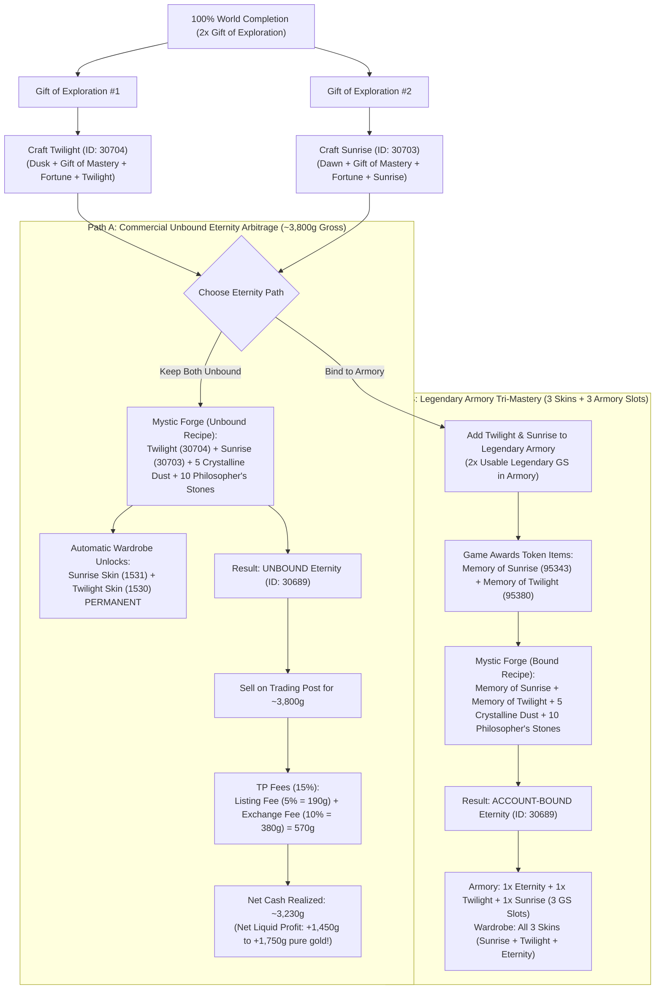

---

### 4.1 Mathematical Arbitrage Model & Trading Post Fee Structure

The Trading Post operates under a strict, non-negotiable two-tier fee schedule:
1. **Listing Fee (5%):** Charged immediately upfront upon placing a sell listing. This fee is **sunk** and non-refundable, even if the listing is canceled or underbid.
2. **Exchange / Transaction Fee (10%):** Deducted automatically from the gross payout when the item sells.
3. **Total Aggregate Cut (15%):** The seller receives exactly $85\%$ of the gross sale price.

$$\text{Net Liquid Gold Received} = \text{Gross Sale Price } (P) \times 0.85$$

$$\text{Net Arbitrage Profit } (\Delta_{\text{profit}}) = (P \times 0.85) - \left( \text{Cost}(\text{Twilight}) + \text{Cost}(\text{Sunrise}) + \text{Cost}(\text{Forge Catalysts}) \right)$$

#### Detailed Cost Accounting & Arbitrage Breakdown (2026 Meta Averages):

| Item / Process Step | Optimized Path (1x Starter Kit + TP Precursor) | Standard Path (2x TP Precursors) | Hobbs Collection Path (Crafted Precursors) |
|---|---|---|---|
| **Twilight Precursor (Dusk)** | **0.00g** (Wizard's Vault Starter Kit / 1,200 AA) | ~340.00g (Trading Post Buy Order) | ~210.00g (Mats + Hobbs vendor fees) |
| **Sunrise Precursor (Dawn)** | ~320.00g (Trading Post Buy Order) | ~320.00g (Trading Post Buy Order) | ~200.00g (Mats + Hobbs vendor fees) |
| **2x Gift of Mastery** | **0.00g** (2x Map Comp, 2x WvW, 400 Spirit Shards, 500 Obsidian) | **0.00g** | **0.00g** |
| **2x Gift of Fortune** (154 Clovers, 500 Ectos, 2x Might, 2x Magic) | ~880.00g (with Vault clovers & core promotions) | ~960.00g | ~960.00g |
| **1x Gift of Twilight** (Metal + Darkness + 100 Icy Runestones + Sigil) | ~145.00g (Gift of Metal included in Starter Kit!) | ~170.00g | ~170.00g |
| **1x Gift of Sunrise** (Metal + Light + 100 Icy Runestones + Sigil) | ~170.00g | ~170.00g | ~170.00g |
| **Catalysts (5 Crystalline Dust + 10 Stones)** | ~1.50g | ~1.50g | ~1.50g |
| **Total Sunk Crafting Investment** | **~1,516.50 Gold** | **~1,961.50 Gold** | **~1,711.50 Gold** |
| **Gross Trading Post Sale Price ($P$)** | **3,800.00 Gold** | **3,800.00 Gold** | **3,800.00 Gold** |
| **Upfront Listing Fee (5%)** | -190.00 Gold | -190.00 Gold | -190.00 Gold |
| **Exchange Fee upon Sale (10%)** | -380.00 Gold | -380.00 Gold | -380.00 Gold |
| **Net Liquid Payout ($0.85 \times P$)** | **3,230.00 Gold** | **3,230.00 Gold** | **3,230.00 Gold** |
| **Net Arbitrage Cash Profit** | **+1,713.50 Pure Gold** | **+1,268.50 Pure Gold** | **+1,518.50 Pure Gold** |
| **Wardrobe Cosmetics Unlocked** | **Twilight Skin + Sunrise Skin** | **Twilight Skin + Sunrise Skin** | **Twilight Skin + Sunrise Skin** |

> [!TIP]
> **Mathematical Proof of Superiority Over Selling Individual Greatswords:**
> * Selling Twilight alone on TP: Gross ~1,900g $\rightarrow$ Net ~1,615g (Profit: ~750g). Sunk: 1x Gift of Exploration. Skin unlocked: **0 skins** (must remain unbound to sell).
> * Selling Sunrise alone on TP: Gross ~1,850g $\rightarrow$ Net ~1,572.5g (Profit: ~700g). Sunk: 1x Gift of Exploration. Skin unlocked: **0 skins**.
> * Combined Individual Sale: Net **3,187.5g** | Combined Profit: **~1,450g** | **0 Skins Retained**.
> * **The Eternity Arbitrage Loop:** Net **3,230.0g** | Combined Profit: **~1,713.5g** (+263.5g higher!) | **2 Legendary Greatsword Skins Permanently Retained!**

---

### 4.2 Wardrobe Skin Retention Mechanics (The "Skin Harvest" Protocol)

In *Guild Wars 2*, combining two base legendary greatswords in the Mystic Forge executes a unique game state transaction:
1. **Mystic Forge Consumption Trigger:** When physical unbound *Twilight* and physical unbound *Sunrise* are placed into the Mystic Forge and the "Forge" button is clicked, the engine registers both weapons as consumed.
2. **Instant Account Wardrobe Registration:** The consumption of an item of Legendary rarity automatically binds the corresponding skins (`Twilight` - Skin ID: `1530`, `Sunrise` - Skin ID: `1531`) to the account's permanent Wardrobe.
3. **Unbound Output Item Generation:** The resulting item produced by the forge is **Eternity (Item ID: `30689`)**, which enters the inventory in a completely **UNBOUND** state.
4. **Cosmetic Asset Harvest Summary:** The crafter permanently retains the full cosmetic functionality of Twilight (dark cosmic aura, footfalls, blade trail) and Sunrise (celestial solar aura, light footfalls) to transmute onto any weapon on their account forever, while holding a 3,800g tradeable commodity.
5. **The Eternity Skin Exception:** Only the specific hybrid *Eternity skin* (which dynamically transitions between Sunrise by day and Twilight by night) remains locked until the player either binds Eternity to their Legendary Armory or buys/equips an Eternity.

---

### 4.3 Legendary Armory Binding Rules & Memory Tokens

With the release of the Legendary Armory system (July 13, 2021), ArenaNet introduced deterministic token exchange mechanics to eliminate the historical dilemma of choosing between armory utility and Eternity crafting.

#### The Armory Binding Protocol:
1. **Equipping / Depositing to Armory:**
   * When an account right-clicks an unbound *Twilight* or *Sunrise* and selects **"Add to Legendary Armory"** (or equips it), the physical weapon is consumed and permanently stored in the account-wide Legendary Armory (Item limit: 1 per weapon type for Gen 1s).
2. **Deterministic Memory Generation:**
   * Upon binding Twilight, the account immediately receives **`Memory of Twilight`** (Item ID: `95380`, chat link `[&AgFkbAAA]`).
   * Upon binding Sunrise, the account immediately receives **`Memory of Sunrise`** (Item ID: `95343`, chat link `[&AgFnbAAA]`).
   * *Note:* If a player bound Twilight/Sunrise prior to the update or misplaced the memory, the tokens can be reclaimed directly from **Grandmaster Hobbs** in Lion's Arch or the Legendary Armory vendor.
3. **Account-Bound Eternity Mystic Forge Recipe:**
   $$\text{Memory of Twilight} + \text{Memory of Sunrise} + 5\text{ Pile of Crystalline Dust} + 10\text{ Philosopher's Stone} \rightarrow \text{Account-Bound Eternity (ID: 30689)}$$
4. **Legendary Armory Tri-Mastery State:**
   * Adding the newly forged Account-Bound Eternity to the Legendary Armory results in:
     * **1x Eternity Slot** in the Armory.
     * **1x Twilight Slot** in the Armory.
     * **1x Sunrise Slot** in the Armory.
     * **Total Usable Legendary Greatswords:** Up to **3 Greatswords simultaneously** across any character on the account (e.g. dual-wielding Greatswords across weapon sets or equipping across 3 different characters simultaneously with zero transmutation charges).
     * **Wardrobe Unlocks:** All 3 skins (Sunrise + Twilight + Eternity) fully unlocked.

---

### 4.4 Comprehensive Master Decision Matrix

| Dimension | Path A: Commercial Unbound Arbitrage | Path B: Full Legendary Armory Tri-Mastery |
|---|---|---|
| **Input Greatswords** | Physical Unbound Sunrise + Physical Unbound Twilight | Bound Sunrise + Bound Twilight (via Armory) |
| **Intermediate Tokens** | None (Physical Weapons directly in Forge) | `Memory of Sunrise` (95343) + `Memory of Twilight` (95380) |
| **Mystic Forge Recipe** | `Sunrise` + `Twilight` + 5 `Dust` + 10 `Stones` | `Memory of Sunrise` + `Memory of Twilight` + 5 `Dust` + 10 `Stones` |
| **Resulting Eternity Item** | **UNBOUND Eternity** (Tradable on TP) | **ACCOUNT-BOUND Eternity** (Untradable) |
| **Wardrobe Skins Unlocked** | **Twilight Skin + Sunrise Skin** (2 Skins) | **Twilight Skin + Sunrise Skin + Eternity Skin** (All 3 Skins) |
| **Legendary Armory Slots** | 0 Armory Slots retained | **3 Usable Greatswords** (1 Twilight + 1 Sunrise + 1 Eternity) |
| **Gross TP Sale Value** | **~3,800 Gold** (3,600g - 4,200g market range) | 0 Gold |
| **Trading Post Fees (15%)** | Listing (5% = 190g) + Exchange (10% = 380g) = **-570g** | 0 Gold |
| **Net Liquid Gold Realized** | **~3,230 Gold** | 0 Gold |
| **Net Profit / Value Yield** | **+1,450g to +1,750g Pure Liquid Gold** | Infinite stat-swapping & build freedom across all alts |
| **Recommended Profile** | Gold-focused veterans, alt-cyclers, economy optimizers | Main-character perfectionists, multi-class raiders/WvWers |

---

## 5. The 4-Pillar Staging Protocol & Final Assembly Checklist

The fabrication of **Twilight** requires strict adherence to the **4-Pillar Staging Protocol**. Because intermediate gifts and crafting components involve high-value materials, dungeon currencies, and account-bound tokens, staging these items systematically in isolated inventory containers prevents catastrophic errors (such as accidental vendor sales, improper salvage kit usage, or premature Mystic Forge combines).

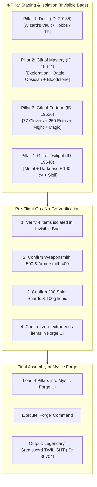

---

### 5.1 Pillar 1 Staging: Precursor Weapon (*Dusk* — ID: `29185`)

* **Target Item:** `Dusk` (Item ID: `29185`, chat link `[&AgE5HQAA]`).
* **Source Validation:**
  1. *Wizard's Vault Starter Kit:* Instant claim for 1,200 Astral Acclaim (Account Bound).
  2. *Grandmaster Hobbs Tier III Completion:* Crafted via Weaponsmith 500 (`Essence of Gloom` + `Spirit of Perfected Nightsword` + `Mirror` + `Dimensional Destabilizer`).
  3. *Trading Post Direct Purchase:* Delivered via TP Delivery Box (~340g buy order).
* **Forensic Verification Checklist:**
  * [ ] Verify item name is strictly **Dusk** (Exotic Greatsword, Level 80).
  * [ ] Ensure it is NOT an intermediate collection experiment (`Dusk Experiment` or `Perfected Nightsword`).
  * [ ] Ensure it is NOT a counterfeit lookalike skin (e.g. *Cobalt*, *Darkblade Greatsword*).
  * [ ] Move `Dusk` into **Slot 1 of Character's Invisible Bag / Safe Box**.

---

### 5.2 Pillar 2 Staging: *Gift of Mastery* (ID: `19674`)

* **Target Item:** `Gift of Mastery` (Item ID: `19674`, chat link `[&AgH6TAAA]`).
* **Intermediate Mystic Forge Recipe:**
  $$\text{Gift of Exploration} + \text{Gift of Battle} + 250\text{ Obsidian Shards} + \text{Bloodstone Shard} \rightarrow \mathbf{\text{Gift of Mastery}}$$
* **Component Verification & Pre-Requisites:**
  1. **1x Gift of Exploration** (Item ID: `19677`): Awarded from 100% Core Tyria Map Completion. Check character map panel ($303\text{ WPs}, 517\text{ POIs}, 266\text{ Vistas}, 175\text{ Hearts}, 67\text{ HPs}$).
  2. **1x Gift of Battle** (Item ID: `19678`): Awarded from final tier of WvW Gift of Battle Reward Track ($20,000\text{ points}$).
  3. **250x Obsidian Shards** (Item ID: `19925`): Sourced via Karma (525,000 Karma at Balthazar Temple / Ley-Energy Converter / Silverwastes bandit chests).
  4. **1x Bloodstone Shard** (Item ID: `20797`): Purchased from Miyani or Mystic Forge Attendant for **200 Spirit Shards**.
* **Staging Execution:**
  * Combine the 4 components in the Mystic Forge to yield `Gift of Mastery`.
  * Move `Gift of Mastery` into **Slot 2 of Character's Invisible Bag**.

---

### 5.3 Pillar 3 Staging: *Gift of Fortune* (ID: `19626`)

* **Target Item:** `Gift of Fortune` (Item ID: `19626`, chat link `[&AgHqTAAA]`).
* **Intermediate Mystic Forge Recipe:**
  $$77\text{ Mystic Clovers} + 250\text{ Globs of Ectoplasm} + \text{Gift of Might} + \text{Gift of Magic} \rightarrow \mathbf{\text{Gift of Fortune}}$$
* **Component Verification & Order-of-Operations Protocol:**
  1. **77x Mystic Clovers** (Item ID: `19675`):
     * *Order-of-Operations Rule:* **Roll all Mystic Clovers BEFORE buying T6 Fine Materials!** Failed Clover rolls in the Mystic Forge refund substantial quantities of T6 Blood, Bones, Claws, Dust, Fangs, Scales, Totems, and Venom.
  2. **250x Globs of Ectoplasm** (Item ID: `19721`): Sourced via Silver-Fed Salvage of Lv68+ Rare gear or direct TP purchase.
  3. **1x Gift of Might** (Item ID: `19672`):
     * Recipe: 250 Vicious Fangs (`24357`) + 250 Armored Scales (`24289`) + 250 Vicious Claws (`24351`) + 250 Ancient Bones (`24358`).
     * Combined in Mystic Forge.
  4. **1x Gift of Magic** (Item ID: `19673`):
     * Recipe: 250 Vials of Powerful Blood (`24295`) + 250 Powerful Venom Sacs (`24283`) + 250 Elaborate Totems (`24300`) + 250 Piles of Crystalline Dust (`24277`).
     * Combined in Mystic Forge.
* **Staging Execution:**
  * Combine Clovers + Ectoplasm + Gift of Might + Gift of Magic in the Mystic Forge to produce `Gift of Fortune`.
  * Move `Gift of Fortune` into **Slot 3 of Character's Invisible Bag**.

---

### 5.4 Pillar 4 Staging: *Gift of Twilight* (ID: `19648`)

* **Target Item:** `Gift of Twilight` (Item ID: `19648`, chat link `[&AgFACAAA]`).
* **Intermediate Mystic Forge Recipe:**
  $$\text{Gift of Metal} + \text{Gift of Darkness} + 100\text{ Icy Runestones} + \text{Superior Sigil of Force} \rightarrow \mathbf{\text{Gift of Twilight}}$$
* **Component Verification & Crafting Protocol:**
  1. **1x Gift of Metal** (Item ID: `19621`):
     * Crafting Discipline: Weaponsmith 400 or Armorsmith 400 (Recipe from Miyani for 10g).
     * Materials: 250 Mithril Ingots + 250 Orichalcum Ingots + 250 Platinum Ingots + 250 Darksteel Ingots.
     * *Note:* Included free in Wizard's Vault Twilight Starter Kit.
  2. **1x Gift of Darkness** (Item ID: `19631`):
     * Crafting Discipline: Armorsmith 400 (Recipe from Miyani for 10g).
     * Materials:
       * 1x **Gift of Ascalon** (Item ID: `19664`): Purchased from Historian Cerberus (Lion's Arch) or Dungeon Vendor for **500 Tales of Dungeon Delving** (Ascalonian Catacombs).
       * 100x **Onyx Lodestones** (Item ID: `24315`): Sourced via core promotion or TP buy orders.
       * 250x **Orichalcum Ingots** (Item ID: `19685`).
       * 1x **Superior Sigil of Force** (Item ID: `24615`).
  3. **100x Icy Runestones** (Item ID: `19676`):
     * Purchased strictly from **Riff** in Frostgorge Sound (`[&BIMCAAA=]`) or Master Craftsman vendors for **100.00 Gold flat** (1g per runestone; non-discountable).
  4. **1x Superior Sigil of Force** (Item ID: `24615`):
     * Sourced via Weaponsmith 400 crafting or Trading Post buy order.
* **Staging Execution:**
  * Combine Gift of Metal + Gift of Darkness + 100 Icy Runestones + Superior Sigil of Force in the Mystic Forge to yield `Gift of Twilight`.
  * Move `Gift of Twilight` into **Slot 4 of Character's Invisible Bag**.

---

### 5.5 The Industrial Final Assembly Pre-Flight Checklist (Go / No-Go Gates)

Before stepping up to the Mystic Forge, execute the following audit:

```
================================================================================
PRIORY PRE-FLIGHT INDUSTRIAL AUDIT CHECKLIST: TWILIGHT ASSEMBLY
================================================================================

[GATE 1: INVENTORY SAFETY & ISOLATION]
  [x] Character has an Invisible 20/24/32-Slot Bag equipped in bag slot #1.
  [x] Exactly the 4 required pillar items are placed into the Invisible Bag:
        ├── Slot 1: Dusk (Item ID: 29185)
        ├── Slot 2: Gift of Mastery (Item ID: 19674)
        ├── Slot 3: Gift of Fortune (Item ID: 19626)
        └── Slot 4: Gift of Twilight (Item ID: 19648)
  [x] Character inventory is cleared of any duplicate or experimental weapons.

[GATE 2: DISCIPLINE & CURRENCY AUDIT]
  [x] Weaponsmith discipline rating confirmed >= 400 (or 500 if Hobbs crafted).
  [x] Armorsmith discipline rating confirmed >= 400.
  [x] Spirit Shard wallet confirmed >= 200 (consumed for Bloodstone Shard).
  [x] Dungeon Delving currency confirmed >= 500 Tales (consumed for Ascalon).
  [x] Liquid Gold wallet confirmed >= 100g (consumed for Icy Runestones).

[GATE 3: FORGE EXECUTION PROTOCOL]
  [x] Travel to Mystic Forge (Mistlock Sanctuary, Armistice Bastion, or Lion's Arch).
  [x] Open Mystic Forge interaction window.
  [x] Select and load:
        1. Dusk
        2. Gift of Mastery
        3. Gift of Fortune
        4. Gift of Twilight
  [x] Verify the 'Forge' button turns GOLD/ACTIVE and output preview displays TWILIGHT.
  [x] Execute Click: FORGE!

[GATE 4: POST-CREATION ROUTING DECISION]
  [ ] ROUTE A (Commercial Eternity Arbitrage):
        - Keep Twilight UNBOUND.
        - Craft Sunrise (unbound) with Gift of Exploration #2.
        - Combine Sunrise + Twilight in Forge -> Yields UNBOUND Eternity.
        - Harvest Sunrise + Twilight skins permanently into Wardrobe.
        - List Eternity on TP for ~3,800g (Net Payout: ~3,230g).
  [ ] ROUTE B (Legendary Armory Tri-Mastery):
        - Add Twilight to Legendary Armory (unlocks skin + 1 Armory GS slot).
        - Receive 'Memory of Twilight' (Item ID: 95380).
        - Add Sunrise to Legendary Armory (receive 'Memory of Sunrise' ID: 95343).
        - Forge Memory of Twilight + Memory of Sunrise + 5 Dust + 10 Stones.
        - Yields Account-Bound Eternity (3 Greatswords in Armory + 3 Skins).
================================================================================
```

---

## 6. VIP Lounge Landscape, Spatial Density & The Instant-Return Teleport Anchor

VIP Lounges (Lounge Passes) provide high-density access to essential crafting, trading, banking, and mystic forging services. However, their structural utility for legendary crafting and map completion pipelines differs drastically based on their **map instance architecture** and **teleport memory mechanics**.

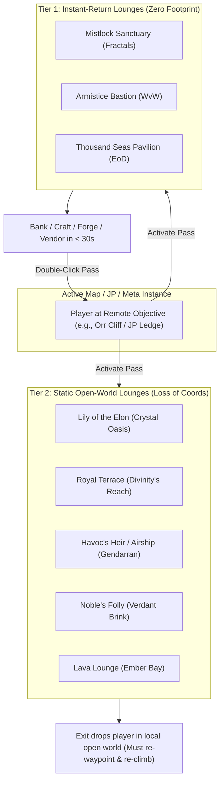

### 6.1 Complete VIP Lounge Master Comparison Matrix

| Lounge Name | Location / Expansion | Pass Item ID (Perm / 2-Wk) | "Return to Previous Location" Support? | Spawn-to-Forge Distance | Crafting Disciplines | Key Integrated Vendors & Unique Features |
|---|---|---|---|---|---|---|
| **Mistlock Sanctuary** | Fractals of the Mists | `83380` / `83410` | **YES (Double-click pass or portal)** | **~380 units (< 2.5s)** | **All 8 Disciplines** | **Fractal gate, BUY-2046 (2x daily cheap Clovers), BLING-9009, Dungeon exchange vendor, low-gravity Nova Launch travel.** |
| **Armistice Bastion** | World vs. World | `91291` / `91299` | **YES (Double-click pass or skill)** | **~420 units (< 3.0s)** | **All 8 Disciplines** | **WvW Team Chat access, Gift of Battle track vendor, Siege Master, Skirmish Supervisor, damage test golems, dueling pit.** |
| **Thousand Seas Pavilion** | End of Dragons / Cantha | `98042` / N/A | **YES (Double-click pass)** | **~450 units (< 3.2s)** | **All 8 Disciplines** | **Preserves Jade Tech Protocol buffs (Offensive/Defensive) and battery charges! Global fishing portals, underwater arena.** |
| **Lily of the Elon** | Crystal Oasis (PoF) | `81706` / N/A | **NO** (Exits to Free City of Amnoon) | ~650 units (~5.0s) | All 8 Disciplines | Included in PoF Deluxe/Ultimate. Direct access to Elonian bounties and casino blitz. |
| **Royal Terrace** | Divinity's Reach | `49149` / `49154` | **NO** (Exits to Divinity's Reach) | ~520 units (~4.0s) | All 8 Disciplines | Core Tyria city hub; quick access to Divinity's Reach festival portals. |
| **Havoc's Heir (Airship)** | Gendarran Fields | `49449` / `49453` | **NO** (Exits to Gendarran Fields) | ~580 units (~4.5s) | All 8 Disciplines | Airborne ship; cramped multi-tier navigation. |
| **Noble's Folly** | Verdant Brink (HoT) | `74996` / `75479` | **NO** (Exits to Verdant Brink canopy) | ~600 units (~4.5s) | All 8 Disciplines | Direct access to Heart of Thorns map vendors. |
| **Lava Lounge** | Ember Bay (LWS3) | `79668` / `79667` | **NO** (Exits to Ember Bay) | ~550 units (~4.2s) | All 8 Disciplines | Thermal tube launch integration. |
| **Champion's Rest** | Heart of the Mists (PvP) | `82701` / `82697` | **NO** (Exits to PvP Lobby) | ~480 units (~3.5s) | All 8 Disciplines | Requires PvP Tournament rank or glory vouchers. |

---

### 6.2 Why Mistlock Sanctuary & Armistice Bastion Are the Gold Standard

For high-efficiency legendary crafting and map completion pipelines, **Mistlock Sanctuary** and **Armistice Bastion** are the undisputed apex tier due to three architectural advantages:

1. **The Instant-Return Teleport Anchor:**
   * When navigating a multi-tier map (e.g. climbing Straits of Devastation cliffs or deep inside a jumping puzzle for Dusk III Gloom extraction), running out of inventory space, needing to refine 250 Mithril Ingots, or wanting to combine items in the Mystic Forge would normally require waypointing to a city, doing the task, paying waypoint silver, and repeating a 10-minute climbing traversal.
   * With Mistlock / Armistice, the player double-clicks the pass from their Shared Inventory Slot, appears in the lounge, deposits/crafts/forges in 20 seconds, and double-clicks the pass again to **materialize at the exact millimeter and z-axis altitude of their previous open-world spot**, with zero waypoint cost and zero lost progress.
2. **Radial Spatial Density:**
   * In Mistlock Sanctuary, the Bank, Mystic Forge, Trading Post, Guild Bank, and all 8 crafting stations are arranged in a compact concentric circle within ~400 units of the teleport spawn point. Traversal between crafting, banking, and forging takes under 3 seconds.
3. **Integrated Currency Pipelines:**
   * **Mistlock Sanctuary** houses **BUY-2046**, allowing the player to purchase their 2 daily discounted Mystic Clovers without leaving their crafting hub.
   * **Armistice Bastion** allows the player to monitor active WvW team chat, check map queue status, and purchase WvW provisions while processing legendary materials.

---

## 7. Salvage Yield Dynamics, Convenience Gizmos & Inventory Management Architecture

### 7.1 Salvage Engine Models & Exact Yield Formulas

Salvaging equipment in *Guild Wars 2* is a core economic engine that feeds Tier 6 materials, Globs of Ectoplasm, Lucent Motes, and Charms/Symbols into legendary crafting pipelines.

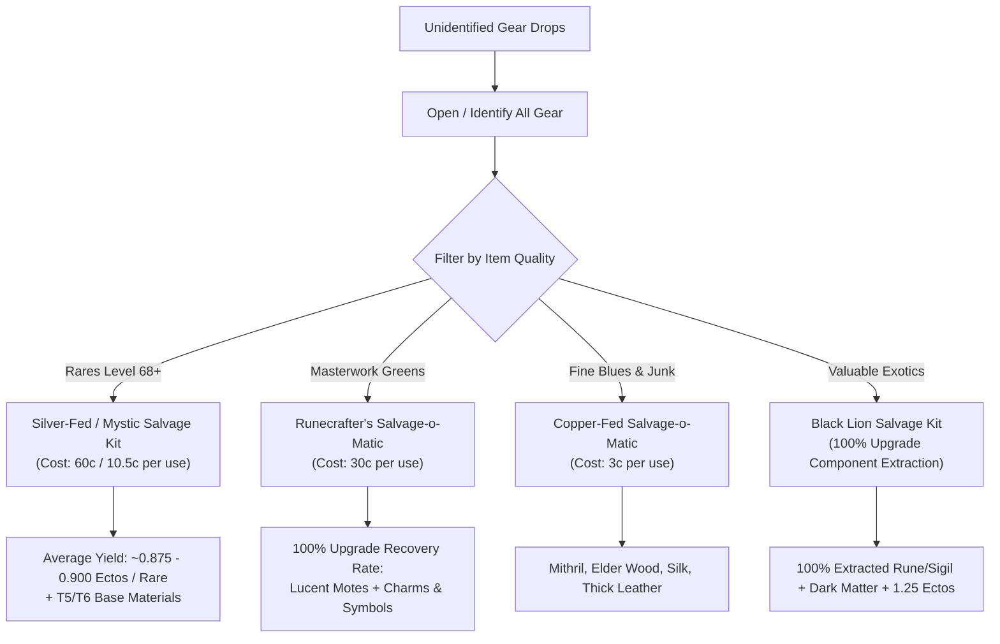

#### 1. Level 68+ Rare (Yellow) Salvaging & The Ectoplasm Formula
* **Required Kit Tier:** Master's Salvage Kit, Mystic Salvage Kit, or **Silver-Fed Salvage-o-Matic** (Item ID: `67040`).
* **Expected Value:**
  $$E[\text{Globs of Ectoplasm per Rare}] \approx \mathbf{0.875 - 0.900}$$
* **Probability Distribution (Empirical Dataset):**
  * 0 Ectoplasms: $\sim 43\%$
  * 1 Ectoplasm: $\sim 32\%$
  * 2 Ectoplasms: $\sim 19\%$
  * 3 Ectoplasms: $\sim 6\%$
* **Critical Trap:** Salvaging Level 68+ Rares with a *Copper-Fed Salvage-o-Matic* reduces the expected ectoplasm yield to $\sim 0.14$ Ectos/item (an **84% loss of ectoplasm value**). Never use basic/copper-fed kits on rare gear.

#### 2. Masterwork (Green) Salvaging & The Runecrafter's Formula
* **Optimal Kit:** **Runecrafter's Salvage-o-Matic** (Item ID: `89141`). Cost: 30 copper per salvage.
* **Mechanic:** Features a **100% chance to salvage upgrade components**. Minor and Major runes/sigils embedded in green gear are broken down into:
  * **Lucent Motes**
  * **Symbols** (Symbol of Control, Symbol of Enhancement, Symbol of Pain)
  * **Charms** (Charm of Brilliance, Charm of Potence, Charm of Skill)
* **Economic Arbitrage:** When Charm and Symbol prices are elevated on the Trading Post, salvaging greens with Runecrafter's generates **+18% to +35% higher profit** than Copper-Fed mass salvaging.

#### 3. Fine (Blue) & Common Gear
* **Optimal Kit:** **Copper-Fed Salvage-o-Matic** (Item ID: `67079`). Cost: 3 copper per salvage.
* **Mechanic:** Lowest operational cost for bulk reduction into Mithril, Elder Wood, Silk Scraps, and Thick Leather.

#### 4. Exotic (Orange) Gear & Black Lion Kits
* **Optimal Kit:** **Black Lion Salvage Kit** (Item ID: `19986`).
* **Mechanic:** **100% chance to extract upgrade components** intact without destroying them. 
* **Rule:** If an exotic item contains a Superior Rune or Sigil worth $\ge 1.50\text{ gold}$ (e.g. *Superior Sigil of Force*, *Superior Rune of the Scholar*), salvage strictly with a Black Lion Salvage Kit to recover the raw upgrade for direct legendary consumption or Trading Post sale.

---

### 7.2 Teleport-to-Friend (T2F) & The Meta Taxi Protocol

* **Recharging Teleport to Friend** (Item ID: `85240`): Infinite-use Gem Store gizmo with a 1-hour cooldown.
* **Consumable Teleport to Friend** (Item ID: `67377`): Single-use consumable awarded from daily login chests and Black Lion Chests.

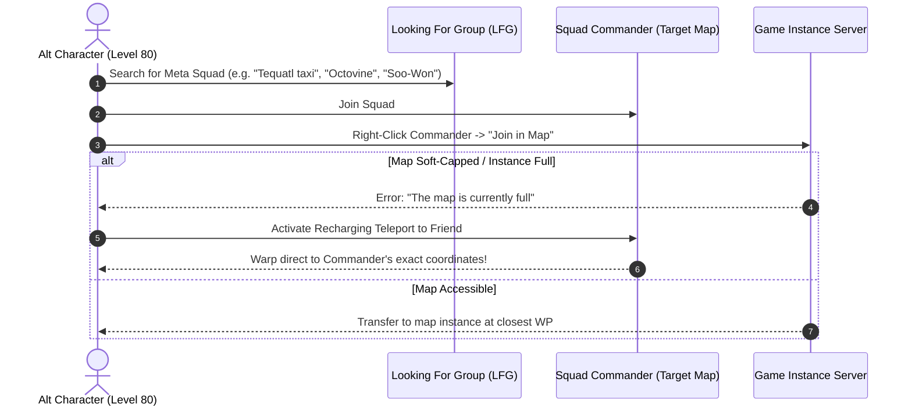

---

### 7.3 Material Storage Expansion & Bag Overflow Management Architecture

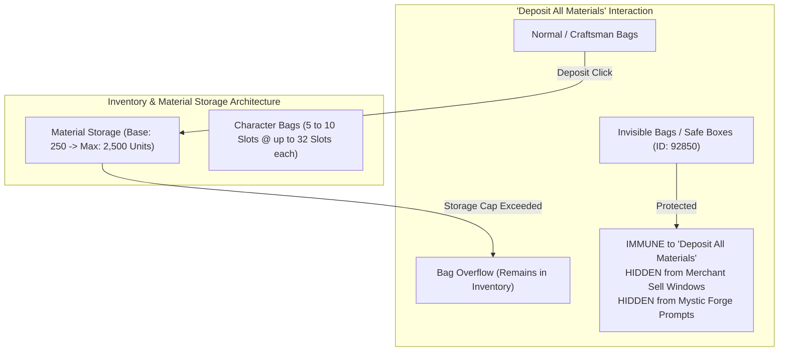

#### 1. Material Storage Scaling (Base 250 $\rightarrow$ 2,500 Max)
* Each **Storage Expander** (Item ID: `42970`) adds +250 capacity to every material slot across the entire account (up to 10 upgrades = 2,500 maximum stack limit).
* **Legendary Crafting Bottleneck:** Crafting Twilight requires 1,000 T6 trophies for the Gift of Might/Magic (250 each of 8 types), 250 Ectoplasms, 250 Mithril/Darksteel/Platinum/Orichalcum ingots. Accounts with only the base 250 storage cap experience severe inventory clogging during material accumulation. Expanding to at least **500 - 750 storage capacity** eliminates the need for mule characters.

#### 2. Bag Slot Progression & 32-Slot Options
* Characters can expand from 5 to 10 bag slots via **Bag Slot Expanders** (Item ID: `42971`).
* **High-Capacity 32-Slot Bag Options:**
  1. *32-Slot Boreal Bags* (Icebrood Saga / Bjora Marches): Crafted using Eternal Ice Shards and Eitrite Ingots.
  2. *32-Slot Olmakhan Bandolier* (Living World Season 4 / Sandswept Isles): Crafted via Difluorite Crystals and Supreme Runes of Holding.
  3. *32-Slot Reinforced Crafting Bags* (Standard 500 Tailor/Armorsmith/Leatherworker recipes).

#### 3. Invisible Bags & Legendary Crafting Safety Protocols
* **The Invisible Bag Rule:** Every character engaging in legendary precursor collections or Mystic Forge crafting MUST equip at least one **Invisible Bag** (or Safe Box / Olmakhan Safe Bag).
* **Guaranteed Safeguards of Invisible Bags:**
  * Items stored inside are **NOT deposited** when clicking "Deposit All Materials" in the inventory header.
  * Items stored inside are **NOT listed in Merchant sell tabs** (preventing catastrophic accidental vendor sales of precursors, legendary components, or expensive lodestones).
  * Items stored inside are **NOT auto-populated in Mystic Forge promotion panels**, preventing misclicks that destroy intermediate components.

---

## 8. Complete Booster Registry & Gobbler Transformation Mechanics

### 8.1 Master Booster Registry Table

| Booster / Item Name | GW2 Item ID | Rarity | Primary Effect & Multipliers | Stacking Behavior | Optimal Mode |
|---|---|---|---|---|---|
| **Heroic Booster** | `20005` | Exotic | +50% XP (all sources), +50% WvW Reward Track Progress, +50% PvP Reward Track Progress. | Stacks duration up to 24h. Combines XP + Item booster effects. | WvW Gift of Battle speedrun / Map leveling. |
| **Experience Booster** | `20002` | Rare | +50% XP (all sources), +50% WvW Reward Track, +50% PvP Reward Track. | Stacks duration up to 24h. Overwritten/merged by Heroic Booster. | General XP & WvW farming. |
| **Item Booster** | `20003` | Rare | +50% Magic Find, +50% Gathering Chance, +33% Gathering Speed, 10-second Swiftness on gather. | Stacks duration up to 24h. | Gathering routes / Map open-world sweeps. |
| **Black Lion Booster** | `82060` | Masterwork | +50% XP, +50% WvW/PvP Track, +50% Magic Find, +50% Gathering. | Stacks duration up to 24h. Stacks additively with Heroic Booster! | High-speed Gift of Battle farming. |
| **Celebration Booster** | `67836` | Masterwork | +10% WvW/PvP Track, +100% Magic Find, +100% XP from kills, +10% Karma, +10% Movement Speed. | Stacks duration up to 24h. Mutually exclusive with Birthday Booster. | Universal stacking baseline. |
| **Birthday Booster** | `45003` | Rare | +10% WvW/PvP Track, +100% Magic Find, +100% XP from kills, +10% Karma, +10% Movement Speed. | Stacks duration up to 24h. Functionally identical to Celebration Booster. | Long-term buff banking. |
| **WvW Reward Track Enrichment** | `87398` | Fine | +5% WvW Reward Track Progress. | Slotted into Ascended / Legendary Amulet enrichment slot. | Permanent passive WvW boost. |
| **Guild WvW Track Enhancement** | N/A | Buff | +10% WvW Reward Track Progress. | Purchased from Guild Tavern Bartender (Level 3-6 Tavern). Duration 24h. | Essential WvW prep buff. |
| **Hallow's Fortune Firework** | `89422` | Masterwork | +10% XP from all sources. | Stacks duration up to 2 hours. Stacks with all booster items! | Map completion XP acceleration. |
| **Lunar New Year Fireworks** | `69986` | Masterwork | +10% XP from all sources, +10% Magic Find. | Stacks duration up to 2 hours. | Festival buff stacking. |

---

### 8.2 Gobbler Mechanics & Transformation Animation Bypasses

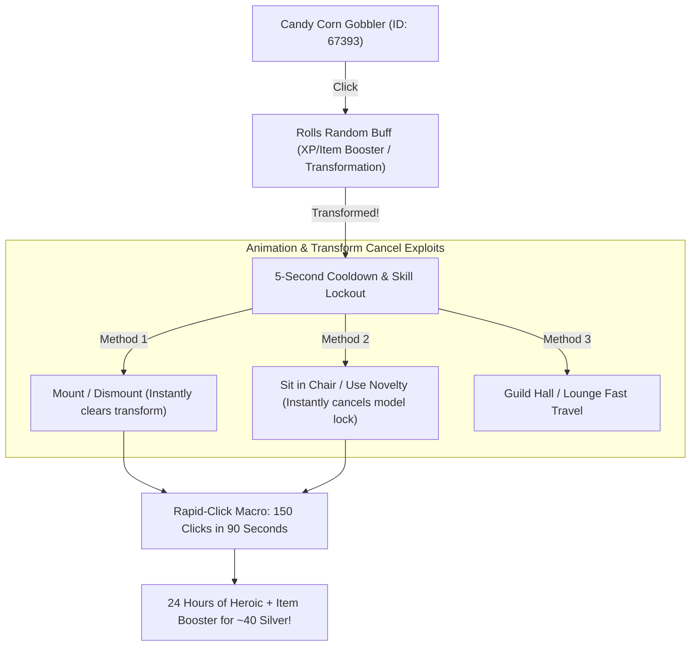

#### 1. Candy Corn Gobbler (Item ID: `67393`)
* **Cost:** 3 Piece of Candy Corn per activation.
* **Buff Pool:** Randomly grants 7 minutes of *Experience Booster*, *Item Booster*, *Speed Booster*, or transforms the player into Halloween costumes (Candy Corn Elemental, Skeleton, Mummy, Ghost).
* **The Transformation Problem:** Rolling a costume forces a 5-second internal animation cooldown and disables inventory clicks, making stacking 24 hours of buffs painfully slow (~45 minutes of manual clicking).
* **The Animation Cancel Exploits:**
  1. **Chair / Novelty Cancel Trick (Fastest):** Sit in any Chair Novelty or use an Endless Tonic while opening the inventory. Interacting with the chair instantly suppresses the transform animation without triggering the lockout, allowing **uninterrupted continuous clicking (100-200 clicks per minute)**.
  2. **Mount Cancel Trick:** Activate the Gobbler while mounted. The mount model suppresses costume transforms.
  3. **Cost Efficiency:** Consuming 1,500 Candy Corn (~40 silver) yields **18-24 hours of stacked Experience and Item Boosters**, saving tens of dollars in Gem Store booster purchases.

#### 2. Snowflake Gobbler (Item ID: `92585`)
* **Cost:** 5 Snowflakes per activation.
* **Effect:** Grants 15 minutes of *Blessing of the Snowflake* (+25% WvW Reward Track Progress, +25% PvP Reward Track, +25% XP from kills, +25% Magic Find).
* **Mechanics:** Clean consumption with zero transformation animations. Stacks duration up to 24 hours seamlessly.

#### 3. Zhaitaffy Gobbler (Item ID: `93704`)
* **Cost:** 25 Piece of Zhaitaffy per activation.
* **Effect:** Grants 15 minutes of *Dragon Festival Blessing* (+25% WvW Reward Track Progress, +25% PvP Reward Track, +25% XP, +25% Magic Find).
* **Mechanics:** Stacks duration up to 24 hours cleanly.

---

### 8.3 Maximum WvW Gift of Battle Speed Stacking Formula

The **Gift of Battle** (Item ID: `19678`) requires **20,000 WvW Reward Track Points** across 40 tiers.

$$\text{Points per Tick} = 195 \times \left(1 + \sum \text{Boost Multipliers}\right)$$

$$\text{Max Stacking Multiplier} = 1 + \underbrace{0.10}_{\text{Guild Tavern}} + \underbrace{0.50}_{\text{Heroic Booster}} + \underbrace{0.50}_{\text{Black Lion Booster}} + \underbrace{0.10}_{\text{Celebration Booster}} + \underbrace{0.05}_{\text{Enrichment}} = +125\%$$

$$\text{Boosted Rate} = 195 \times 2.25 = \mathbf{438.75\text{ points per 5-minute tick}}$$

* **Unboosted Time:** $20,000 / 195 \times 5\text{ min} = \mathbf{8.55\text{ hours}}$.
* **Max Boosted Time:** $20,000 / 438.75 \times 5\text{ min} = \mathbf{3.79\text{ hours}}$ (Over **55% time saved**).
* **Instant Skip:** Consuming **80x `Potion of WvW Rewards`** instantly awards 20,000 points (0 minutes).

---

## 9. Comprehensive Forensic Breakdown of Hobbs' Dusk Collections

To craft the precursor **Dusk** (Item ID: `29185`), the account must master Central Tyria: Legendary Crafting:
* **Tier 1:** *Revered Antiquarian* (1 Mastery Point, 1,016,000 XP)
* **Tier 2:** *Magister of Legends* (4 Mastery Points, 1,778,000 XP)
* **Tier 3:** *Historian of the Armaments* (7 Mastery Points, 2,540,000 XP)

---

### 9.1 Dusk Tier I: The Experimental Nightsword

* **Achievement ID:** `2420` | **Unlock Item:** `Twilight Vol. 1` (Item ID: `76846`, 5 gold + 10,003 Karma from Grandmaster Hobbs).
* **Reward:** `Chest of the End` (Item ID: `74838`), containing `Essence of the End` (Item ID: `71852`) and `Box of Recipes: Dusk (First Tier)`.

| # | Item Name | GW2 Item ID | Type | Zone / Map | Closest Waypoint | Trigger Mechanism & Event Specifics | Failure Mode & Solver Guardrail |
|---|---|---|---|---|---|---|---|
| 1 | **Final Sorrow** | `76644` | Trophy | Harathi Hinterlands | `[&BKUAAAA=]` Arca WP | Talk to Elise's ghost during `Protect Fen as he makes his way into the Bonerattler Caverns`. | **Timing Despawn Bug:** Elise only appears after Fen leaves her grave; despawns quickly if player runs out ahead. |
| 2 | **Malchor's Demise** | `71212` | Trophy | Malchor's Leap | `[&BB4CAAA=]` Pagga's WP | Cleanse or defend the Cathedral of Zephyrs (`Protect the Cathedral of Zephyrs`). | Minimum bronze participation required. Looted directly from end chest. |
| 3 | **Orr's Fall** | `72972` | Trophy | Straits of Devastation | `[&BO4CAAA=]` Rally WP | Complete Vizier's Tower jumping puzzle. | Spawns Veteran Risen Wizard; trophy drops from the Grand Chest. |
| 4 | **Ascalon's Searing** | `72431` | Trophy | Plains of Ashford | `[&BIABAAA=]` Ashford WP | Read about the fall of Ascalon at Shards of War monument. | **Dialogue Trap:** Player must click "Examine further" twice to receive credit. |
| 5 | **Scarlet's Demise** | `75711` | Trophy | Lion's Arch | `[&BBAEAAA=]` Trader's WP | Examine wreckage of the Breachmaker in Sanctum Harbor. | Underwater POI; interact prompt is under the turbine seabed hull. |
| 6 | **Marionette's Defeat**| `70908` | Trophy | Lornar's Pass | `[&BOkAAAA=]` False Lake WP | Examine wreckage of Scarlet's Twisted Marionette. | Prompt is under giant sword hilt on the vista climbing path. |
| 7 | **Reactor Meltdown** | `77184` | Trophy | Fractals of the Mists | Fort Marriner `[&BBAEAAA=]` | Thaumanova Reactor Fractal (Scale 1-100). | Drops from the final chest after slaying Thaumanova Anomaly. |
| 8 | **Aetherblade Downfall**| `73742` | Trophy | Fractals of the Mists | Fort Marriner `[&BBAEAAA=]` | Captain Mai Trin Boss Fractal. | Drops from the end reward chest after Mai Trin is defeated. |
| 9 | **Molten Collapse** | `72876` | Trophy | Fractals of the Mists | Fort Marriner `[&BBAEAAA=]` | Molten Boss Fractal. | Drops from end chest after Molten Berserker / Firestorm defeat. |
| 10 | **Nightmare's Legacy** | `76260` | Trophy | Kessex Hills | `[&BBIAAAA=]` Viathan WP | Defeat Champion Toxic Alchemist in Viathan Lake. | Spawns during Toxic Offshoot meta chain. Looted from corpse. |
| 11 | **Return to Depths** | `76591` | Trophy | Sparkfly Fen | `[&BMcBAAA=]` Ocean WP | Defeat Risen crew and sink pirate ship *Ash Horizon*. | Spawns during dynamic event `Sink the Ash Horizon`. |
| 12 | **Research Destruction**| `73401` | Trophy | Malchor's Leap | `[&BBcDAAA=]` Bauxite WP | Destroy Inquest facility at Bauxite Alchemicals. | Looted from the final lab chest of `Bashing Bauxite Alchemicals`. |
| 13 | **Ocean Supremacy** | `77094` | Trophy | Bloodtide Coast | `[&BKgBAAA=]` Laughinggull WP| Defeat World Boss Taidha Covington. | Fixed world boss timer (every 3 hours). Looted from boss chest. |
| 14 | **Overlord's Defeat** | `74649` | Trophy | Kessex Hills | `[&BBEAAAA=]` Overlord's WP | Defeat Champion Harathi Overlord. | Climax of Harathi assault on Overlord's Greatcamp. Loot from corpse. |
| 15 | **Modniir's Ruin** | `72104` | Trophy | Harathi Hinterlands | `[&BLEAAAA=]` Demetra WP | Defeat World Boss Modniir Ulgoth. | Multi-tier meta event chain. Looted from final chest. |

#### Crafting Phase: Dusk Experiment (Item ID: `75592`)
* **Discipline Rating:** Weaponsmithing 450.
* **Recipe Ingredients:**
  * 1x `Essence of the End` (Item ID: `71852`)
  * 1x `Experimental Nightsword Blade` (Item ID: `76994`) — Crafted: 15 Deldrimor Steel Ingots + 100 Memory of Battle + 100 Shard of Glory.
  * 1x `Experimental Nightsword Hilt` (Item ID: `72743`) — Crafted: 15 Deldrimor Steel Ingots + 100 Memory of Battle + 100 Shard of Glory.
  * 1x `Legendary Inscription` (Item ID: `73928`) — Crafted: 1 Elonian Leather Square + 1 Orichalcum Plated Dowel + 1 Glob of Ectoplasm.
* **Mandatory Action:** Salvage `Dusk Experiment` using any salvage kit to yield `Spirit of the Dusk Experiment` (Item ID: `73524`).

---

### 9.2 Dusk Tier II: The Perfected Nightsword

* **Achievement ID:** `2455` | **Unlock Item:** `Twilight Vol. 2` (Item ID: `75568`, 5 gold + 10,003 Karma from Hobbs).
* **Reward:** `Tricks and Tips for Advanced Nightsword Crafting` (Item ID: `72100`), containing `Expertise in Nightsword Crafting` (Item ID: `77089`) and `Box of Recipes: Dusk (Second Tier)`.

| # | Item Name | GW2 Item ID | Type | Acquisition Method | Exact Material & Currency Requirements |
|---|---|---|---|---|---|
| 1 | **Basic Mithril Requisition** | `75908` | Trophy | Trade to Master Weaponsmith | 250x Basic Mithril Greatswords (= 750 Mithril Ingots + 750 Elder Wood Planks). |
| 2 | **Art of Forging: Blade** | `75341` | Trophy | Trade to Master Weaponsmith | 10 Bronze, 10 Iron, 10 Steel, 10 Darksteel, 10 Mithril, 10 Orichalcum, and 5 Deldrimor Steel Greatsword Blades. |
| 3 | **Mithril Blade Requisition** | `74306` | Trophy | Trade to Master Weaponsmith | 250x Mithril Greatsword Blades (= 750 Mithril Ingots = 1,500 Mithril Ore). |
| 4 | **Weighted Nightsword Blade** | `76869` | Trophy | Craft (Weaponsmith 450) | 250 Mithril Ingots + 10 Deldrimor Steel Ingots + 10 Primordium + 10 Reagents. |
| 5 | **Art of Forging: Hilt** | `70991` | Trophy | Trade to Master Weaponsmith | 10 Bronze, 10 Iron, 10 Steel, 10 Darksteel, 10 Mithril, 10 Orichalcum, and 5 Deldrimor Steel Greatsword Hilts. |
| 6 | **Mithril Hilt Requisition** | `75676` | Trophy | Trade to Master Weaponsmith | 250x Mithril Greatsword Hilts (= 750 Mithril Ingots = 1,500 Mithril Ore). |
| 7 | **Balanced Nightsword Hilt** | `73252` | Trophy | Craft (Weaponsmith 450) | 250 Mithril Ingots + 100 Elder Wood Planks + 10 Deldrimor Steel Ingots. |
| 8 | **Superior Forging Tools** | `76464` | Trophy | Craft (Weaponsmith 450) | 250 Mithril Ingots + 100 Orichalcum Ingots + 10 Deldrimor Steel Ingots + 10 Reagents. |
| 9 | **Desert Magics: Nightsword** | `72571` | Trophy | Scholar Mossi (Lion's Arch) | 1,000x Bandit Crests (Silverwastes meta/chests). |
| 10 | **Jungle Magics: Nightsword** | `76727` | Trophy | Scholar Mossi (Lion's Arch) | 400x Geodes (Dry Top sandstorm meta/events). |
| 11 | **Old World Magics: Nightsword**| `72156` | Trophy | Scholar Mossi (Lion's Arch) | 100x Obsidian Shards (Karma / Silverwastes). |
| 12 | **Ancient Water Magics** | `76481` | Trophy | Scholar Mossi (Lion's Arch) | 100x Karka Shells (Southsun Cove farming / TP). |
| 13 | **Herbal Magics: Nightsword** | `74642` | Trophy | Scholar Mossi (Lion's Arch) | 25x Passion Flowers (Passiflora nodes / TP). |
| 14 | **Stabilizing Magics** | `77250` | Trophy | Scholar Mossi (Lion's Arch) | 25x Stabilizing Matrices (Fractal daily chests / TP). |
| 15 | **Twilight Vol. 2** | `75568` | Trophy | Grandmaster Hobbs | 5 gold + 10,003 Karma. |
| 16 | **Spirit of Dusk Experiment** | `73524` | Material | Salvage Tier 1 Weapon | Salvaged from `Dusk Experiment` (Item ID: `75592`). |

#### Crafting Phase: Perfected Nightsword (Item ID: `75618`)
* **Discipline Rating:** Weaponsmithing 450.
* **Recipe Ingredients:**
  * 1x `Expertise in Nightsword Crafting` (Item ID: `77089`)
  * 1x `Spirit of the Dusk Experiment` (Item ID: `73524`)
  * 1x `Jar of Luminesce Polish` (Item ID: `75316`) — Crafted: 250 Bloodstone Dust + 1 Amalgamated Gemstone + 10 Reagents + 10 Master Maintenance Oil.
  * 1x `Prismatic Lodestone` (Item ID: `73517`) — Crafted: 1 Glacial + 1 Molten + 1 Onyx + 1 Charged Lodestone.
* **Mandatory Action:** Salvage `Perfected Nightsword` to obtain `Spirit of the Perfected Nightsword` (Item ID: `73193`).

---

### 9.3 Dusk Tier III: Dusk

* **Achievement ID:** `2477` | **Unlock Item:** `Twilight Vol. 3` (Item ID: `71672`, 5 Spirit Shards + 10,003 Karma from Hobbs).
* **Key Gizmo:** `Gloominator` (Item ID: `75632`, Recipe: 1 Onyx Lodestone, 10 Obsidian Shards, 5 Quartz Crystals, 50 Platinum Ore, 25 Primordium). Must remain in inventory while traversing gloom sites.
* **Reward:** `Chest of Gloom` (Item ID: `76511`), containing `Essence of Gloom` (Item ID: `76379`) and `Box of Recipes: Dusk`.

| # | Gloom / Item Name | GW2 Item ID | Zone / Map | Waypoint & Coordinates | Extraction Requirements & Failure Modes |
|---|---|---|---|---|---|
| 1 | **Gloominator** | `75632` | Lion's Arch | Trader's Forum `[&BBAEAAA=]` | Gizmo must be kept in character inventory during all 27 gloom visits. |
| 2 | **Aquatic Murk** | `72003` | Fractals of the Mists | Fort Marriner `[&BBAEAAA=]` | Aquatic Ruins Fractal. Must have the **Luminous Plants path** (random instance roll). |
| 3 | **Swampy Gloom** | `70544` | Fractals of the Mists | Fort Marriner `[&BBAEAAA=]` | Swampland Fractal. In Bloomhunger's arena; does not require boss kill. |
| 4 | **Frozen Darkness** | `74590` | Fractals of the Mists | Fort Marriner `[&BBAEAAA=]` | Snowblind Fractal. Pitch-black blizzard forest after lighting bonfire. |
| 5 | **Jade Night** | `70530` | Fractals of the Mists | Fort Marriner `[&BBAEAAA=]` | Solid Ocean Fractal. In boss arena after Jade Maw defeat. |
| 6 | **Cavernous Gloom** | `71832` | Blazeridge Steppes | `[&BPUBAAA=]` Behem WP | Behem Gauntlet Jumping Puzzle. Inside final chest cavern. |
| 7 | **Pirates Darkness** | `75487` | Lion's Arch | `[&BDMEAAA=]` Farshore WP | Weyandt's Revenge JP. **Failure Mode:** Must step inside pitch-black spiked floor room; portal skipping to chest fails. |
| 8 | **Forsaken Gloom** | `77037` | Dredgehaunt Cliffs | `[&BFcCAAA=]` Wyrmblood WP| Forsaken Fortune mini-dungeon. Triggered after Veteran Fleshgrazer defeat. |
| 9 | **Obsidian Darkness** | `71983` | Obsidian Sanctum | WvW Panel -> Obsidian Sanctum | **Failure Mode:** In pitch-black dark maze corridor; portal skipping bypasses trigger volume. |
| 10 | **Spelunker's Dim** | `73931` | Caledon Forest | `[&BDUBAAA=]` Sleive's WP | Spelunker's Delve JP end chest ledge. |
| 11 | **Itlaocol's Gloom** | `73050` | Caledon Forest | `[&BMcAAAA=]` Falias Thorp WP| Tears of Itlaocol mini-dungeon. Solve floor dart puzzle. |
| 12 | **Grenth's Darkness** | `74297` | Cursed Shore | `[&BBcDAAA=]` Murdered Dreams| Cathedral of Silence. Uncontested: near Grenth statue; Contested: during Priest meta. |
| 13 | **Inky Blackness** | `76487` | Fireheart Rise | `[&BOcAAAA=]` Breaktooth WP | Inside boiling tar lake of Sloven Pitch. |
| 14 | **Tequatl's Gloom** | `72402` | Sparkfly Fen | `[&BNABAAA=]` Splintered Coast| World Boss Tequatl. Stand inside Tequatl's Watery Grave whirlpool during fight. |
| 15 | **Coil's Gloom** | `75026` | Timberline Falls | `[&BEgCAAA=]` Coil WP | Inside subterranean Inquest complex in Lair of the Coil. |
| 16 | **Tangled Darkness** | `76874` | The Silverwastes | `[&BIwHAAA=]` Hidden Depths | Center of Tangled Labyrinth. **Time Gate:** Only open for 15 minutes during Vinewrath Time Out. |
| 17 | **Crypt's Gloom** | `72989` | Gendarran Fields | `[&BOkAAAA=]` Provern Shore | Treasure chamber of Provernic Crypt mini-dungeon. |
| 18 | **Rhendak's Murk** | `74076` | Diessa Plateau | `[&BN4AAAA=]` Incendio WP | Font of Rhand mini-dungeon. Clear Incendio meta to open underwater gate. |
| 19 | **Mine's Darkness** | `76119` | Dry Top | `[&BIsHAAA=]` Prosperity WP | Inside Prosperity Mine cavern in Prospect Valley. |
| 20 | **Breach Copper Gloom**| `72020` | The Silverwastes | `[&BH8HAAA=]` Red Rock | Defeat or stand near Champion Mordrem Copper Husk in underground Breach. |
| 21 | **Cereboth Darkness** | `76020` | Kessex Hills | `[&BBIAAAA=]` Cereboth WP | Hidden cave behind waterfall in Cereboth Canyon (Cave Troll lair). |
| 22 | **Underworld Murk** | `74259` | Queensdale | `[&BPwAAAA=]` Swamplost WP | Defeat World Boss Shadow Behemoth in Godslost Swamp. Stand near portals. |
| 23 | **Captive Darkness** | `71386` | Fireheart Rise | `[&BOcAAAA=]` Breaktooth WP | Vexa's Lab mini-dungeon test subject cages in Sloven Pitch. |
| 24 | **Breach Iron Gloom** | `72953` | The Silverwastes | `[&BIcHAAA=]` Amber Sandfall | Stand near Champion Mordrem Iron Troll during The Breach. |
| 25 | **Breach Silver Gloom**| `72031` | The Silverwastes | `[&BIgHAAA=]` Indigo Cave | Stand near Champion Mordrem Silver Teragriff during The Breach. |
| 26 | **Breach Plat Gloom** | `76282` | The Silverwastes | `[&BIAHAAA=]` Blue Oasis | Stand near Champion Mordrem Platinum Thrasher during The Breach. |
| 27 | **Tribulation Gloom** | `75617` | Dredgehaunt Cliffs | `[&BGUCAAA=]` Sorrow's WP | Tribulation Caverns JP cavern beneath Tribulation Rift Scaffolding. |
| 28 | **Underground Dark** | `74538` | Fractals of the Mists | Fort Marriner `[&BBAEAAA=]` | Underground Facility Fractal in Champion Rabsovich's room. |
| 29 | **Twilight Vol. 3** | `71672` | Lion's Arch | Trader's Forum `[&BBAEAAA=]` | 5 Spirit Shards + 10,003 Karma from Grandmaster Hobbs. |
| 30 | **Spirit Perfected** | `73193` | Material | Salvaged Tier 2 Weapon | Obtained by salvaging `Perfected Nightsword` (Item ID: `75618`). |

#### Final Precursor Crafting: Dusk (Item ID: `29185`)
* **Discipline Rating:** Weaponsmithing 500 (Ascended).
* **Recipe Ingredients:**
  * 1x `Essence of Gloom` (Item ID: `76379`)
  * 1x `Spirit of the Perfected Nightsword` (Item ID: `73193`)
  * 1x `Mirror` (Item ID: `73291`) — Crafted Weaponsmith 500: 100 Mithril Ingots + 100 Silver Ingots + 10 Piles of Coarse Sand + 10 Reagents.
  * 1x `Dimensional Destabilizer` (Item ID: `73411`) — Crafted Weaponsmith 500: 5 Mystic Binding Agents (50g vendor / Miyani) + 10 Globs of Dark Matter + 5 Globs of Ectoplasm + 1 Vial of Condensed Mists Essence.

---

## 10. Economic Arbitrage & Currency Bottlenecks

### 10.1 Precursor Vector Comparison Matrix

| Acquisition Vector | Raw Gold Cost | Time Investment | Account-Bound Currency Impact | Risk / Variance | Recommended Persona |
|---|---|---|---|---|---|
| **Wizard's Vault Starter Kit** | **0.00 gold** | **5 minutes** | 1,200 Astral Acclaim (~10 days normal play) | Zero risk; seasonal rotation dependency. | **Optimal for 99% of players** owning SotO/JW. |
| **Trading Post Direct Purchase** | **~320 - 380 gold** | **Instant (0.1h)** | 0 currencies | Instant delivery; buy-order queue delays. | Gold-rich veterans / speedrunners. |
| **Grandmaster Hobbs Collections**| **~180 - 230 gold** | **30 - 45 hours** | 40,000 Karma, 12 Masteries, 1,000 Crests, 400 Geodes, 110 Obsidian, 10 Dark Matter | Contested metas, fractal RNG, jumping puzzles. | AP hunters, lore enthusiasts, solo purists. |
| **Mystic Forge Rare GS RNG** | **~250 - 450 gold** (EV)| **1 - 2 hours** | 0 currencies | **Extreme Variance:** ~0.79%-1.25% drop rate; can exceed 800g on bad streaks. | **Not recommended under any condition.** |

---

### 10.2 Intermediate Gifts & Currency Arbitrage Breakdown

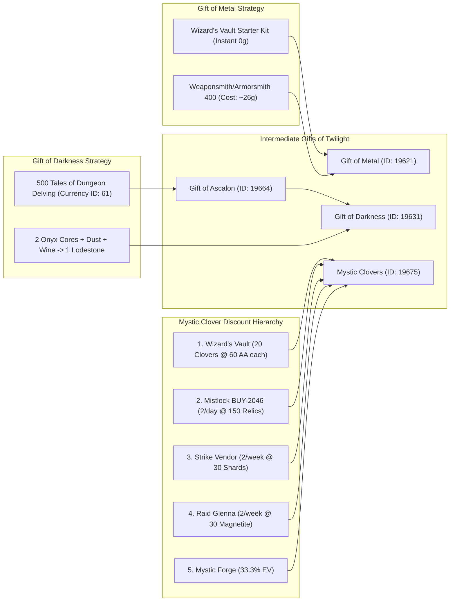

#### 1. Gift of Metal (Item ID: `19621`)
* **Recipe:** Weaponsmith 400 or Armorsmith 400 (Recipe costs 10g from Miyani).
  * 250 Mithril Ingots + 250 Orichalcum Ingots + 250 Darksteel Ingots + 250 Platinum Ingots.
* **Wizard's Vault Shortcut:** Included directly inside the **Legendary Starter Kit (Twilight Package)**, completely bypassing crafting and saving ~26g.

#### 2. Gift of Darkness (Item ID: `19631`)
* **Recipe:** Armorsmith 400 (Recipe costs 10g from Miyani).
  * 250 Orichalcum Ingots + 100 Onyx Lodestones + 1 Gift of Ascalon (Item ID: `19664`) + 1 Superior Sigil of Force.
* **Tales of Dungeon Delving (Wallet Currency ID: `61`):**
  * *Ascalonian Catacombs (AC):* Story + P1, P2, P3 yields 380+ Tales per daily run (~35 minutes).
  * *Dungeon Frequenter Achievement:* Clearing 8 unique dungeon paths awards 5 gold + 150 Tales of Dungeon Delving chest (repeatable indefinitely).
  * *Tyrian Defense Seals:* Exchanged 1:1 for Tales at Eye of the North vendor.
* **Onyx Lodestone Promotion Arbitrage Formula:**
  $$\text{Recipe: } 2\text{ Onyx Cores} + 1\text{ Pile of Crystalline Dust} + 1\text{ Bottle of Elonian Wine} + 1\text{ Philosopher's Stone} \rightarrow 1\text{ Onyx Lodestone}$$
  * *Arbitrage Condition:* Whenever $2 \times \text{Core Price} + 0.1 \times \text{Dust Price} + 0.25\text{g} < 0.85 \times \text{Lodestone Price}$, promoting cores in the Mystic Forge generates massive profit.

#### 3. Mystic Clovers (Item ID: `19675`) Deterministic Discount Hierarchy
1. **Wizard's Vault:** 20 cheap clovers per season (60 AA each = 1,200 AA total).
2. **Fractal Mistlock BUY-2046:** 2 clovers/day (150 Fractal Relics + 1 Mystic Coin + 1 Ecto + 2 Spirit Shards).
3. **Strike Mission Vendor (Crystal Bloom Quartermaster):** 2 clovers/week (30 Prophet Shards + 1 Coin + 1 Ecto + 2 Spirit Shards).
4. **Raid Vendor (Scholar Glenna):** 2 clovers/week (30 Magnetite Shards + 1 Coin + 1 Ecto + 2 Spirit Shards).
5. **Mystic Forge Fallback:** 1 Coin + 1 Ecto + 1 Obsidian Shard + 6 Philosopher's Stones (33.3% Clover drop rate, 66.7% T6 material byproduct refund).

---

## 11. The Complete GW2 Convenience Ecosystem & Converter Exchange Dynamics

The efficiency of high-throughput legendary crafting and multi-character account progression in *Guild Wars 2* is deeply anchored in permanent convenience infrastructure: **Permanent Account Contracts**, **Daily Converter Exchange Networks**, and **Consolidated Portal Tomes**.

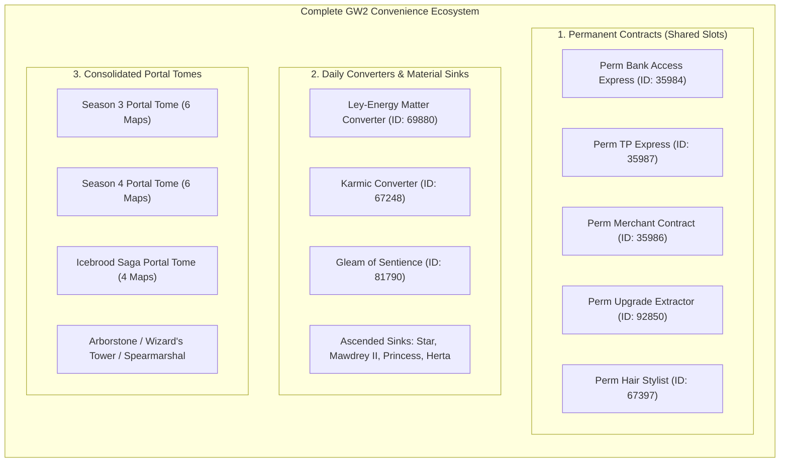

---

### 11.1 The Permanent Contract Ecosystem & Black Lion Drop Mechanics

Permanent contracts are tradeable, infinite-use account upgrades that simulate having full city services accessible anywhere in Tyria without entering loading screens or leaving map instances.

| Contract Name | Item ID | Functionality & In-Game Utility | BLC Drop Tier & Probabilities | Trading Post Price (2026 Meta) | Shared Slot Ergonomics |
|---|---|---|---|---|---|
| **Permanent Bank Access Express** | `35984` | Opens the entire Account Bank, Material Storage, and Wardrobe preview anywhere in combat-free terrain. | **Extremely Rare** (~0.01% - 0.03% / 1 in 3,000-10,000 chests) | **~2,200g - 2,800g** | Highest priority shared inventory item in the entire game. Eliminates 90% of hub visits. |
| **Permanent Trading Post Express** | `35987` | Spawns a personal Trading Post NPC or opens the Pick-Up / Delivery tab instantly anywhere. | **Extremely Rare** (~0.01% - 0.03%) | **~1,200g - 1,600g** | Essential for liquidating monster drops and claiming material buy-orders during crafting. |
| **Permanent Black Lion Merchant** | `35986` | Spawns a Black Lion Merchant that sells Basic Gathering Tools, Basic Salvage Kits, and buys vendor trash. | **Extremely Rare** (~0.02% - 0.04%) | **~750g - 950g** | Instant inventory trash liquidation and emergency salvage kit purchases during map sweeps. |
| **Permanent Upgrade Extractor** | `92850` | Infinite-use Upgrade Extractor. Safely removes Runes, Sigils, Infusions, and Enrichments without destroying gear or upgrades. | **Extremely Rare** (~0.005% - 0.01%) | **~3,800g - 5,200g** | Supreme value for Agony Infusions (+9 stat infusions) and expensive exotic upgrades ($>2\text{g}$). |
| **Permanent Hair Stylist Contract**| `67397` | Infinite access to the Total Makeover & Self-Style Hair Kit styling window. | **Extremely Rare** (~0.02% - 0.04%) | **~1,900g - 2,500g** | Vanity/roleplay convenience. Tradable on TP. |
| **Endless Repair Canister** | `86549` | Instant access to the armor repair dialogue anywhere. | Uncommon / Rare | **~15g - 25g** | Minor utility since armor repair costs 0 gold, but restores broken armor without visiting an anvil. |

#### Black Lion Chest Acquisition Mechanics & Economics:
1. **RNG Drop Probability:** Permanent contracts occupy the *Extremely Rare* drop table inside Black Lion Chests. Empirical drop rate analysis across hundreds of thousands of keys indicates an expected drop rate of $\mathbf{0.02\%}$ ($\approx 1 \text{ contract per 5,000 keys}$).
2. **Black Lion Statuettes:** Periodically, specific permanent contracts rotate into the Black Lion Statuette vendor (e.g. *Permanent Hair Stylist* for 100-150 Statuettes).
3. **Shared Inventory Slot ROI:** Storing the "Holy Trinity" (Bank Access + TP Express + Merchant Contract) across 3 Shared Inventory Slots provides instantaneous account-wide liquidity, reducing crafting turnaround times from 15 minutes to under 45 seconds.

---

### 11.2 Complete Converter Exchange Tables & Material Sinks

Converters transform excess account-bound map currencies, Karma, and Ascended crafting materials (Bloodstone Dust, Dragonite Ore, Empyreal Fragments) into liquid gold, Tier 6 fine materials, and Obsidian Shards.

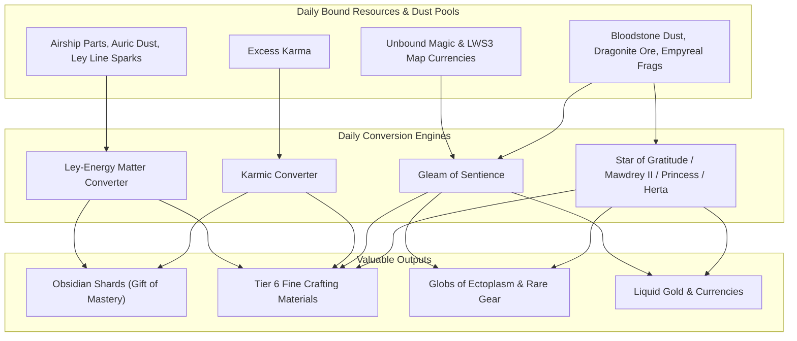

#### 1. Ley-Energy Matter Converter (LEMC — Item ID: `69880`)
* **Acquisition:** Complete the *Heart of Thorns* meta-achievement *"Characters of the Heart of Maguuma"* (Dragon's Stand / Mouth of Mordremoth victory).
* **Reset Schedule:** Server Daily Reset (00:00 UTC).
* **Master Exchange Architecture (4 Daily Tabs):**

| Tab # | Input Currency | Cost per Item | Daily Offerings (Randomized per Slot) | Optimal Pick / Priority Rule |
|---|---|---|---|---|
| **Tab 1: Verdant Brink** | **Airship Parts** | 25 Airship Parts | 1x Bag of Masterwork Gear, 1x Pact Scout's Mapping Material, 1x Obsidian Shard, 1x Heavy Crafting Bag, 1x Airship Key. | **1. Heavy Crafting Bag** (T6 mats)<br/>**2. Obsidian Shard** (Legendary prep)<br/>**3. Mapping Materials** (Karma/Gold) |
| **Tab 2: Auric Basin** | **Auric Dust** | 25 Auric Dust | 1x Exalted Key, 1x Obsidian Shard, 1x Heavy Crafting Bag, 1x Bag of Rare Gear, 1x Mote of Auric Dust. | **1. Heavy Crafting Bag**<br/>**2. Obsidian Shard**<br/>**3. Exalted Key** |
| **Tab 3: Tangled Depths**| **Ley Line Sparks** | 25 Ley Line Sparks | 1x Vial of Ley Line Sparks, 1x Obsidian Shard, 1x Heavy Crafting Bag, 1x Vial of Auric Dust, 1x Chak Acid. | **1. Heavy Crafting Bag**<br/>**2. Obsidian Shard**<br/>**3. Chak Acid** |
| **Tab 4: General HoT** | **Random HoT Currency** | 25 of selected currency | 1x Obsidian Shard, 1x Heavy Crafting Bag, 1x Bag of Rare Gear, 1x Pact Scout Mapping Material. | **1. Heavy Crafting Bag**<br/>**2. Obsidian Shard** |

* **Daily Strategy:** Always check all 4 tabs daily. Purchasing the discounted **Heavy Crafting Bags** across all tabs yields 4-12 Tier 6 crafting materials daily at near-zero opportunity cost.

---

#### 2. Karmic Converter (Item ID: `67248`)
* **Acquisition:** Complete the *Exalted Acceptance* achievement in Auric Basin (Heart of Thorns).
* **Reset Schedule:** Server Daily Reset (00:00 UTC).
* **Exchange Tabs & Economics:**

| Tab Name | Items Available | Karma Cost | Realized Market Value & Legendary Utility |
|---|---|---|---|
| **Tab 1: Daily Consumables** | **Heavy Crafting Bag** (1x)<br/>**Obsidian Shard** (1x)<br/>**Bag of Masterwork Gear** (1x) | 4,900 Karma<br/>4,900 Karma<br/>3,500 Karma | **Heavy Crafting Bag:** Yields 3x T6 Fine Mats (~75s - 1.20g value). ROI: ~20-25 copper/karma.<br/>**Obsidian Shard:** Bypasses Silverwastes/Balthazar Temple farming. |
| **Tab 2: Gathering & Bags** | **Heavy Miner's Bag** (1x)<br/>**Bag of Rare Gear** (1x)<br/>**Trade Contract Bundle** (1x) | 4,900 Karma<br/>7,000 Karma<br/>4,900 Karma | **Bag of Rare Gear:** 1x guaranteed Lv 70+ Rare gear (yielding ~0.875 Ectoplasm via Silver-Fed Salvage). |
| **Tab 3: Exotic & Trophies** | **Large Moldy Bag** (1x)<br/>**Heavy Ritual Bag** (1x) | 3,500 Karma<br/>4,900 Karma | Secondary T5/T6 leather and silk generation. |

---

#### 3. Gleam of Sentience (Item ID: `81790`) & LWS3 Sentient Gobblers
* **Acquisition:** Combined via Mystic Forge / Achievements from 4 Living World Season 3 Sentient items:
  1. *Sentient Aberration* (Item ID: `81855` — Bloodstone Fen)
  2. *Sentient Anomaly* (Item ID: `81777` — Lake Doric)
  3. *Sentient Destroyer* (Item ID: `81653` — Ember Bay)
  4. *Sentient Singularity* (Item ID: `81702` — Draconis Mons)
* **Dual Functionality:** Serves both as an **Ascended Dust Sink** (consumes Bloodstone Dust, Dragonite Ore, Empyreal Fragments) and a **Daily Unbound Magic Converter**.

##### The 4 Daily Purchases for Unbound Magic + Map Currencies:

| Item Name | Daily Purchase Cost | Contents & Economic Drops |
|---|---|---|
| **Sentient Seed** | 25 Unbound Magic + 50 Bloodstone Rubies | Yields: 3-5 Unbound Magic bundles, 2-4 T6 materials, Rare gear, Bloodstone materials. |
| **Sentient Root** | 25 Unbound Magic + 50 Petrified Wood | Yields: Unbound Magic, Dragonite/Bloodstone sinks, T6 fine trophies, Rare items. |
| **Sentient Sprout** | 25 Unbound Magic + 50 Jade Shards | Yields: Unbound Magic, Lodestones, Globs of Ectoplasm, Tier 6 crafting bags. |
| **Sentient Bloom** | 25 Unbound Magic + 50 Fire Orchids | Yields: High-tier crafting ingredients, Lodestones, rare armor, Unbound Magic refund. |

##### Daily Ascended Material Consumption (Dust / Ore / Fragment Sinks):
* Each individual Sentient component (or Gleam of Sentience) consumes **25 to 50 Ascended materials per click** up to a hard daily account cap of **150-300 units per material type**.
* Awards **Sentient Gift** containers yielding valuable T5/T6 fine trophies, lodestones, junk trophies (10s - 50s vendor value), and rare unidentified gear.

---

#### 4. Ascended Gobbler Master Comparison Matrix

| Gobbler Gizmo | Item ID | Material Consumed | Daily Consumption Cap | Primary Output Container | Key Loot & Legendary Value |
|---|---|---|---|---|---|
| **Star of Gratitude** | `67392` | **Empyreal Fragments** | 150 - 300 Fragments (3-6 clicks @ 50 ea) | `Gift from Mawdrey II / Star` | T6 Fine Mats, Rare Gear, Obsidian Shards, Spirit Shards, 50s Junk items. |
| **Mawdrey II** | `64585` | **Bloodstone Dust** | 150 - 250 Dust (3-5 clicks @ 50 ea) | `Gift from Mawdrey II` | T6 Trophies, Lodestones, Rare Gear, Empyreal conversion. |
| **Princess** | `73248` | **Dragonite Ore** | 150 - 250 Ore (3-5 clicks @ 50 ea) | `Box of Goods` | T6 Crafting Materials, Exotics, Rares, Ectoplasm feedstock. |
| **Herta** | `74726` | **Bloodstone Dust** | 250 Dust (1 click/day) | `Exalted Chest` | 1x Crystalline Ore, 1x Auric Sliver, Rare gear, T6 materials. |
| **Candy Corn Gobbler** | `67393` | **Piece of Candy Corn** | Unlimited (3 per click) | Direct Buffs | 7-min XP/Item/Speed Boosters (requires animation cancel). |
| **Snowflake Gobbler** | `92585` | **Snowflakes** | Unlimited (5 per click) | Direct Buffs | 15-min +25% WvW/PvP Reward Track + Magic Find. |
| **Zhaitaffy Gobbler** | `93704` | **Piece of Zhaitaffy** | Unlimited (25 per click) | Direct Buffs | 15-min +25% WvW/PvP Track + XP from kills. |

---

### 11.3 Portal Tome Mechanics & Global Transit Architecture

Teleport scrolls and portal tomes allow instant, zero-waypoint-cost transit across the entire Living World ecosystem.

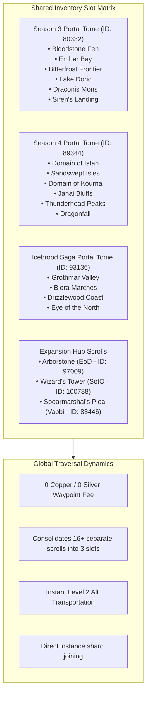

#### Portal Tome Ergonomics & Mechanical Rules:
1. **Scroll Consolidation:** Individual map scrolls cost 1,000 Unbound/Volatile Magic + 50 silver or 1,000 Karma. Slotting individual scrolls into their respective Season Portal Tome combines up to 6 scrolls into **a single account-bound item**, saving 5 shared inventory slots per season.
2. **Zero-Waypoint Silver Cost:** Using a Portal Tome or individual scroll to teleport to a Living World zone costs **0 copper / 0 silver**, completely bypassing distance-scaled waypoint travel fees.
3. **Alt-Parking & Low-Level Accessibility:** Characters of any level (even level 2 newly created characters) can activate a Portal Tome from a Shared Inventory Slot to instantly travel to end-game zones (e.g. *Bjora Marches* or *Echovald Wilds*) for chest parking, node farming, or world completion staging.
4. **World Boss & Operation Portal Devices:**
    * **World Boss Portal Device** (Item ID: `88406`): Broadcasts notifications 10 minutes prior to Core Tyria world bosses and teleports the character directly to the boss waypoint for 0 silver.
    * **Maguuma Pact Operation Portal Device** (Item ID: `89885`): Notifies and warps to Heart of Thorns meta-events (Verdant Brink, Auric Basin, Tangled Depths, Dragon's Stand).

---

## 12. Formal OWL Ontology Architecture: TBox vs. SKOS Concept Schemes vs. ABox NamedIndividuals

Project Priory employs a strict tripartite semantic model conforming to W3C Semantic Web and Linked Data standards. This architecture solves the foundational challenges of knowledge representation in large-scale MMO progression graphs: **formal logical reasoning**, **controlled vocabulary classification without class explosion**, and **high-fidelity concrete game assertions**.

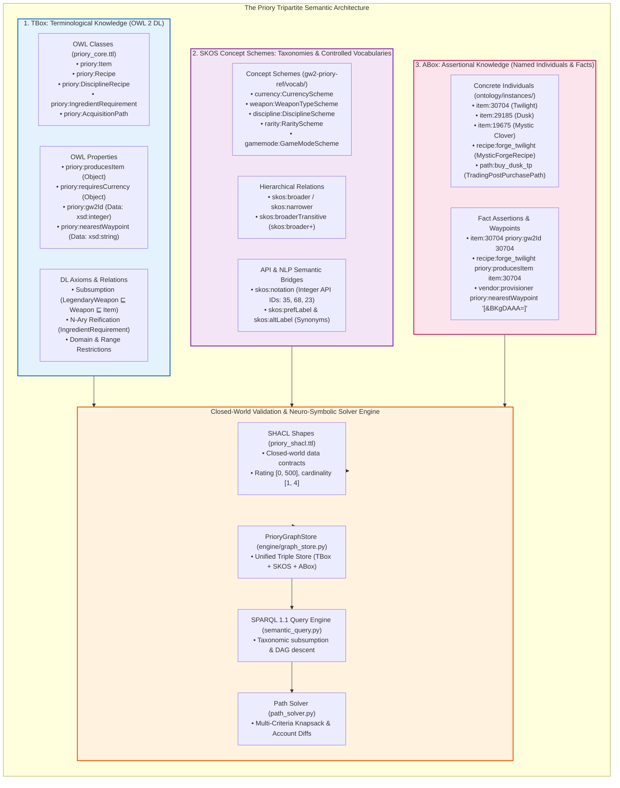

---

### 12.1 The Theoretical & Practical Distinctions

#### 1. TBox (Terminological Box — OWL 2 DL Schema)
* **Formal Role:** Defines the ontology's structural schema, entity types, relationships, and logical domain rules under the **Open-World Assumption (OWA)**.
* **Mathematical Formalism:** Expressed in Description Logics ($\mathcal{SROIQ}(D)$), declaring concept inclusions ($C \sqsubseteq D$), role inclusions ($R \sqsubseteq S$), and property characteristics (functional, inverse, transitive).
* **Core OWL Classes in Priory:**
  * `priory:Item` $\sqsubseteq \top$ (Top-level physical or virtual item in GW2).
  * `priory:EquipableItem` $\sqsubseteq$ `priory:Item`.
  * `priory:Weapon` $\sqsubseteq$ `priory:EquipableItem`.
  * `priory:LegendaryWeapon` $\sqsubseteq$ `priory:Weapon`.
  * `priory:PrecursorWeapon` $\sqsubseteq$ `priory:Weapon`.
  * `priory:Recipe` $\sqsubseteq \top$ (Transformation rule producing items).
  * `priory:DisciplineRecipe` $\sqsubseteq$ `priory:Recipe`.
  * `priory:MysticForgeRecipe` $\sqsubseteq$ `priory:Recipe`.
  * `priory:IngredientRequirement` $\sqsubseteq \top$ (Reified N-ary association node).
  * `priory:AcquisitionPath` $\sqsubseteq \top$ (Vendor, achievement, TP, or drop vector).
* **The Reified N-Ary Relation Pattern:**
  Standard RDF triples are strictly binary `(Subject, Predicate, Object)`. A crafting recipe, however, requires specifying an input item AND an integer quantity. Modeling this as `recipe:forge_twilight priory:requiresItem item:19675` loses the quantity, while attaching quantity directly to `item:19675` corrupts the item definition. Priory solves this using the W3C N-Ary Relation Pattern:
  ```turtle
  recipe:forge_twilight a priory:MysticForgeRecipe ;
      priory:producesItem item:30704 ; # Twilight
      priory:hasIngredientRequirement [
          a priory:IngredientRequirement ;
          priory:requiresItem item:19675 ; # Mystic Clover
          priory:requiredQuantity 77       # Exact integer count
      ] .
  ```

---

#### 2. SKOS Concept Schemes (Controlled Vocabularies & Flexible Taxonomies)
* **Formal Role:** Provides lightweight, standardized categorization systems for attributes that classify items rather than defining new structural types.
* **Why SKOS Instead of OWL Classes? (The "Class Explosion" Solution):**
  * If a Greatsword were modeled as an OWL class `GreatswordWeapon`, and Legendary as `LegendaryItem`, representing *Twilight* would require multiple class inheritance (`Twilight a GreatswordWeapon, LegendaryItem, TwoHandedItem, WeaponsmithCraftedItem`).
  * As dimensions grow (8 rarities $\times$ 19 weapon types $\times$ 9 disciplines $\times$ 7 game modes), this causes an uncontrollable **Class Explosion** of thousands of combinatorial classes, paralyzing DL reasoners.
  * SKOS treats categories as **Concepts (data individuals in a scheme)** rather than ontological classes. An item remains a simple individual of `priory:Weapon`, and points to SKOS concepts via properties:
    ```turtle
    item:30704 a priory:LegendaryWeapon ;
        priory:hasRarity rarity:Legendary ;
        priory:hasWeaponType weapon:Greatsword ;
        priory:requiresDiscipline discipline:Weaponsmith .
    ```
* **Hierarchical Subsumption (`skos:broader` & `skos:broaderTransitive`):**
  Taxonomies are navigated effortlessly using SPARQL 1.1 property paths:
  ```turtle
  weapon:Greatsword skos:broader weapon:TwoHandedWeapon .
  weapon:TwoHandedWeapon skos:broader weapon:WeaponType .
  ```
  Querying for all two-handed weapons requires only:
  ```sparql
  SELECT ?item WHERE {
      ?item priory:hasWeaponType ?wt .
      ?wt skos:broader+ weapon:TwoHandedWeapon .
  }
  ```
* **The REST API Semantic Bridge (`skos:notation`):**
  Official ArenaNet API endpoints (e.g. `/v2/account/wallet`, `/v2/currencies`) return integer currency IDs. Priory embeds these directly inside SKOS concepts using `skos:notation`:
  ```turtle
  currency:ProvisionerToken a skos:Concept ;
      skos:inScheme currency:CurrencyScheme ;
      skos:prefLabel "Provisioner Token"@en ;
      skos:altLabel "Faction Token"@en ;
      skos:notation "35"^^xsd:integer . # Matches /v2/account/wallet ID: 35

  currency:AstralAcclaim a skos:Concept ;
      skos:inScheme currency:CurrencyScheme ;
      skos:prefLabel "Astral Acclaim"@en ;
      skos:notation "68"^^xsd:integer . # Matches /v2/account/wallet ID: 68
  ```

---

#### 3. ABox (Assertional Box — Named Individuals & Concrete Game Data)
* **Formal Role:** Contains the actual instantiated facts, game items, recipe graphs, vendor exchange parameters, and spatial waypoints in Guild Wars 2.
* **Concrete Assertions:** Populates specific properties with exact numerical values, chat link hashes, and GPS-style waypoint coordinates:
  ```turtle
  item:30704 a priory:LegendaryWeapon, owl:NamedIndividual ;
      rdfs:label "Twilight"@en ;
      priory:gw2Id 30704 ;
      priory:chatCode "[&AgErZgAA]" ;
      priory:hasRarity rarity:Legendary ;
      priory:hasWeaponType weapon:Greatsword ;
      priory:isAccountBound false ;
      priory:producedBy recipe:forge_twilight .
  ```

---

### 12.2 Architectural Comparison Matrix

| Dimension | TBox (OWL 2 DL) | SKOS Concept Schemes | ABox (Named Individuals) |
|---|---|---|---|
| **Primary W3C Standard** | [W3C OWL 2 Web Ontology Language](https://www.w3.org/TR/owl2-syntax/) | [W3C SKOS Core](https://www.w3.org/TR/skos-reference/) | [W3C RDF 1.1 / OWL 2 DL](https://www.w3.org/TR/rdf11-concepts/) |
| **Physical File Location** | `ontology/priory_core.ttl` | `gw2-priory-ref/vocab/*.ttl` | `ontology/instances/*.ttl` |
| **Primary Building Block** | `owl:Class`, `owl:ObjectProperty` | `skos:ConceptScheme`, `skos:Concept` | `owl:NamedIndividual`, RDF Literals |
| **Core Semantics** | Open-World Assumption, DL Subsumption | Taxonomic categorization, Poly-hierarchy | Asserted facts, Ground Truth Instances |
| **Domain Scope** | Metamodel & Structural Relations | Controlled Taxonomies (Rarity, Type) | Real GW2 Items, Recipes, Waypoints |
| **Class Explosion Risk** | High if misused for attributes | **Zero (Concepts are graph nodes)** | None (Concrete individuals) |
| **External API Integration** | Property definition (`priory:gw2Id`) | Integer ID bridging (`skos:notation`) | Direct API payload binding |
| **Validation Gate** | SHACL NodeShapes & PropertyShapes | SHACL IRI validity checks | SHACL Value & Range constraints |

---

### 12.3 How the Tripartite Architecture Powers the Priory Engine

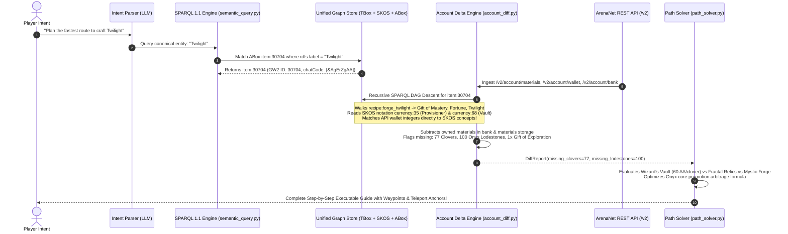

---

## 13. Domain Failure Modes & Codified Priory Semantic Solver Rules (v4.0.0)

```mermaid
graph TD
    subgraph MasterRules ["Master Codified Rules for Priory Neuro-Symbolic Solvers (v4.0.0)"]
        R1["Rule 1: Ascalon's Searing requires clicking 'Examine' TWICE"]
        R2["Rule 2: Dark room glooms fail if Mesmer portal bypasses maze"]
        R3["Rule 3: Tangled Labyrinth only accessible 15-min post-Vinewrath"]
        R4["Rule 4: Multi-character discipline routing prevents redundant 400/500 leveling"]
        R5["Rule 5: Clover rolling must precede T6 fine material TP purchases"]
        R6["Rule 6: Gobbler animation canceling must be prescribed for Candy Corn"]
        R7["Rule 7: Aquatic Ruins gloom requires Luminous Plants path instance roll"]
        R8["Rule 8: Tears of Itlaocol requires solving floor dart puzzle on foot"]
        R9["Rule 9: Font of Rhand requires Incendio Templum meta clear"]
        R10["Rule 10: 2x Gift of Exploration must be routed to Eternity arbitrage"]
        R11["Rule 11: Mistlock/Armistice Pass required as teleport anchor during exploration"]
        R12["Rule 12: Runecrafter's on Greens & Silver-Fed on Rares (Zero Copper-Fed on Rares)"]
        R13["Rule 13: Staging all 4 pillars in Invisible Bags to prevent misclicks"]
        R14["Rule 14: Recharging T2F integration for alt boss taxiing"]
        R15["Rule 15: Permanent Contract Triad in Shared Slots for zero-hub crafting"]
        R16["Rule 16: Daily LEMC & Karmic Converter routing for Obsidian/T6 generation"]
        R17["Rule 17: Gleam of Sentience daily 4 Unbound Magic purchases for dust sinks"]
        R18["Rule 18: Portal Tome consolidation saving 13+ Shared Inventory slots"]
        R19["Rule 19: SKOS notation bridging for zero-hardcoding wallet currency resolution"]
        R20["Rule 20: Reified N-ary relation parsing for multi-quantity crafting DAG traversal"]
        R21["Rule 21: Eternity TP 15% fee deduction in net arbitrage liquidation calculations"]
        R22["Rule 22: Unbound Forge consumption triggers permanent Wardrobe skin unlock"]
        R23["Rule 23: Armory binding generates Memory tokens for Account-Bound Eternity"]
        R24["Rule 24: 4-Pillar pre-flight Go/No-Go verification audit gate enforcement"]
    end
```

### 13.1 Master Solver Guardrails & Rules

1. **`RULE_ORDER_CLOVERS_BEFORE_T6`**: The solver must never schedule T6 fine material Trading Post buy orders until all 77 Mystic Clovers have been rolled, because failed Mystic Forge rolls refund ~66.7% of attempts as Tier 6 fine materials.
2. **`RULE_WIZARDS_VAULT_STARTER_KIT_PRIORITY`**: If the account has $\ge 1,200$ Astral Acclaim and the active season features the Twilight Starter Kit, the solver must lock the Precursor and Gift of Metal acquisition nodes to the Starter Kit (saving ~650g).
3. **`RULE_EXAMINE_TWICE_ASCALON`**: For collectible `Ascalon's Searing` (Item ID: `72431`), the player execution prompt must explicitly instruct clicking the secondary "Examine further" dialogue button.
4. **`RULE_DARK_ROOM_PORTAL_BYPASS`**: For collectibles `Pirates Darkness` (`75487`) and `Obsidian Darkness` (`71983`), warn the player that Mesmer portal skips to the end chest will fail the trigger; the character must step physically inside the dark corridor.
5. **`RULE_TANGLED_LABYRINTH_META_WINDOW`**: For `Tangled Darkness` (`76874`), schedule the task exclusively during the 15-minute "Time Out" phase immediately following a successful Mordrem Vinewrath meta event.
6. **`RULE_ACCOUNT_DISCIPLINE_FRAGMENTATION`**: If Character A possesses Weaponsmith 500 and Character B possesses Armorsmith 400, distribute crafting tasks across both characters via the Account Bank rather than recommending leveling redundant crafting disciplines.
7. **`RULE_GOBBLER_ANIMATION_CANCEL`**: When scheduling buff stacking with `Candy Corn Gobbler` (`67393`), include the chair/novelty or mount cancel technique to prevent the 5-second transform lockout.
8. **`RULE_POST_TWILIGHT_ETERNITY_PATH_SELECTION`**: When an account reaches 100% Core Map Completion (2x Gift of Exploration), evaluate whether the player prioritizes liquid wealth or Legendary Armory slots:
   * If liquid gold is prioritized: schedule crafting unbound Sunrise and unbound Twilight, forge Unbound Eternity (unlocking Sunrise & Twilight skins), and sell on the Trading Post for ~3,800g (~1,700g net profit after 15% TP fees).
   * If armory utility is prioritized: bind Sunrise and Twilight to the Legendary Armory, obtain `Memory of Sunrise` and `Memory of Twilight`, and forge an Account-Bound Eternity (unlocking all 3 skins + Armory slot).
9. **`RULE_VIP_LOUNGE_ANCHOR_CRAFTING`**: During long exploration or collection runs, instruct the player to use Mistlock Sanctuary or Armistice Bastion as their teleport anchor to refine materials, bank, and forge without losing their remote open-world coordinates.
10. **`RULE_SALVAGE_DISCIPLINE_SEPARATION`**: Enforce the exact salvage kit mapping:
    * Level 68+ Rare Equipment $\rightarrow$ Silver-Fed / Mystic Salvage Kit ($\sim 0.875 - 0.900$ Ectos/item).
    * Masterwork (Green) Equipment $\rightarrow$ Runecrafter's Salvage-o-Matic (100% Upgrade recovery into Charms/Symbols).
    * Fine (Blue) & Common $\rightarrow$ Copper-Fed Salvage-o-Matic.
    * High-value Exotics ($\ge 1.50\text{g}$ upgrades) $\rightarrow$ Black Lion Salvage Kit.
11. **`RULE_FOUR_PILLAR_INVISIBLE_BAG_STAGING`**: All precursor crafting components, Mystic Coins, Clovers, and intermediate Gifts (Dusk, Gift of Mastery, Gift of Fortune, Gift of Twilight) must be staged inside an Invisible Bag / Safe Box to prevent accidental "Deposit All Materials", merchant vendor sales, or Mystic Forge auto-selection errors.
12. **`RULE_TELEPORT_TO_FRIEND_ALT_TAXI`**: For alt characters requiring world boss or meta participation for Hobbs' collections or map milestones, utilize LFG squad taxis with `Recharging Teleport to Friend` to bypass undiscovered waypoint transit.
13. **`RULE_PERMANENT_CONTRACT_SHARED_ERGONOMICS`**: When Permanent Bank Access (`35984`), TP Express (`35987`), and Merchant Contract (`35986`) are detected in account inventory or shared slots, solver paths must omit intermediate city waypoint trips and schedule in-situ inventory clearing.
14. **`RULE_DAILY_CONVERTER_HARVESTING`**: Schedule daily routing for Ley-Energy Matter Converter (Heavy Crafting Bags on all 4 tabs) and Karmic Converter (Heavy Crafting Bags / Obsidian Shards) to passively accumulate T6 materials and obsidian pools.
15. **`RULE_GLEAM_OF_SENTIENCE_UNBOUND_SINK`**: For accounts holding excess LWS3 map currencies (Bloodstone Rubies, Petrified Wood, Jade Shards, Fire Orchids), prioritize purchasing the 4 daily Gleam of Sentience items (*Sentient Seed, Root, Sprout, Bloom*) before trading currencies for volatile/unbound magic bundles.
16. **`RULE_PORTAL_TOME_SLOT_CONSOLIDATION`**: If an account owns 2 or more scrolls for a single Living World Season (LWS3, LWS4, IBS), mandate purchasing the Season Portal Tome to consolidate inventory slots into a single Shared Inventory Slot.
17. **`RULE_SKOS_NOTATION_WALLET_BRIDGING`**: The Delta Engine must dynamically resolve account wallet currency IDs via `skos:notation` lookups against `currency:CurrencyScheme` rather than using hardcoded integer mappings in application logic.
18. **`RULE_NARY_INGREDIENT_QUANTITY_RESOLUTION`**: All SPARQL query paths parsing crafting recipes must traverse `priory:hasIngredientRequirement` blank nodes and extract both `priory:requiresItem` and `priory:requiredQuantity` to ensure mathematical determinism in multi-item recipe DAG resolution.
19. **`RULE_TP_FEE_STRUCTURE_DEDUCTION`**: Financial valuation engines estimating net gold yield for marketable legendaries must apply the standard $5\%$ listing fee and $10\%$ exchange fee ($15\%$ aggregate discount factor) against gross market value: $\text{Net} = P \times 0.85$.
20. **`RULE_WARDROBE_SKIN_HARVEST_RECOGNITION`**: When analyzing the commercial Eternity path, the reasoning engine must assert that forging unbound Twilight + unbound Sunrise retains both skins in the account Wardrobe without bounding the final weapon.
21. **`RULE_ARMORY_MEMORY_TOKEN_SYNTHESIS`**: When synthesizing Account-Bound Eternity, the solver must look for `Memory of Twilight` (`95380`) and `Memory of Sunrise` (`95343`) generated by armory deposit rather than requiring physical weapons.
22. **`RULE_PREFLIGHT_GO_NO_GO_AUDIT`**: Prior to issuing the final Mystic Forge combine command for Twilight or Eternity, the solver must execute the 4-gate verification audit confirming isolated inventory slots, character crafting ratings, currency thresholds, and exact ingredient preview.

---

*Authored by the Deep Domain Research Team, Project Priory.*  
*Specification Version: 4.0.0 (Master Specification).*
