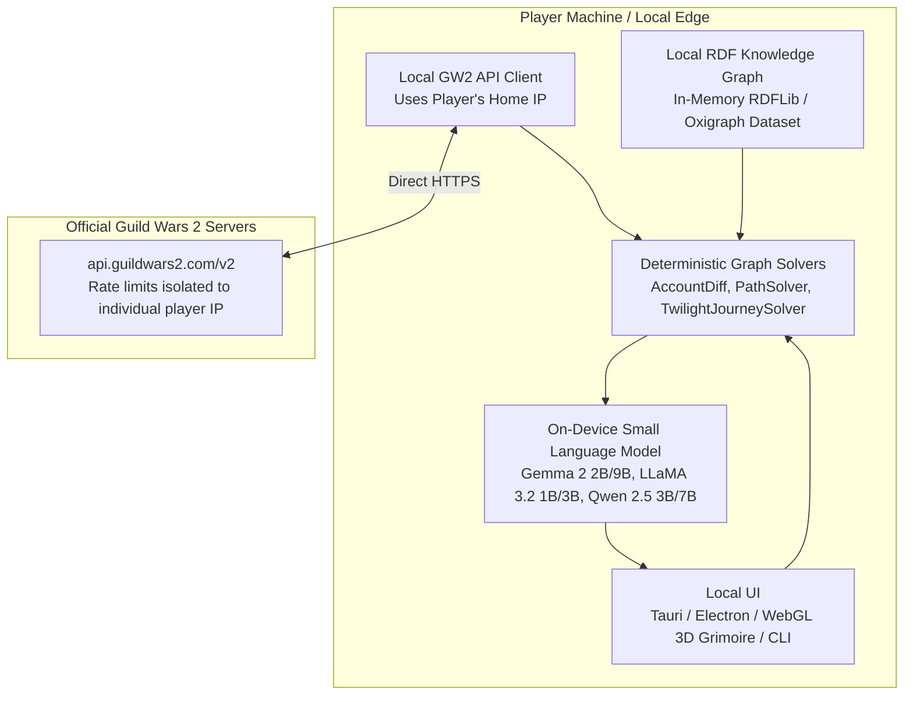
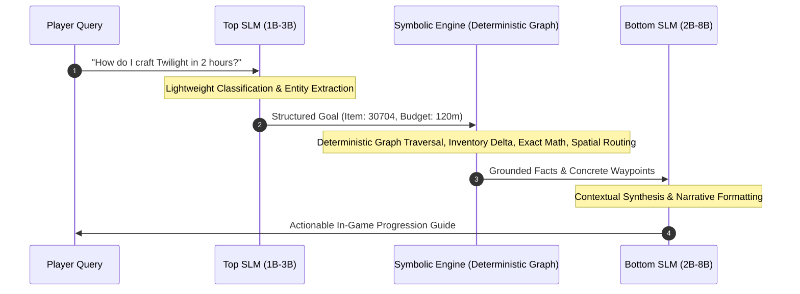

# RFC: Local Edge & Standalone On-Device Architecture for Project Priory

**Status:** Proposed / Exploration Phase  
**Author:** Project Priory Architecture Team  
**Context:** GW2 Official API Rate-Limiting & Distributed Edge LLM Execution  

---

## 1. Problem Statement: Centralized API & Server Bottlenecks

### 1.1 GW2 REST API Rate Limiting (The 50-User Wall)
The official Guild Wars 2 REST API (`https://api.guildwars2.com/v2`) imposes strict per-IP rate limits:
* **Token Bucket Limit:** ~300 requests per minute per origin IP address.
* **Burst Limit:** Heavy endpoints (`/v2/account/materials`, `/v2/characters`, `/v2/account/bank`, `/v2/account/legendaryarmory`) require multiple HTTP round-trips per account fetch.
* **The Centralized Failure Mode:** If Project Priory is hosted as a single multi-tenant centralized web application, just **20 to 50 active concurrent users** will trigger HTTP `429 Too Many Requests` status codes from ArenaNet, blocking the entire server for all players.

### 1.2 Privacy, Costs, and Cloud LLM Latency
* **API Key Security:** Players are understandably hesitant to send full-access GW2 API keys to a remote third-party cloud server.
* **Cloud Inference Costs:** Passing large JSON schemas to proprietary cloud LLMs (OpenAI, Anthropic, Google Cloud) introduces recurring operational costs per query.
* **Latency:** Cloud round-trips add 1–3 seconds of network overhead compared to local execution.

---

## 2. The Architectural Solution: Distributed Standalone Edge Client

Instead of a centralized server, Project Priory can be deployed as a **standalone on-device application** (Desktop GUI / CLI / Local Daemon):

### Key Advantages:
1. **Infinite Scaling & Zero IP Bottlenecks:** Every player queries the GW2 API from their own residential IP address using their own API key. 50,000 players = 50,000 independent rate-limit quotas.
2. **100% Data Privacy:** Player API keys, inventory items, and character builds never leave their personal machine.
3. **Zero Hosting & Cloud Inference Costs:** All compute (SPARQL graph reasoning + SLM inference) runs locally.
4. **Offline Capability:** The entire Knowledge Graph (recipes, vendors, waypoints, and taxonomies) is bundled locally and functions with zero internet connection (except for fetching live account snapshots).

---

## 3. Why the Neuro-Symbolic Architecture Makes Small Models (SLMs) Excel

In standard AI applications, small on-device models (1B–8B parameters) struggle with complex reasoning, hallucinate math, and lose track of long dependency trees.

**In Project Priory, small models succeed brilliantly because of the Neuro-Symbolic Sandwich design:**

### Cognitive Division of Labor:
* **The Symbolic Engine does all the hard work:** Graph traversal, 10-level deep recipe expansion, material math, wallet subtractions, daily time-gate calculations, and waypoint lookup are done with 100% mathematical certainty in Python and SPARQL.
* **The Top SLM (1B–3B):** Only handles intent disambiguation and entity resolution (`"twilight"` -> `item:30704`, `"ranking"` -> `COMPARATIVE_RANKING`). Models like **Llama 3.2 1B/3B** or **SmolLM2 1.7B** excel at this with JSON structured outputs.
* **The Bottom SLM (2B–8B):** Only transforms verified, structured markdown facts into an engaging guide. Models like **Google Gemma 2 2B/9B**, **Qwen 2.5 7B**, or **Llama 3.1 8B** produce publication-grade guides with zero hallucinations because all facts are supplied directly in the prompt context.

---

## 4. Hardware Profiles & Supported On-Device Runtimes

| Model | Parameters | Quantization | RAM / VRAM Footprint | Target Hardware | Speed (Tokens/s) |
|---|:---:|:---:|:---:|---|:---:|
| **Google Gemma 2 2B** | 2.6B | Q4_K_M / Q8 | ~1.8 GB | Low-end laptops, CPU only | 45–70 t/s |
| **Meta LLaMA 3.2 3B** | 3.2B | Q4_K_M | ~2.2 GB | Integrated GPUs, Apple Silicon | 50–90 t/s |
| **Qwen 2.5 7B** | 7.6B | Q4_K_M | ~4.8 GB | Mid-range GPU (GTX 1660 / RTX 3060) | 35–60 t/s |
| **Meta LLaMA 3 30B / Gemma 2 27B** | 27B–30B | Q4_K_M | ~16–18 GB | Apple Silicon (M1/M2/M3 Pro/Max), High-end PC (RTX 4080/4090) | 20–35 t/s |

### Recommended Local Execution Engines:
1. **Ollama / llama.cpp:** Multi-platform (macOS, Windows, Linux) with CPU/GPU offloading and GGUF quantization.
2. **Apple Silicon MLX:** Ultra-fast unified memory execution for Mac users.
3. **ONNX Runtime / WebGPU:** Direct in-browser / Electron acceleration.

---

## 5. Client Packaging & Distribution Formats

### Option A: Tauri Native Desktop Application (Recommended)
* **Frontend:** Vue 3 / React + WebGL 3D Grimoire.
* **Backend:** Rust binary wrapping a local Python sidecar or embedded Oxigraph triple store + `llama-cpp-rs`.
* **Binary Size:** Under 100 MB (excluding the SLM model weights which can be downloaded on first run).

### Option B: Local Standalone Python Bundle (PyInstaller / uv)
* Packaged single-click executable running the existing Flask/FastAPI WebGL interface at `http://localhost:5000`.
* Plugs directly into a local Ollama instance (`http://localhost:11434`).

### Option C: Blish HUD / In-Game Overlay Addon
* Communicates with a local lightweight background daemon to display interactive progression waypoints directly over the Guild Wars 2 game window.

---

## 6. Implementation Roadmap

- [ ] **Phase 1 (Engine Benchmark):** Benchmark Gemma 2 2B and Llama 3.2 3B on standard intent parsing and guide synthesis datasets using local Ollama.
- [ ] **Phase 2 (Standalone Packaging):** Create a standalone desktop launcher prototype (`priory-desktop`) bundling the knowledge graph and local web interface.
- [ ] **Phase 3 (Model Fine-Tuning / GGUF Preset):** Fine-tune a specialized 2B–3B model with GW2 domain jargon and create single-click GGUF weights.
- [ ] **Phase 4 (Tauri App Shell):** Build a cross-platform desktop UI with automatic GW2 API key storage in OS keystores (macOS Keychain, Windows Credential Vault).
