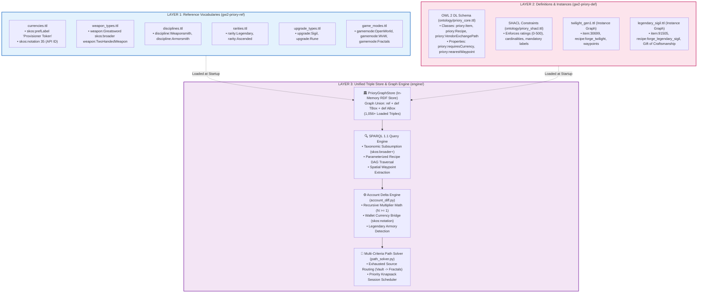
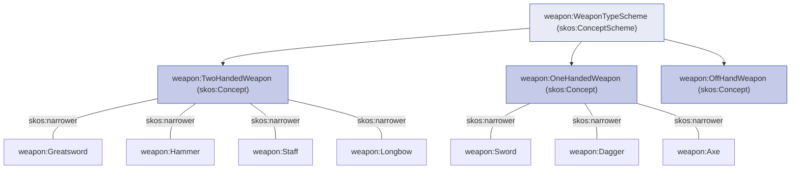
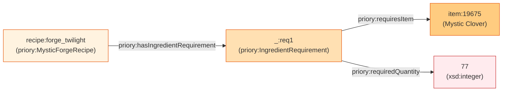
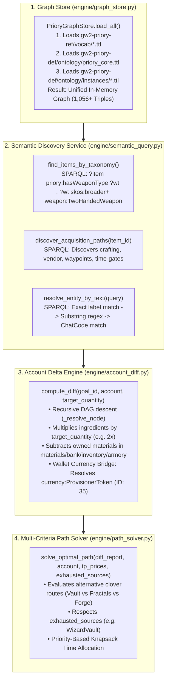
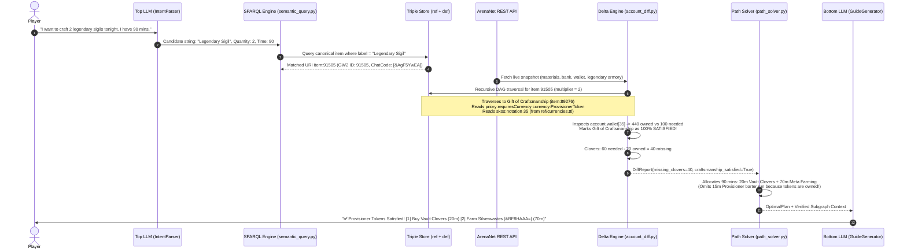

# The Three Semantic Layers Deep Dive: `ref`, `def`, and the Triple Store

This document provides a comprehensive, detailed technical analysis of the **three foundational semantic layers** that power Project Priory.

As the Semantic Layer Lead, you must understand how these three layers interact, how W3C standards (SKOS, OWL 2 DL, SHACL, SPARQL 1.1) are applied, and how data flows through the unified graph.

---

## 🗺️ Architectural Map of the Three Semantic Layers



---

## 1. LAYER 1: The `ref` Layer (W3C SKOS Taxonomies)

**Repository:** `https://github.com/cdcc-jpg/gw2-priory-ref`  
**Standard:** [W3C SKOS (Simple Knowledge Organization System)](https://www.w3.org/TR/skos-reference/)  
**Primary Responsibility:** Authoritative, decoupled reference vocabularies that classify game concepts and bridge official ArenaNet API IDs to semantic entities.

### Why SKOS instead of OWL Classes?
In ontology design, using OWL classes for fixed taxonomies (like item rarities or weapon categories) leads to "Class Explosion" and makes multi-attribute classification rigid. SKOS allows concepts to exist as lightweight graph individuals organized into **hierarchical concept schemes**.

### Core SKOS Properties Used:
* `skos:ConceptScheme`: The container taxonomy (e.g. `currency:CurrencyScheme`, `weapon:WeaponTypeScheme`).
* `skos:Concept`: An individual concept node (e.g. `currency:ProvisionerToken`, `weapon:Greatsword`).
* `skos:prefLabel`: The authoritative human label in a specific language (`"Provisioner Token"@en`).
* `skos:altLabel`: Alternate slang, abbreviations, or synonyms (`"Leggy Sigil"@en`, `"GoM"@en`).
* `skos:broader`: Declares a parent category (`weapon:Greatsword skos:broader weapon:TwoHandedWeapon`).
* `skos:notation`: Stores the official ArenaNet API integer ID (`"35"^^xsd:integer`).

### Concrete Example: The Currency Bridge (`currencies.ttl`)
```turtle
@prefix skos: <http://www.w3.org/2004/02/skos/core#> .
@prefix xsd: <http://www.w3.org/2001/XMLSchema#> .
@prefix currency: <https://priory.gw2/ref/currency/> .

currency:CurrencyScheme a skos:ConceptScheme ;
    rdfs:label "Guild Wars 2 Currency & Token Taxonomy"@en .

currency:ProvisionerToken a skos:Concept ;
    skos:inScheme currency:CurrencyScheme ;
    skos:prefLabel "Provisioner Token"@en ;
    skos:notation "35"^^xsd:integer . # <--- Matches ArenaNet API /v2/account/wallet ID

currency:AstralAcclaim a skos:Concept ;
    skos:inScheme currency:CurrencyScheme ;
    skos:prefLabel "Astral Acclaim"@en ;
    skos:notation "68"^^xsd:integer .
```

### The Hierarchical Weapon Taxonomy (`weapon_types.ttl`)


---

## 2. LAYER 2: The `def` Layer (OWL 2 DL Schemas & ABox Instances)

**Repository:** `https://github.com/cdcc-jpg/gw2-priory-def`  
**Standards:** [W3C OWL 2 DL](https://www.w3.org/TR/owl2-syntax/), [W3C SHACL](https://www.w3.org/TR/shacl/)  
**Primary Responsibility:** Formal schema (TBox), integrity validation shapes, and concrete game instance graphs (ABox) representing items, recipe DAGs, and spatial navigation.

---

### A. The Core Schema (TBox — `ontology/priory_core.ttl`)

Defines the class hierarchy and relationships governing how items transform into other items.

```mermaid
classDiagram
    class Item {
        +Integer gw2Id
        +String rdfs:label
        +String chatCode
        +Boolean isAccountBound
    }
    class EquipableItem
    class Weapon
    class LegendaryWeapon
    class PrecursorWeapon
    class UpgradeComponent
    class LegendarySigil
    class Recipe {
        +Integer outputQuantity
    }
    class DisciplineRecipe {
        +Integer requiresRating
    }
    class MysticForgeRecipe
    class IngredientRequirement {
        +Integer requiredQuantity
    }
    class AcquisitionPath
    class VendorExchangePath {
        +String vendorNPC
        +String zoneName
        +String waypointName
        +String nearestWaypoint
    }
    class TimeGate

    Item <|-- EquipableItem
    EquipableItem <|-- Weapon
    Weapon <|-- LegendaryWeapon
    Weapon <|-- PrecursorWeapon
    Item <|-- UpgradeComponent
    UpgradeComponent <|-- LegendarySigil

    Recipe <|-- DisciplineRecipe
    Recipe <|-- MysticForgeRecipe

    Item "1" --> "*" Recipe : priory:producedBy
    Recipe "1" --> "1" Item : priory:producesItem
    Recipe "1" --> "1..4" IngredientRequirement : priory:hasIngredientRequirement
    IngredientRequirement "1" --> "1" Item : priory:requiresItem

    Item "1" --> "*" AcquisitionPath : priory:acquiredVia
    AcquisitionPath <|-- VendorExchangePath
    VendorExchangePath --> "1" TimeGate : priory:hasTimeGate
```

---

### B. The Reified N-Ary Relation Pattern (Why We Need It)

In standard RDF, a triple is binary: `(Subject, Predicate, Object)`.  
However, crafting requires expressing **Subject (Recipe) $\rightarrow$ Object (Item) $\rightarrow$ Quantity (Integer)**.

To represent quantities without ambiguity, Project Priory uses the **W3C Reified N-Ary Relation Pattern**:



In Turtle (`.ttl`):
```turtle
recipe:forge_twilight a priory:MysticForgeRecipe ;
    priory:producesItem item:30699 ;
    priory:hasIngredientRequirement [
        a priory:IngredientRequirement ;
        priory:requiresItem item:19675 ; # Mystic Clover
        priory:requiredQuantity 77       # Exact quantity
    ] .
```

---

### C. The Instance Graph (ABox — `ontology/instances/`)

Instance graphs define actual items, recipes, vendor exchanges, and spatial waypoints in Guild Wars 2.

#### Example: Faction Provisioner Vendor Exchange with Spatial Waypoint
```turtle
item:89276 a priory:GiftItem ;
    rdfs:label "Gift of Craftsmanship"@en ;
    priory:gw2Id 89276 ;
    priory:hasRarity rarity:Legendary ;
    priory:isAccountBound true ;
    priory:acquiredVia [
        a priory:VendorExchangePath ;
        priory:requiresCurrency currency:ProvisionerToken ;
        priory:requiredQuantity 50 ;
        priory:vendorNPC "Faction Provisioner"@en ;
        priory:zoneName "Black Citadel"@en ;
        priory:waypointName "Junker's Waypoint"@en ;
        priory:nearestWaypoint "[&BKgDAAA=]" ; # <--- Clickable in-game waypoint code!
        priory:hasTimeGate [ a priory:TimeGate ; rdfs:label "Daily barter limit" ]
    ] .
```

---

### D. SHACL Validation Rules (`ontology/priory_shacl.ttl`)

Before any graph file is merged into production, `pyshacl` validates all triples against structural constraints to prevent corrupted data:

```turtle
priory:DisciplineRecipeShape a sh:NodeShape ;
    sh:targetClass priory:DisciplineRecipe ;
    sh:property [
        sh:path priory:requiresRating ;
        sh:datatype xsd:integer ;
        sh:minInclusive 0 ;
        sh:maxInclusive 500 ; # <--- Cannot exceed max crafting level 500
        sh:minCount 1 ;
        sh:maxCount 1 ;
        sh:message "Discipline recipe must require a rating between 0 and 500."@en ;
    ] ;
    sh:property [
        sh:path priory:requiresDiscipline ;
        sh:minCount 1 ;
        sh:nodeKind sh:IRI ;
        sh:message "Must link to a valid SKOS Discipline Concept."@en ;
    ] .
```

---

## 3. LAYER 3: The Unified Triple Store & Graph Engine (`engine/`)

The engine manages the in-memory graph, executes SPARQL 1.1 queries, applies live player overlays, and optimizes gameplay routes.



---

## 4. How the Three Layers Connect in a Single Query

Here is the complete cross-layer execution trace when a player requests `Gift of Craftsmanship`:



---

## 5. Architectural Summary Table

| Layer | Physical Location | Standard | Role & Responsibility |
| :--- | :--- | :--- | :--- |
| **`ref`** | `gw2-priory-ref/vocab/*.ttl` | **W3C SKOS** | Controlled vocabularies, category hierarchies, API integer ID bridges (`skos:notation`), and human synonyms. |
| **`def` (Schema)** | `gw2-priory-def/ontology/priory_core.ttl` | **W3C OWL 2 DL** | TBox schema defining classes, object/data properties, N-ary relation patterns, and spatial waypoint properties. |
| **`def` (Shapes)** | `gw2-priory-def/ontology/priory_shacl.ttl` | **W3C SHACL** | Closed-world integrity validation enforcing data contracts on all triples before merging. |
| **`def` (Instances)** | `gw2-priory-def/ontology/instances/*.ttl` | **RDF Graphs** | Verified item DAGs (*Twilight*, *Legendary Sigil*), recipe combinations, vendor tables, and waypoint chat codes. |
| **Triple Store** | `gw2-priory-def/engine/graph_store.py` | **RDFLib / Oxigraph** | In-memory graph store holding the union of all `.ttl` files with SPARQL 1.1 query support. |
| **Delta Engine** | `gw2-priory-def/engine/account_diff.py` | **Python Math** | Multiplier-aware recursive inventory delta subtraction, wallet checks, and Legendary Armory detection. |
| **Path Solver** | `gw2-priory-def/engine/path_solver.py` | **Priority Knapsack** | Multi-criteria cost evaluation (Vault vs Forge) and time-budget session scheduler. |
